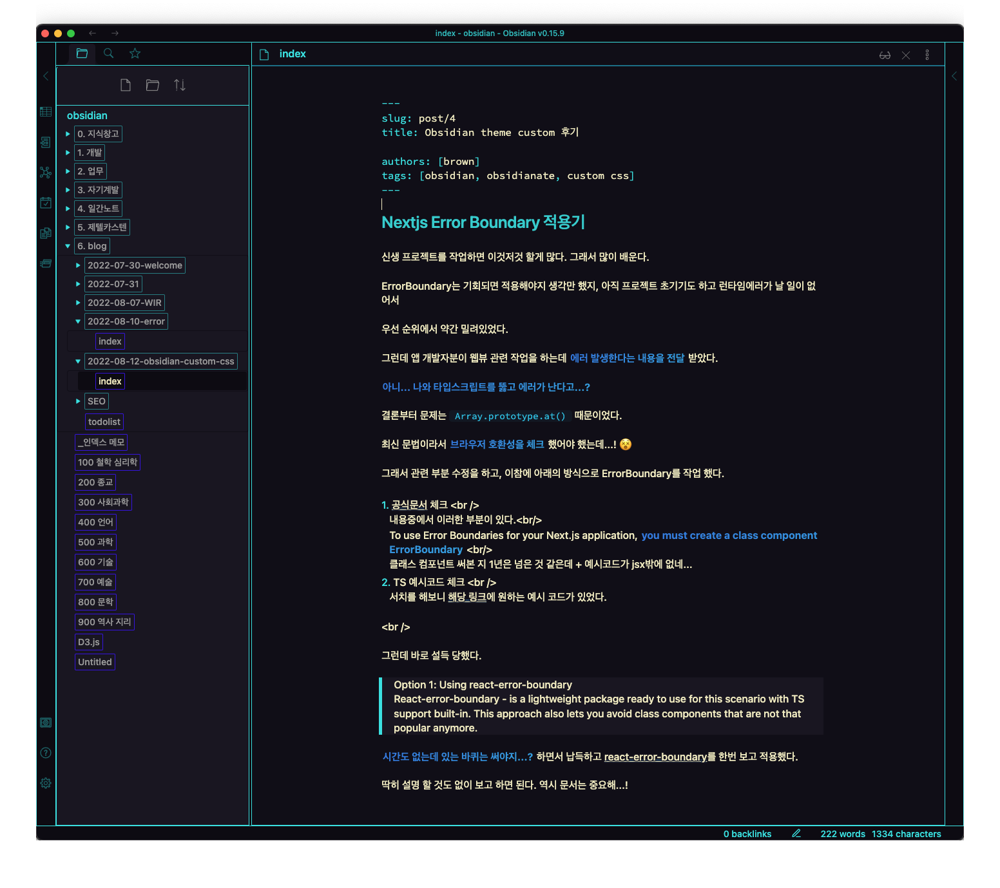
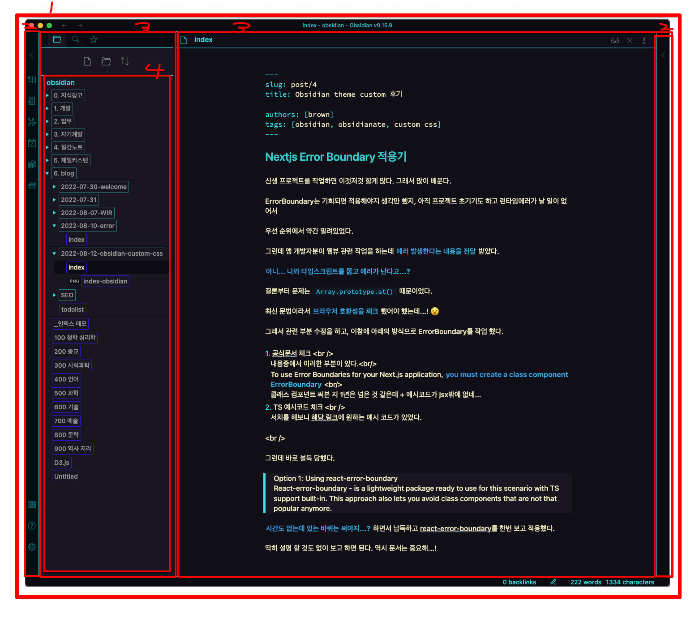
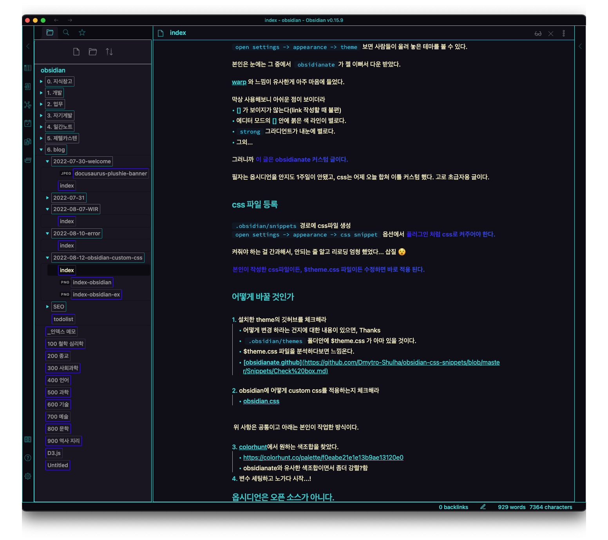

## Obsidian theme custom 후기

최근 판교뚜벅초님 영상을 보고 옵시디언에 꽂혔다.

**올려보자 나의 생산성... 제발!!!**

그러면서 옵시디언 사용법 + 제텔카스텐에 대한 글을 하나 써보려 했는데...

obsidian 기본 테마도 나름 괜찮지만 새로운 테마를 적용하고, 커스텀한 후기를 먼저 작성하려고 한다.

~~이거는 지금 안쓰면 잊어먹는다...~~

### obsidianate theme

`open settings -> appearance -> theme` 보면 사람들이 올려 놓은 테마를 볼 수 있다.

본인의 눈에는 그 중에서 `obsidianate`가 젤 이뻐서 다운 받았다.

[warp](https://www.warp.dev/) 와 느낌이 유사한게 아주 마음에 들었다.

막상 사용해보니 아쉬운 점이 보이더라

- [] 가 보이지가 않는다(link 작성할 때 불편)
- 에디터 모드의 [] 안에 붉은 색 라인이 별로다.
- `strong` 그라디언트가 내눈에 별로다.
- 그외...

그러니까 **이 글은 obsidianate 커스텀 글이다.**

필자는 옵시디언을 안지도 1주일이 안됐고, css는 어제 오늘 합쳐 이틀 커스텀 했다. 고로 초급자용 글이다.

### css 파일 등록

`.obsidian/snippets`경로에 css파일 생성
`open settings -> appearance -> css snippet` 옵션에서 **플러그인 처럼 css로 켜주어야 한다.**

켜줘야 하는 걸 간과해서, 안되는 줄 알고 리로딩 엄청 했었다... 삽질 😵

**본인이 작성한 css파일이든, $theme.css 파일이든 수정하면 바로 적용 된다.**

### 어떻게 바꿀 것인가

1. 설치한 theme의 깃허브를 체크해라

   - 어떻게 변경 하라는 건지에 대한 내용이 있으면, Thanks
   - `.obsidian/themes` 폴더안에 $theme.css 가 아마 있을 것이다.
   - $theme.css 파일을 분석하다보면 느낌온다.
   - [obsidianate github](https://github.com/Dmytro-Shulha/obsidian-css-snippets/blob/master/Snippets/Check%20box.md)

2. obsidian에 어떻게 custom css를 적용하는지 체크해라
   - [obsidian css](https://github.com/Dmytro-Shulha/obsidian-css-snippets/tree/master/Snippets)

위 사항은 공통이고 아래는 본인이 작업한 방식이다.

3. [colorhunt](https://colorhunt.co/)에서 원하는 색조합을 찾았다.
   - https://colorhunt.co/palette/f0eabe21e1e13b9ae13120e0
   - obsidianate와 유사한 색조합이면서 좀더 강렬?함
4. 변수 세팅하고 노가다 시작...!

### 옵시디언은 오픈 소스가 아니다.

**그러므로 내가 잘못 안것이 아니면 위의 1,2번 을 보고 뭐랄까 장님 코끼리만지듯 진행해야 한다.**

1.  `.workspace`
2.  `.side-dock-ribbon`
3.  `workspace-leaf`

    - `.workspace-leaf-content[data-type="search"]` 이런 식으로 개별 leaf를 선택할 수 있지만 명칭을 알 수가 없다 ㅋㅋ;
    - `.workspace-leaf.mod-active` 로 클릭 상태 시 css 처리

4.  `nav folder ~~~`

알아내고 변경했던 섹션 클래스들은 위처럼 되어 있고, 개별 part들은 [obsidian css](https://github.com/Dmytro-Shulha/obsidian-css-snippets/tree/master/Snippets) 여기서 찾으면 쉽게 변경 할 수 있다.

이글을 작성하는 현재 상태 ~~너무 빤딱빤딱한가..?~~

### obsidian-template

**작성한 커스텀 css 및 shortcut을 나름 vscode 처럼 맞춘 [obsidian-template repo](https://github.com/brown2243/obsidian-template)를 참고해주시라!!!**
