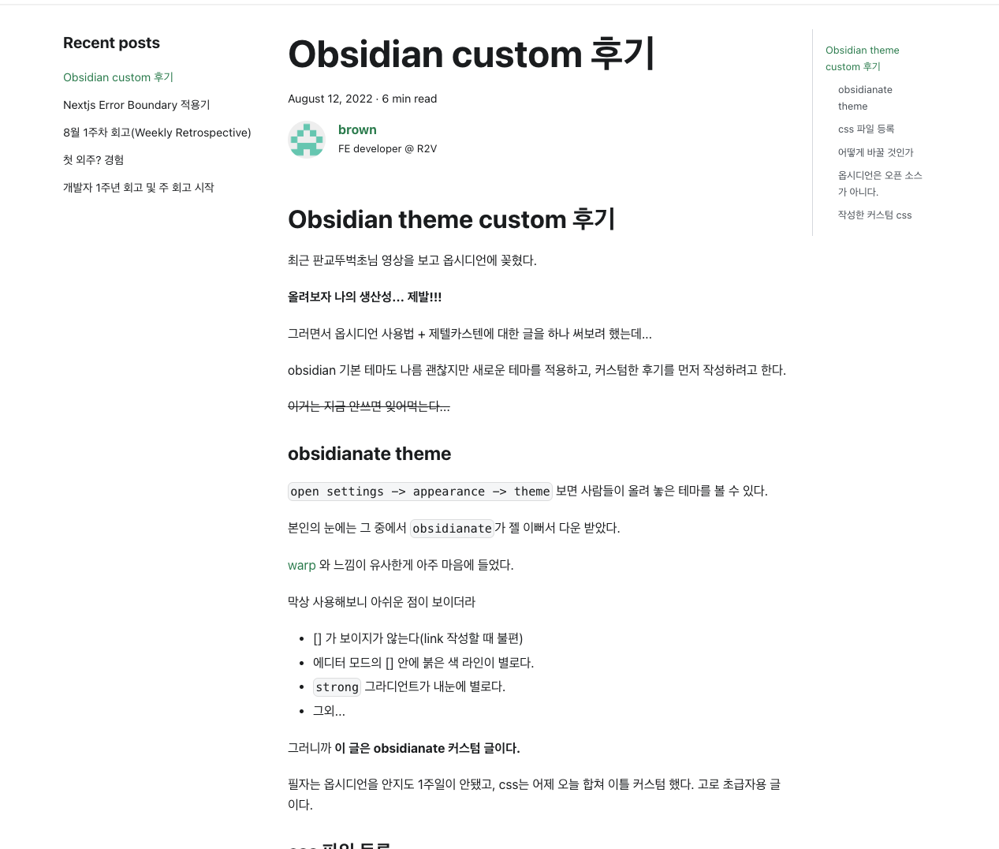
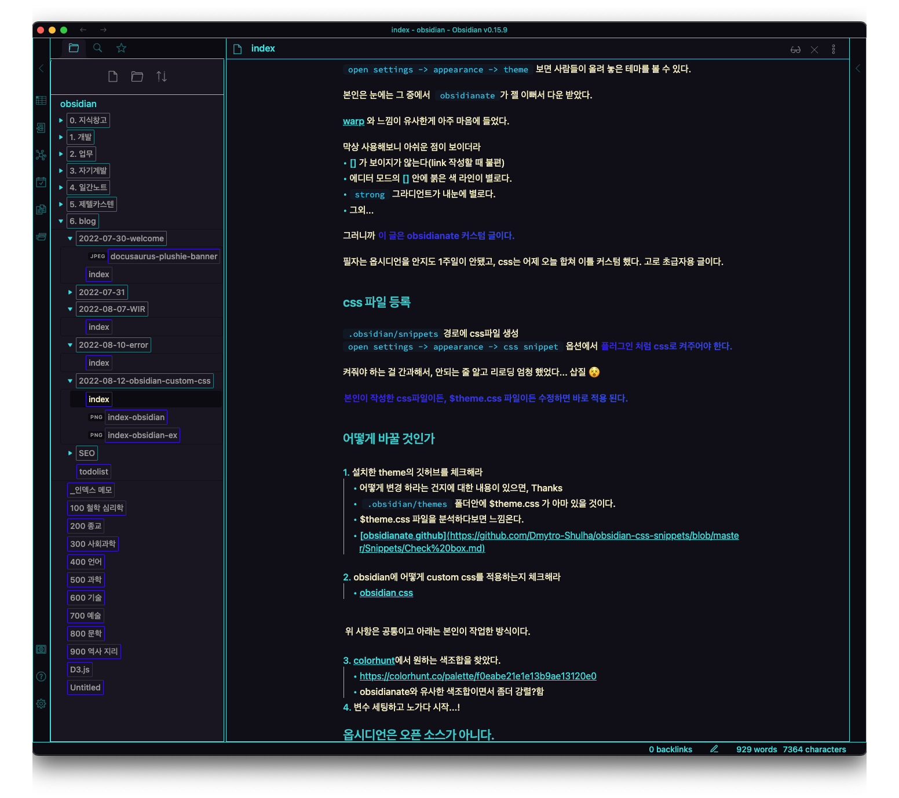

## blog 초기 setting 후기

### 1. blog를 시작해보자

**블로그를 시작하자**  라는 구체적인 영감을 받은 것은 [퇴직한 동료개발자가 러브콜을 받는 모습](https://braurus.dev/blog/post/0)을 봤을 때이고,
**나도 노력한 증거를 남겨야겠다**라고 생각했다.

왜 노력한 증거를 남기는 방식이 블로그인가?
> 만만해서, 이참에 글 쓰는 연습을 해보려고

### 2.  `docusaurus` 세팅

수많은 static site 생성 tool(Jekyll, Gatsby... )중에서 왜  `docusaurus` 인가?
>  선임개발자였던 [luke](https://dezang.net/)의 추천
>  facebook에서 만들어서
>  트렌디해보여서? 😎
>  너무 쉽게 나름 이쁜 블로그가 생겨버려서

[docusaurus](https://docusaurus.io/ko/docs) 는 그냥 문서보고 하면 된다. 심지어 번역도 되어있고 쉽다.
~~사실 글 작성외에 아직 기본 세팅에서 바꿔본게 없다...~~

### 3. deployment by `vercel`
이것도 정말 미쳤다. workflow도 작성할 필요없이 그냥 레포지토리만 등록하니까, defalut branch에 push만 하면 자동으로 배포된다.

[client-docusaurus-brown2243.vercel.app](https://client-docusaurus-brown2243.vercel.app/) 이런 식으로 서브 도메인으로 제공해준다.

여기까지의 상태로 3주 정도 쓰고 있었다. 어짜피 처음 블로그를 개설하고 글 몇개 쓴다고 갑자기 방문자들이 엄청 생기는 건 아니니까 천천히 개선해 나갈 생각이었다.

그런데 obsidian 을 이쁘게 세팅하고 나니, 블로그의 글이 너무 밋밋해 보이는 문제가 생겼다.

#### blog

#### obsidian

**그래서 블로그 초기 세팅 작업을 하려고 한다. blog 초기 setting 후기2로 계속**

---

## 8월 2주차 주 회고
뭔가 글을 잘 안쓸 것 같고, 주제도 별로 없을 것 같아 **주 회고는 반드시 작성해야지 라는 취지로 주 회고를 기획 했는데** 생각보다 쓸게 많고 재밌다.

이번주에 글을 4편이나 작성해서 , 주 회고를 따로 쓰기보단 묶어서 쓴다.

나름 열심히 보낸 일주일이었고, 앞으로도 Keep going 해봐야지!

