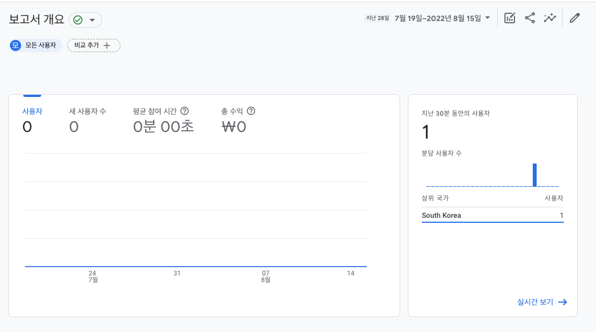
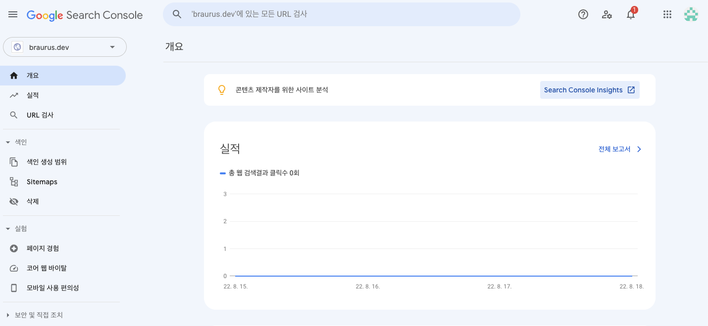

[1편에서 이어집니다](https://braurus.dev/blog/post/5)

역시 이런건 작업하면서, 글도 써야한다.

이틀밖에 안됐는데 가물가물...

## 4. domain 구매

배포 및 호스팅은 `vercel` 에서 알아서 해준다. awesome!

도메인을 설정하려면 당연하게도 도메인을 사야하는데, **중요한 것은 어디서 살 것 인가**이다.

처음에는 그냥 국내업체에서 구매할까 했지만, 아는 사람한데 물어보고 검색 좀 해보니까

**해외 도메인 업체를 이용하는 것으로 그 중에서도 [porkbun](https://porkbun.com/) 으로 결정했다.**

why? -> **제일 싸니까**

도메인은 고민 끝에 `brown` + `docusaurus` = `braurus`

거기에 개발자 티내야 하니까 `braurus.dev`로 결정해서 구매했다.

구매하는 방법은

1. 회원가입
2. 도메인을 선택
3. 결제

본인은 카드도 오직 체크카드, 그것도 국내결제 밖에 안되는 카드인데!?

라고 생각하면서 진행했는데, 구글 결제 선택하니까 알아서 플레이스토어로 어떻게 결제가 되더라.

그렇게 생각보다 싸게 도메인을 일단 2년치로 구매했다.

## 5. domain assign by vercel

개인 도메인을 구입했다면, vercel 프로젝트 세팅의, domain에서 등록하고 그냥 하라는대로 하면 된다.

1. DNS RECORDS 세팅
   ~~2. NAMESERVERS -> 포크번 디폴트 네임서버를 버셀 네임서버로 변경
   ns1.vercel-dns.com  
    ns2.vercel-dns.com

**버셀 네임서버로 변경하고 버셀에 레코드 등록하니까 search-console에서 인증이 안됌**

## 6. GTAG

개인 도메인을 붙여놓으니, 물론 아무도 안보겠지만 정말 아무도 안보는지 매우 궁금해졌다.

그런고로 [GTAG](https://marketingplatform.google.com/about/analytics/)를 달아야겠다!

1. 링크로 들어가서 gtag를 만들고 `측정 ID` 저장

docusaurus 에서는 [gtag 관련 플러그인](https://docusaurus.io/ko/docs/api/plugins/@docusaurus/plugin-google-gtag)을 제공해준다.

2. `npm install --save @docusaurus/plugin-google-gtag` 로 설치를 하고,
3. `docusaurus.config.js`에서 위의 `측정 ID`를 설정하면 끝

gtag 추적 아이디는 어짜피 사이트에서 다 보이니 굳이 감출 필요는 없는 것 같다.

`측정 ID` 와 `스트림 URL` 일치가 중요!

잘 등록되면 저렇게 뜬다.

## 7. Search Console

하는 김에, [search console](https://search.google.com/search-console/welcome?utm_source=about-page)도 해보자!

도메인을 산 사람들은 왼쪽이다. 본인의 도메인을 넣고 누르면 **DNS 레코드를 통해 도메인 소유권을 확인**하라고 하는데 어렵지 않다.

그냥 등록하면 끝인 작업인데, 도메인은 포크번에서 구입하고, 버셀네임서버로 변경한 뒤 버셀에다 등록하니까 도메인 소유권 인증이 안되더라. 포크번 네임서버로 변경하고 거기다 등록하니 마무리 되었다.

## 8. sitemap

사이트 맵 주소는 `$address/sitemap.xml`이다
**docusaurus.config.js 에 url을 본인 도메인으로 변경해주고, search console에 제출하자.**
