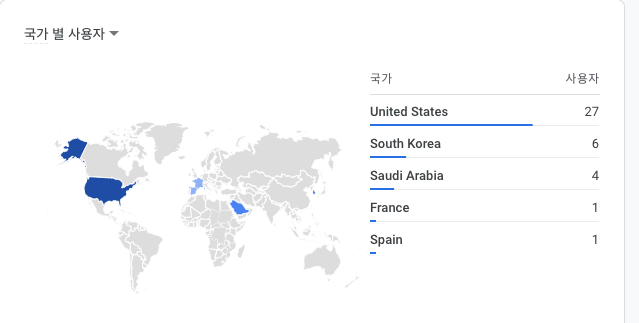
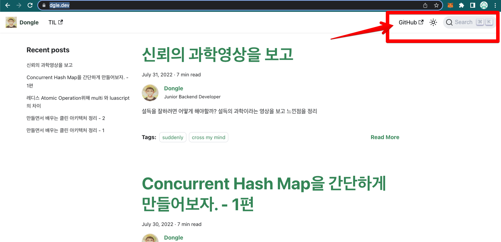
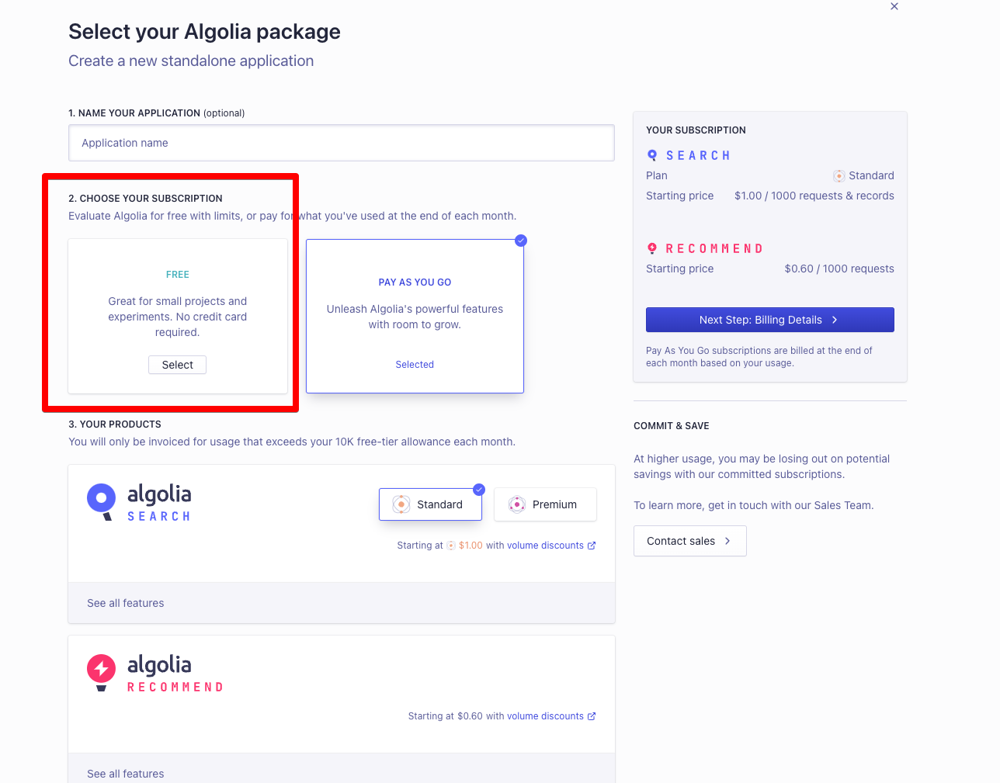
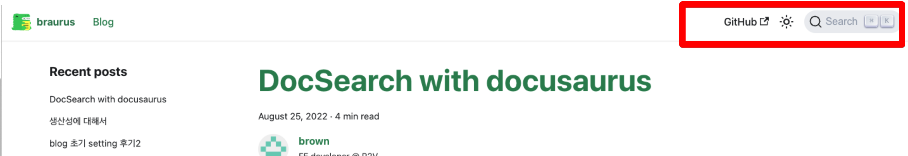

# DocSearch with docusaurus

## Intro

블로그 만든지 1달 정도 되었나...?

깜짝 놀랄만한 일이 생겼다.

솔직히 본인이 유명인도 아니고! 홍보를 하는 것도 아니고!! 그렇다고 대단한 글을 작성하는 것도 아닌데!!!

**생각보다 많은 분들이 이 블로그를 봐주신 것이다!!!!!** 😎




모든 콘텐츠가 한국어 인데 why...?

> **Thanks!!!**

도대체 어떻게 알고 봤는지 신기하기만 하다.

그래서 생각하고 있던 docusaurus 작업 중

1. 검색 붙이기
2. 테마 수정하기
3. 메인 수정하기

**검색 붙이기**를 하면서 + 후기를 남긴다.

## DocSearch

알게 된 것은 [친구의 블로그](https://dgle.dev/) 덕분이다.



아니 저 기능 뭐지 탐난다...! 라는 생각으로 작업했다.

### 1. 공식문서 체크

> [docusaurus](https://docusaurus.io/ko/docs/search#using-algolia-docsearch)는 [알골리아](https://docsearch.algolia.com/) DocSearch에 대한 최고 수준의 지원을 제공합니다.

### 2. apply docsearch program

> 서비스는 모든 오픈 소스 프로젝트에 대해 무료입니다.  
> 대상 여부를 확인하고 DocSearch 프로그램에 지원하세요.

[docsearch program](https://docsearch.algolia.com/apply/)에 등록해본다.

본인 블로그는 아직 빌딩단계라서 해당없다는 회신을 받았는데, 딱히 상관은 없다.

### 3. 알고리아 회원가입

[algolia](https://www.algolia.com/users/sign_in)에서 회원 가입을 진행해준다.

### 4. create application

[어플리케이션을 생성해주는데](https://www.algolia.com/account/plan/create?planName=base&showSearch=true&units=100&showRecommend=false&recommendRequests=10&inCreateAppMode=true&from=dashboard)



1. app 이름 적고
2. **꼭 FREE Plan을 선택하자!!**
3. data는 샘플데이터 같은 것 넣으면 된다.
4. `index name` 은 사용하는 값이다.

### 5. API Key 체크

overview 화면에서 API Keys를 누르자

사용하는 key는 `Application ID`,`Search-Only API Key`,`Admin API Key`이다.

### 6. Data crawling

[최신 권장방식 문서](https://www.algolia.com/doc/tools/crawler/getting-started/overview/)이다.

본인은 아래의 방법을 사용했다.

**이 방식은 Legacy 입니다!**

[관련 문서](https://docsearch.algolia.com/docs/legacy/run-your-own/)

1. 이 단계에서는 도커 이미지를 통한 데이터 크롤링을 위해 `docker`, `jq`가 설치 되어 있어야 한다.

   - `brew install --cask docker`
   - `brew install jq`

2. `.env` 작성
   환경 변수를 작성해야 한다.
   ```
   APPLICATION_ID=어플아이디
   API_KEY=어드민키
   ```
3. project 최상단에 `config.json` 작성
   [참조 링크](https://github.com/algolia/docsearch-configs/blob/master/configs/docusaurus-2.json)
   `index_name`, `start_urls`,`sitemap_urls`만 본인에 맡게 변경하시라.
   ```
   {
       "index_name": "braurus", // 1
       "start_urls": ["https://braurus.dev/"], // 2
       "sitemap_urls": ["https://braurus.dev/sitemap.xml"], // 3
       "sitemap_alternate_links": true,
       "stop_urls": ["/tests"],
       "selectors": {
           "lvl0": {
           "selector": "(//ul[contains(@class,'menu__list')]//a[contains(@class, 'menu__link menu__link--sublist menu__link--active')]/text() | //nav[contains(@class, 'navbar')]//a[contains(@class, 'navbar__link--active')]/text())[last()]",
           "type": "xpath",
           "global": true,
           "default_value": "Documentation"
           },
           "lvl1": "header h1",
           "lvl2": "article h2",
           "lvl3": "article h3",
           "lvl4": "article h4",
           "lvl5": "article h5, article td:first-child",
           "lvl6": "article h6",
           "text": "article p, article li, article td:last-child"
       },
       "strip_chars": " .,;:#",
       "custom_settings": {
           "separatorsToIndex": "_",
           "attributesForFaceting": ["language", "version", "type", "docusaurus_tag"],
           "attributesToRetrieve": [
           "hierarchy",
           "content",
           "anchor",
           "url",
           "url_without_anchor",
           "type"
           ]
       }
   }
   ```
4. 스크래퍼 이미지 실행  
   `docker run -it --env-file=.env -e "CONFIG=$(cat ./config.json | jq -r tostring)" algolia/docsearch-scraper`

5. 알고리아 본인 앱 화면에 보면 데이터가 갱신 되어 있을 것이다.

### 7. `docusaurus.config.js`

[이 문서](https://docusaurus.io/ko/docs/search#using-algolia-docsearch)를 참조 하자!

```
// 본인 코드
...
algolia: {
    // 알골리아에서 제공한 appId를 사용하세요.
    appId: "BW2ZDYYT4N",
    // 공개 API 키: 커밋해도 문제가 생기지 않습니다.
    apiKey: "4a0c2546c188aacd5f5277a7a9b34896",
    indexName: "braurus",
    contextualSearch: true,
    },
...
```

---

**드디어 완성이다.**



<br />

검색기능을 붙이고 이 글을 쓰기까지 생각보다 시간이 걸렸지만, 누가 볼 수도 있다고 생각하니 살짝 기대 된다.
<br />

---

### Reference

- **https://younho9.dev/docusaurus-manage-docs-2**
- https://www.whatap.io/ko/blog/67/
