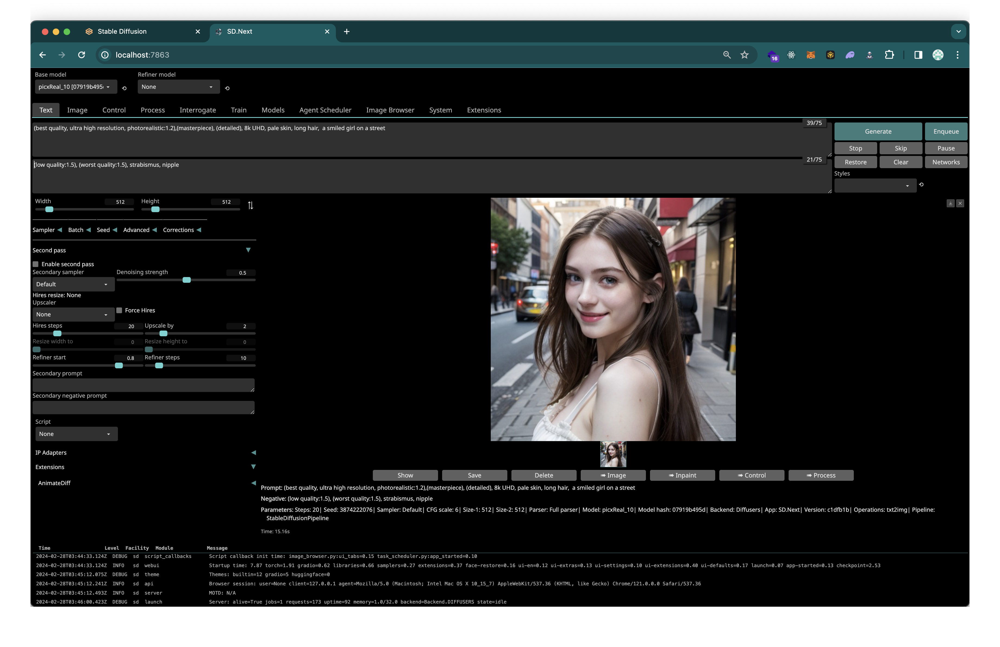
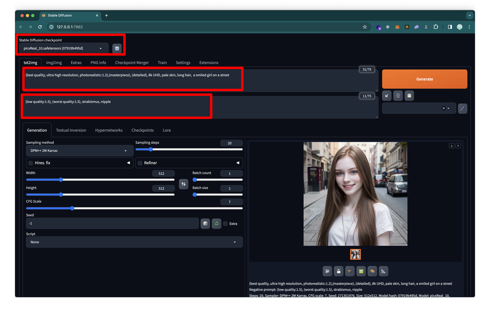
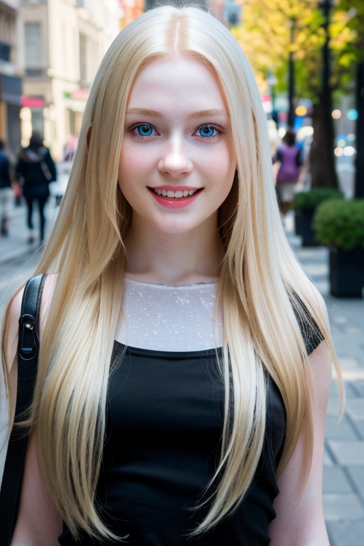
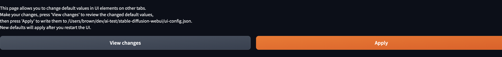
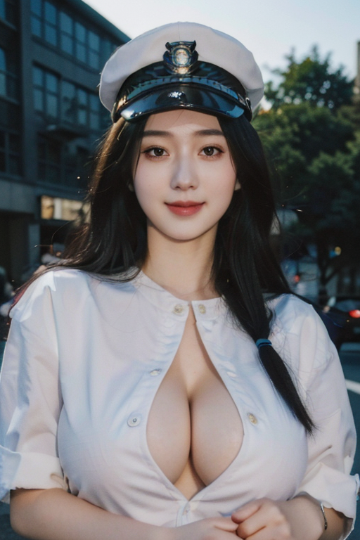
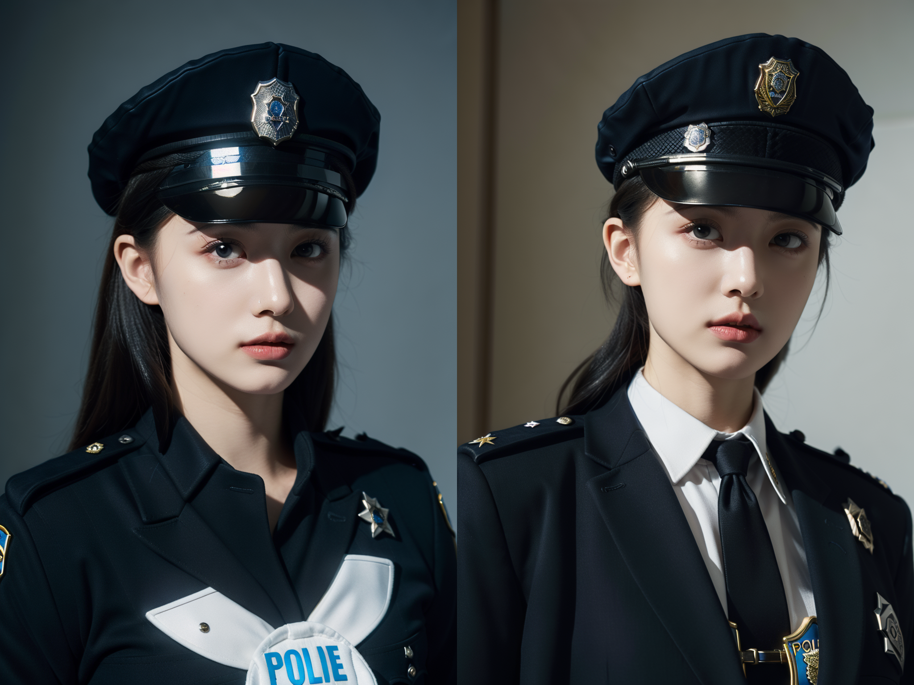

---

# [web-ui 정리 및 사용 후기]

최근에 sora AI라는 동영상 생성 AI 영상을 보았다. 놀랍고 무섭더라...
ChatGPT(GPT-3.5) 처음 쓸때도 놀라웠고, Stable Diffusion때도 놀라웠고 sora도 놀랐다.
AI 관련으로 엔디비아 주식도 놀랍다. 놀라움의 연속이다.

대부분 개발자들(연관 사무직)은 AI가 자신을 대체하지 않을까라는 생각을 다들 한번은 해봤을 것 같다.

**그만큼 AI의 발전속도는 놀랍다.**

피할 수 없으면 즐기라했던가, 늦었다고 생각했을 때가 가장 빠른때라던가, AI 관련 프로덕트를 뭐라도 사용 해봐야 할 것만 같다. 그래도 ChatGPT는 자주 사용하니까 이번에 Stable Diffusion으로 이미지 생성을 해보기로 했다.

## web-ui 세팅

> Stable Diffusion: 텍스트 및 이미지 프롬프트에서 고유한 실사 이미지를 생성하는 생성형 인공 지능(생성형 AI) 모델
> web-ui: 웹 기반 유저 인터페이스

가장 대중적인 방법인 web-ui로 이미지 생성을 해보자!!
본인의 기기는 M1 max이다.

### 1. web-ui 설치

web-ui는 굉장히 성공적인 프로젝트고 바리에이션도 많다.

- https://github.com/AUTOMATIC1111/stable-diffusion-webui
  web-ui를 개발한 오토좌의 레포 링크이다.
- https://github.com/vladmandic/automatic
  검색 후 최초로 사용한 web-ui
  추가적인 기능이 많고, 로그가 상세
- https://github.com/brkirch/stable-diffusion-webui
  기존의 web-ui에서 Apple silicon 관련 성능 개선이 있다고 한다.(vladmandic web-ui와는 기본이미지 생성에서 속도 차이가 없는 것 같다)
  - https://github.com/AUTOMATIC1111/stable-diffusion-webui/discussions/7453
  - https://www.clien.net/service/board/cm_mac/17999717

설치법들은 각 레포 README에 자세하게 나와있다.

```
// https://github.com/brkirch/stable-diffusion-webui
// conda로 환경만들고 진행하는 것을 추천
// python은 3.11.0 (9,10,11)
// 설치 원하는 경로에서 명령어 실행
wget -q https://raw.githubusercontent.com/AUTOMATIC1111/stable-diffusion-webui/master/webui.sh
sh webui.sh // 프로젝트 설치
// 설치 된 stable-diffusion-webui 폴더에서 아래 명령어를 실행
sh webui.sh // 프로젝트 실행
```

### 2. model 다운로드

> 어떤 모델이 생성할 수 있는 이미지는 모델 학습에 사용된 이미지에 의해 결정됩니다. 고양이를 학습하지 않은 모델을 사용해서는 고양이를 생성할 수 없고, 고양이만 학습한 모델이라면 고양이 말고는 아무것도 생성하지 못합니다.
> https://www.internetmap.kr/entry/Stable-Diffusion-Everything-about-models

그렇다고 한다. 간단하게 이해하고 넘어가자.

1. ui를 설치했다면 이미지를 생성할 model을 다운받자.
   본인이 사용한 사이트는 [civitai](https://civitai.com/models)이다.
   모델들이 굉장히 많아 like가 가장 많은 picxreal 모델(SD 1.5)을 다운 받았다.
   [모델 관련 유튜브 링크](https://www.youtube.com/watch?v=GQNiKKq2EP4)
   <br />
2. 다운받은 모델 파일을 프로젝트의 models/Stable-diffusion 폴더에 넣어준다.
   <br />

### 3. 이미지 생성

이제는 web-ui를 실행하고, 이미지 생성을 해보자.

vladmandic/automatic

brkirch/stable-diffusion-webui


_벌써 그럴듯한 이미지를 만들었다._

위부터 1번 박스가 모델 선택(우측 새로고침), 2번이 positive prompt(원하는 특성), 3번이 negative prompt(원하지 않는 특성) 이다.

> 생성형 AI에게 어떤 행동을 해야 하는지 자연어로 설명해 원하는 결과물을 출력할 수 있게 하는 입력값을 프롬프트(Prompt)라고 합니다.
> [코드 스테이츠](https://www.codestates.com/blog/content/%ED%94%84%EB%A1%AC%ED%94%84%ED%8A%B8-%ED%94%84%EB%A1%AC%ED%94%84%ED%8A%B8%EC%97%94%EC%A7%80%EB%8B%88%EC%96%B4%EB%A7%81)

생성할 이미지와 퀄리티를 결정 짓는 요소는 모델과 prompt인 것이다. prompt에 대한 레퍼런스는 굉장히 많은데 요점적으로는

1. 부정형 프롬프트가 더 중요하고(좋은 퀄리티를 강조하기보단 나쁜 퀄리티를 배제하는 방향),
2. 너무 길게 쓰면 오히려 퀄리티가 떨어진다는 것이다.

### 4. 이미지 개선

여러장을 프롬프트를 바꿔서 실행 해봤지만, 뭔가 다른 사람들이 만들어낸 고퀄리티 이미지 레벨까지는 생성되지 않는다.

#### 4.1 web-ui 세팅 변경

1. 이미지 사이즈 부터 다양한 옵션들이 있다. 알아보고 사용해보자
   [설정 분석 자료 링크](https://ai-designer-allan.tistory.com/entry/Stable-Diffusion-%EC%8A%A4%ED%85%8C%EC%9D%B4%EB%B8%94-%EB%94%94%ED%93%A8%EC%A0%84-webui-%EA%B8%B0%EB%8A%A5-%EB%B0%8F-%EC%84%B8%ED%8C%85-%EA%B0%92-%EC%95%8C%EC%95%84%EB%B3%B4%EA%B8%B0-txt2img)
   [CFG Scale 과 Sampling steps](https://sdiffusion.tistory.com/1)

2. civitai 에서 사용중인 모델로 남들이 만들어 놓은 사진의 설정값을 확인해보자
3. 검색 및 반복 테스트 뿐이다...



계속 세팅을 시도해본 결과 퀄리티가 올라간 것 같다.
해당 사진의 세팅은 아래와 같다.

- Sampling method:DPM++ 3M SDE Karras
- Sampling steps:28
- CFG scale:10

이렇게 세팅을 변경했을 때, **가장 중요한 것은 settings 탭 하단에 other/Defaults에서 변경사항을 적용하는 것이다.**

혹은 `ui-config.json`에서 직접 바꿔도 된다.

#### 4.2 임베딩(Embedding) 세팅

임베딩은 모델에 영향을 주지 않은 채 프롬프트를 추가 학습하는 방법으로 textual inversion이라고도 하는데 [정말 간단한 텍스트반전 알아보기](https://www.bercon.org/5613138c-676f-4fcc-8088-7299f8b83f65)에 해당 개념에 대한 자세한 설명이 있다.

사용법은 Embedding 파일을 다운받아 embeddings 폴더에 넣고, Textual Inversion 새로고침해서 확인 후, prompt에 trigger word를 넣으면 된다.

**임베딩은 trigger word가 틀리면 작동되지 않고, 생성 모델과 임베딩 모델이 일치해야 함**
로라도 동일할 것으로 예상!

#### 4.3 로라(LoRA) 세팅

LORA는 Low-Rank Adaptation of Large Language Models의 약자로 작은 데이터셋으로 특정 이미지, 피사체, 옷 같은 부분을 집중적으로 학습해 해당 그림체로 찍어 낼 수 있도록 한다.

- 로라를 사용하려면 프롬프트에 `<lora:로라이름:비중>` 이런식으로 해당 로라를 어느 비중만큼 사용하겠다고 입력해야 한다.
- ui에서 다운받은 로라를 클릭시 프롬프트에 자동으로 들어간다.
- 비중이 1이면 해당 로라에서만 데이터을 가져온다는 뜻으로 0 ~ 1 사이 값을 사용한다.
- 그리고 해당 로라의 트리거 단어도 프롬프트에 넣어주면 완료

#### 4.4 VAE 세팅

VAE(Variational Autoencoder)는 이미지를 선명하거나 부드럽게 만들어주는 보정처리를 한다.
VAE를 사용해도 변화가 없다면, 모델에 이미 포함되어있다고 한다.

- [2D VAE](https://huggingface.co/hakurei/waifu-diffusion-v1-4/blob/main/vae/kl-f8-anime2.ckpt)
- [실사 VAE](https://huggingface.co/Yukihime256/840000/tree/main)

### 5. 정리 및 결과물




마지막 결과물이다. 마지막 왼쪽에는 약간 고윤정이 보이는 것 같다...

지금 생각으로 본인이 원하는 이미지를 가장 빠르게 뽑는 방법은 이것이다.

> 1. 남들이 만들어 놓은 이미지 중 가장 유사한 이미지를 찾기
> 2. 해당 이미지를 생성한 모델을 사용 및 생성 프롬프트, 세팅 참조
> 3. 원하는 이미지와 유사한 결과물 내는 모델 + 제작자가 추천하는 세팅 사용

사람들이 집단 지성으로 모델을 학습시켜서 그런지 이미지 퀄리티가 기존의 알던 것 보다 높았다.

알아야 할 부분이 생각보다 많았지만 결과물을 생각하면 좀 무섭다...
