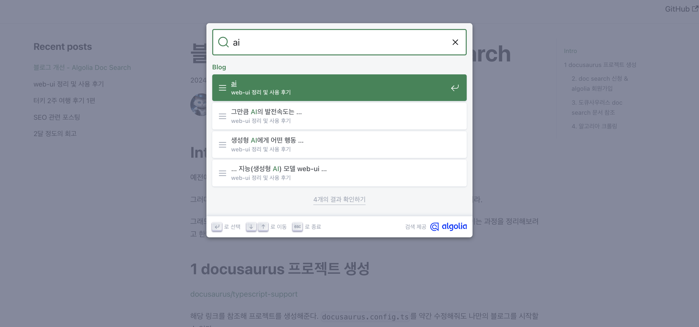

# 블로그 개선 - algolia Doc Search

## Intro

예전에 블로그를 처음 만들고, 기본 프로젝트 상태에서 포스트만 작성했었다.

그러다 한번 리뉴얼 해볼까 하는 마음으로 확인해보니 docusaurus 버전도 2에서 3로 올라 갔더라.

그래도 algolia Doc Search 기능은 붙여 놨었는데, 이번에 전반적으로 리뉴얼 해볼 겸 다시 붙이는 과정을 정리해보려고 한다.

## 1 docusaurus 프로젝트 생성

[docusaurus/typescript-support](https://docusaurus.io/docs/typescript-support)

해당 링크를 참조해 프로젝트를 생성해준다. `docusaurus.config.ts`를 약간 수정해줘도 나만의 블로그를 시작할 수 있다.

### 2. doc search 신청 & algolia 회원가입

[docsearch]https://docsearch.algolia.com/apply/ 해당 링크에서 프로그램 조인을 하고

[algolia](https://www.algolia.com/) 접속해서 가입을 해주자.

무료플랜은 아래와 같다.

> Your first 1,000,000 records are free, and every month you'll receive 10,000 search requests and 10,000 recommend requests.

아래 내용도 참고하자.

> The Algolia Build plan is your Search & Discovery playground.
> It's not intended for production projects.
> **If your project is live, you'll need to display the Algolia Logo next to the search results** or upgrade to the Algolia Grow plan.

### 3. 도큐사우러스 doc search 문서 참조

아래 문서를 참조하여 순서대로 따라가자.

[search#using-algolia-docsearch](https://docusaurus.io/docs/search#using-algolia-docsearch)

1. 플러그인 설치 `npm install --save @docusaurus/theme-search-algolia`
2. config 설정 붙여넣기
   1. @docusaurus/preset-classic에 알고리아가 포함 돠어 있기 때문에 themeConfig에 algolia 관련 설정만 넣으면 됌
   2. 알고리아 앱 대시보드 API Keys 섹션
      1. Application ID
      2. Search-Only API Key
   3. 알고리아 앱 대시보드 search 섹션
      1. Index
   4. Application ID,Search-Only API Key, Index name을 config에 추가하기
3. 프로젝트 실행
   프로젝트 실행시, 알고리아 검색탭이 생성된 걸 볼 수 있다. 하지만 데이터가 크롤링 되지 않아, 사용은 할 수 없다.

### 4. 알고리아 크롤링

문서를 살펴보면 알고리아 크롤러를 사용하는게 권장하는 방식인것 같은데 무료요금제에서는 지원을 하지 않는다 ^^...

이 시점에서 포스트를 접어야하나 고민하다, [run-your-own](https://docsearch.algolia.com/docs/legacy/run-your-own/) 해당 방식으로 진행 해보겠다.

1. `.env`, 루트에 생성
   1. 여기 들어갈 api key는 `Admin API Key`로 공개되지 않게 할 것
2. `config.json`, 루트에 생성 - [config-file 참조 링크](https://docsearch.algolia.com/docs/legacy/config-file)
3. `jq`, `docker` 없으면 설치
4. 스크래퍼 실행 `docker run -it --env-file=.env -e "CONFIG=$(cat ./config.json | jq -r tostring)" algolia/docsearch-scraper`
   1. start_urls에 등록된 url로 데이터를 긁어 알고리아 인덱스에 저장
5. **검색 기능 on!!!**

이렇게 스크래핑까지 진행해주면, 기본 doc search 기능은 완성이다.

다만 **프로덕션에 배포가 마무리 된 후에, 스크래핑을 진행해야 최신 포스트까지 알고리아 index에 넣을 수 있다는 점** 유의하자.
