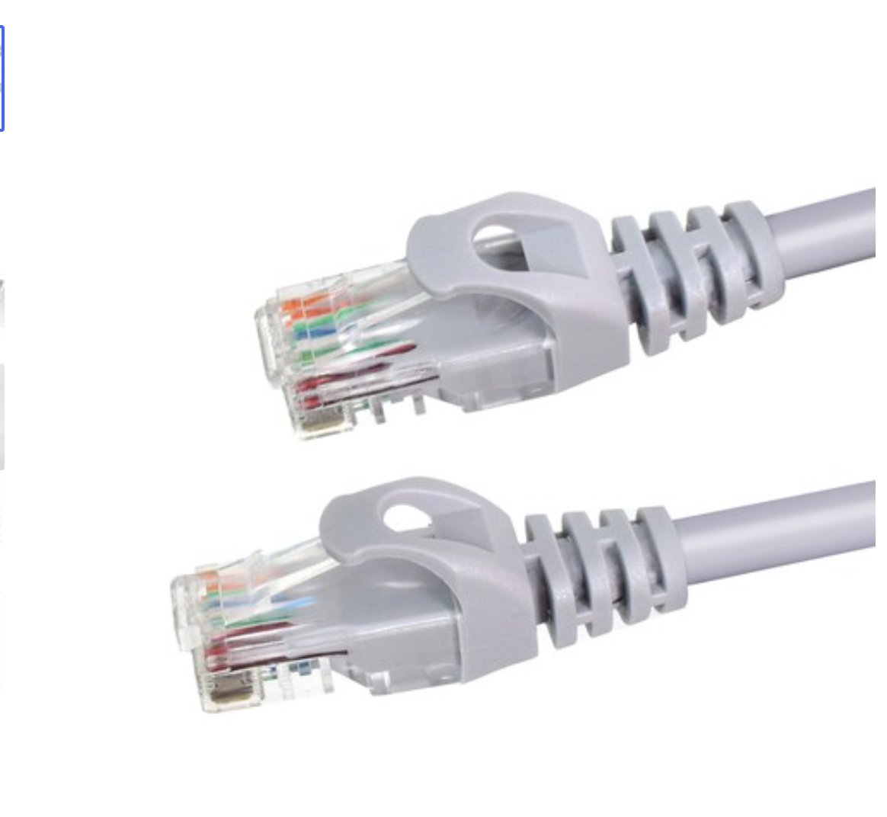
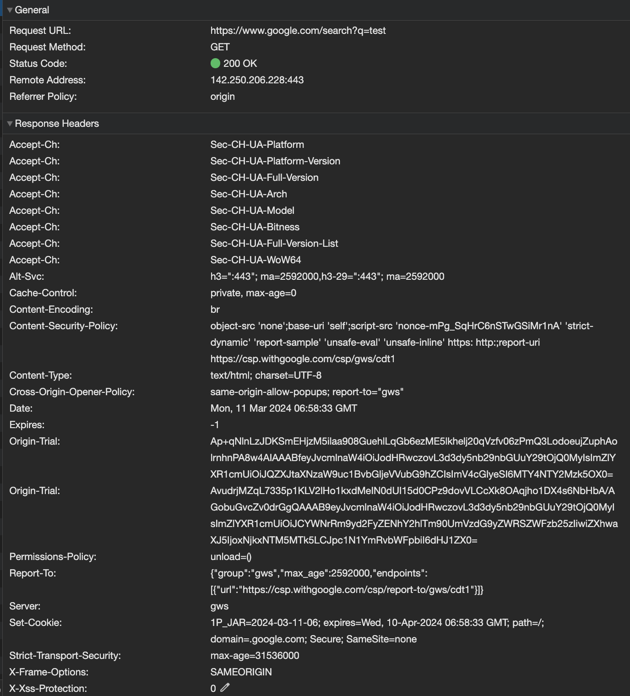

# 웹에서 요청과 응답의 전반적인 과정

## Intro

월드 와이드 웹(World Wide Web)은 인터넷에 연결된 사용자들이 **서로의 정보를 공유할 수 있는 공간**이라고 한다.

브라우저는 url로 해당 하는 서버에서 네트워크를 통해 html문서, 필요한 파일들을 받아와 내 화면에서 보여주는 역활을 한다.

그리고 프론트엔드 개발자의 역활은 어떤 기술을 사용하든 결국 **서버에서 제공해줄 `html`,`css`,`js`를 작성**하는 것이다.

우리가 작성한 파일이 사용자에게 가기까지의 긴 여정을 정리해보자.

<!-- truncate -->

## IP, URL, Domain

프론트엔드 기술면접 예상 질문에 단골인 *구글을 검색하면 웹은 무슨일을 할까*의 프로세스이다.

사용자에게 사이트를 보여주려면 브라우저는 사이트를 호스팅하는 서버를 찾아야 한다. 인터넷의 각 디바이스들은 `IP address`라는 고유한 주소를 가지는데, 서버를 찾는다는 건 해당 서버의 ip주소를 찾는다는 뜻이다.

> IPv4: 4개의 8비트(0 ~ 255)숫자로 구성, ex)192.0.2.1 최대 제공가능: 2 ** 32(대략 43억) 
> IPv6: 8개의 16비트를 16진수로 구성,ex)2001:0DB8:0000:0000:0000:0000:1428:57ab 최대 제공가능:2 ** 128(거의 무제한)

하지만 우리는 이런 `IP 주소`를 입력하지 않는다. `URL(Uniform Resource Locator)`을 입력한다. 우리가 일반적으로 생각하는 인터넷 주소이다. 그리고 **URL은 도메인을 포함한다.**

아래의 URL을 보자. 주소창에 입력하면 test를 검색한 구글 검색화면이 나올 것이다.
`https://www.google.com:443/search?q=test`

- https는 통신 프로토콜
- www.google.com는 domain
- :443 port번호(프로토콜 기본포트는 생략가능 - http:80,https:443)
- /search는 path
- ?q=test는 쿼리 스트링
- 참고로 #으로 시작되는 fragment도 있다.
  - 특정페이지의 특정위치로 스크롤이동없이 바로 이동

`domain`은 `서브도메인(subdomain)`, `이름(name)`, `최상위 도메인(TLD)`으로 나뉜다.

`www.google.com`은 도메인이다.

- "www"는 서브도메인 | 차상위도메인
  - 일반적으로 "world wide web"의 약자
  - 도메인 앞에 확장자로 서로 다른 서버를 가르킬 수 있음 `ex)_drive.google.com`
- "google"은 도메인의 이름 - 웹사이트를 운영하는 주체
- "com"은 최상위 도메인
  - 다양한 유형이 있음 `.com: company`,`.net: network`...

본론으로 돌아와서 URL은 도메인을 포함하고, 도메인을 알면 `DNS(domain name system)`으로 IP 주소를 알 수 있다. 그래서 URL을 입력하면 우리가 원하는 자원에 접근이 가능한 것이다.

## DNS(domain name system)

간단하게 **DNS는 `IP`와 `domain`을 매핑한 데이터베이스**로 우리가 입력한 URL에 포함된 domain이 DNS 서버를 통해 IP로 반환 된다.

순서는 다음과 같다.

1. 브라우저 캐시 확인 -> 최근에 방문한 사이트라면 남아 있을 수 있음
2. 호스트 파일 확인
   1. 운영 체제가 도메인 이름을 ip 주소에 매핑할 때 사용하는 컴퓨터 파일
   2. 맥의 경우 /private/etc/hosts 경로에 존재
3. 1,2번 과정(내부)에서 찾지 못했다면 외부의 DNS resolver(DNS recursor)에 요청(쿼리)
   1. 외부 DNS서버들에게 재귀적인 요청을 보내지만 자체 캐시도 가지고 있음
   2. ISP(인터넷 서비스 제공자)나 기업의 네트워크에서 호스팅
4. DNS resolver 캐시에 없다면, 요청한 도메인 이름에 대한 IP 주소를 찾기 위해 **DNS 계층 구조를 따라 계층적으로 탐색**
   1. root name server -> 최상위 도메인(TLD) 서버 -> 도메인 레지스트리 서버 -> 도메인의 네임서버
5. DNS resolver가 **IP 주소를 웹 브라우저로 반환** 및 캐싱(Time to Live(TTL))

위의 과정을 거쳐 검색할 도메인의 IP주소를 알게 되었다! 그 다음은?

## Network

이제 IP주소를 알고 있으니, 해당서버에 요청을 보내 원하는 응답을 받을 수 있을까?

요청을 보낸다는 건 내가 작성한 내용(로컬)이 외부로 전달된다는 이야기다. 이것이 어떻게 가능할까?

당연한 말이지만 일단 인터넷에 연결이 되어있어야 한다. 외부 DNS로 IP를 가져올 때도, 서버에 데이터를 요청할 때도 랜선이든 wifi든 일단 인터넷 연결이 되어있어야 가능하다. 이에 대해 알아보자.

랜선이라는 단어는 다들 알것이다. 랜선을 안꽂으면 온라인 게임을 할 수 없었으니까 ㅎㅎ...

쿠팡에서 가져온 랜선(UTP 케이블) 사진이다. 랜선을 컴퓨터에 꽂아주면 하드웨어의 유선랜카드와 연결 된다. 와이파이의 경우 무선랜카드를 사용한다.
랜카드는 NIC(Network Interface Controller), 네트워크 어댑터라고도 한다.

IP 주소는 네트워크 상의 논리적인 주소이고, 통신을 위해서는 실제 장비(랜카드)의 MAC 주소(Media Access Control)가 필요하기 때문이다.

잠깐 네트워크 간 통신이 일어나는 과정의 모델에 대해 보고 가자.
먼저 발표된 이론적인 모델 `OSI 7계층 모델`과 현실에서 동작하는 `TCP/IP 4계층 모델`이 있다.

### TCP/IP 4계층 모델

`TCP/IP 4계층 모델`로 4개의 계층으로 나뉜다.

- L4: Application Layer
  - 응용 프로그램이 이 계층에서 동작 (HTTP, FTP, SMTP, DNS 등)
  - 데이터 단위 : 데이터(Data) / 메세지(Message)
- L3: Transport Layer
  - 프로세스 간 신뢰성 있는 데이터 전송
  - 대표적인 프로토콜 TCP, UDP
  - 데이터 단위 : 세그먼트(Segment)
- L2: Internet(network) Layer
  - 호스트 간 논리적 데이터 전송
  - 대표적인 프로토콜 IP, ARP(IP address to Mac address), RARP(Mac address to IP address)
  - 데이터 단위 : 패킷(Packet)
- L1: Network Access Layer
  - 물리적 네트워크를 통한 데이터 전송
  - 대표 프로토콜: 이더넷, WiFi
  - 데이터 단위 : 프레임(Frame)

TCP/IP 요청을 보낸다는 것은 다음의 프로세스를 따른다.

### TCP/IP 전송과정

1. Application Layer에서 데이터를 생성하고 전송을 요청
2. Transport Layer에서 애플리케이션 데이터를 세그먼트로 캡슐화(포트 번호, 순서 번호등 TCP 헤더 추가)
3. Internet(network) Layer에서 TCP 세그먼트를 IP 데이터그램으로 캡슐화(출발지/목적지 IP 주소, 프로토콜 등의 IP 헤더 추가)
4. Network Access Layer에서 IP 데이터그램을 네트워크 접근 계층의 프로토콜에 맞는 프레임으로 캡슐화(출발지/목적지 MAC 주소, 프레임 체크섬 등)
5. 프레임을 물리적인 신호(전기, 광, 무선 등)로 변환하여 물리적 매체를 통해 전송(NIC가 디지털 신호를 아날로그 신호로 변조)
6. 서버의 NIC에 도착하면 역순으로 진행

~~굉장히 복잡하다. 대략적으로 알고 있었는데 글로 작성하려니 어우...~~

이렇게 복잡하게 Layer를 나눈 것은 다 이유가 있다. 프론트 개발자로 이부분에 대해 몰라도 개발과 배포에 전혀 지장이 없는 이유는 각 계층이 독립적이기 때문이다.

만약에 단순한 사이트를 배포하는데도 이러한 지식을 상세하게 알아야한다면 생각만 해도 어지럽다. 감사한 일이다.

이러한 과정을 통해 우리는 서버와 응답을 주고 받는다.

### TCP handshaking

`www.google.com/search?q=test` url을 브라우저에 입력한다고 가정해보자.

HTTP 요청을 서버에 전달하기 위해서는 클라이언트와 서버와 TCP 연결을 맺어야 가능하다.

TCP 연결을 맺는 과정은 `TCP`의 `3-way handshaking`으로 이루어 진다.

> 1. SYN
>    - 클라이언트가 서버에게 TCP 연결을 설정하고자 요청하기 위해 SYN 패킷을 전송
>    - 클라이언트의 초기 시퀀스 번호(Sequence Number)가 포함
> 2. SYN-ACK
>    - 서버는 클라이언트의 SYN 패킷을 받고, 연결 수락을 의미하는 SYN-ACK 패킷을 전송
>    - SYN-ACK 패킷에는 서버의 초기 시퀀스 번호, 클라이언트가 전송한 시퀀스 번호에 1을 더한 값이 포함
> 3. ACK
>    - 클라이언트는 서버의 SYN-ACK 패킷을 받고, 서버에게 연결 수락을 의미하는 ACK(Acknowledgment) 패킷을 전송
>    - 이때 ACK 패킷에는 서버의 초기 시퀀스 번호에 1을 더한 값이 포함

프로토콜을 명시하지 않은 경우 일반적으로 브라우저는 HTTP(80 port)를 사용하여 서버에 연결하려고 한다. HTTP로 연결 된다면 위 과정 이후 HTTP request를 전송한다.

하지만 많은 웹사이트에서 보안상의 이점, `SEO` 혜택등으로 `HTTPS`를 기본으로 사용하며 이를 위해 아래의 방식을 적용한다.

1. 서버측에서 HTTP 요청을 받더라도 HTTPS로 리다이렉트
2. HSTS(HTTP Strict Transport Security) header 사용 - 브라우저는 해당 웹사이트에 대한 모든 요청을 HTTPS로 자동 변환

HTTPS 요청에는 `TLS`(Transport Layer Security)가 사용된다. TLS는 TCP 위에 보안 계층을 추가한 프로토콜로, 데이터의 기밀성, 무결성 및 상호 인증을 보장한다.

> TLS가 도입 된 배경
>
> 1. 호스트 사이에 거쳐야 할 부분이 너무 많다. 이 거치는 지점(프록시 서버, 공유기, 네트워크 장비 등)에서도 요청&응답을 볼 수 있다는 문제점
> 2. 내가 통신하고 있는 상대방이 진짜 내가 원했던 상대방인지 알 수 없다.(중간에 있는 서버가 호스트인 것처럼 속이고 요청을 가로채서 응답하는 경우)
> 3. 요청을 보내서 상대방이 받는 도중 요청이 변조될 수 있고, 이 변조가 발생했는지 당사자들이 알 수 없다.
>    https://sysgongbu.tistory.com/152

`TLS`는 `TCP handshake`후 `SSL/TLS handshake`를 수행하는데 이는 **`공개키 암호화 방식`과 `대칭키 암호화 방식`을 결합한 암호화 방식**을 사용한다.

> 대칭키는 암호화 및 복호화에 같은 키를 사용하는 방식(키를 어떻게 교환할까?) 
> 비대칭키는 암호화 및 복호화에 다른 키를 사용하는 방식(Public Key, Private Key)

RSA 등의 공개키 암호화 알고리즘을 활용하여 초기에 안전하게 대칭키(세션키)를 교환하고, 이후 실제 데이터 전송에는 AES 등의 대칭키 암호화 알고리즘을 사용한다.

1. 클라이언트는 SSL/TLS Version(클라이언트가 지원하는 최상의 버전을 명시), ciphersuite list, random number를 서버에 전송
2. 서버는 적절한 SSL/TLS Version, ciphersuite을 선택
3. 서버는 자신의 공개키가 포함된 디지털 인증서를 클라이언트에게 보냅니다.
4. 클라이언트는 랜덤하게 생성한 대칭키(세션키)를 서버의 공개키로 암호화하여 전송합니다.
5. 서버는 자신의 개인키로 암호화된 대칭키를 복호화하여 대칭키를 얻습니다.
6. 이제 클라이언트와 서버는 동일한 대칭키를 공유하게 되어 이를 사용하여 데이터를 암호화할 수 있습니다.

## HTTP 통신

이제 IP주소를 알고, TCP 연결도 맺었다. 드디어 해당서버에 요청을 보내 원하는 응답을 받을 차례다.

하지만 어떻게 어떤 요청을 보내야 할까? 당연히 내 마음대로 보내진 않을 것이다. 각 클라이언트들이 요청을 제각각 보낸다면 서버측에서는 피곤할 것이다.

그래서 표준이 필요하고 **웹에서의 표준은 `HTTP 프로토콜`이다**.

> HTTP(HyperText Transfer Protocol) 요청은 웹 브라우저 또는 다른 클라이언트가 웹 서버에게 자원을 요청할 때 사용되는 프로토콜로 해당 프로토콜에 따라 자원을 전달 받는다.
>
> - 비연결성(Connectionless): request(요청)/response(응답) 구조 - 응답 후 연결종료
> - 무상태성(Stateless): 프로토콜에서 Client의 상태를 기억하지 않음

사용자가 브라우저에 `www.google.com/search?q=test` URL을 입력하면, 브라우저는 이 URL을 바탕으로 HTTP 요청 메시지를 생성하여 서버로 전송한다.

서버는 이 요청을 처리한 후, HTTP 응답 메시지를 생성하여 브라우저에게 전달한다.

브라우저는 이 응답을 받아 사용자에게 결과를 표시하는 것이다.

해당 메세지들은 브라우저에서 확인할 수 있다.

Http request의 구조는 다음과 같다.

1. start-line
   1. HTTP Method(GET, POST, PUT, DELETE...)
   2. 요청 URL
   3. HTTP 버전(1.0, 1.1, 2.0...)
2. header

   1. 요청의 추가 정보를 담고 있는 부분(Key-Value형식)
   2. Host: 요청하는 호스트의 도메인 이름 또는 IP 주소
   3. User-Agent: 클라이언트 소프트웨어(웹 브라우저)의 정보
   4. Accept: 클라이언트가 받을 수 있는 미디어 타입
   5. Content-Type: 요청 바디의 미디어 타입
   6. Cookie: 클라이언트가 서버로부터 받은 쿠키 정보...

3. body
   1. 일부 요청은 요청 바디를 포함하는데 주로 POST 요청

Http response의 구조는 다음과 같다.

1. status line
   1. 프로토콜 버전
   2. 상태 코드(Status Code): 서버의 처리 결과를 나타내는 세 자리 숫자(200,301,400,401,404...)
2. header
   1. 응답의 추가 정보를 담고 있는 부분(Key-Value형식)
3. body
   1. 응답 내용(HTML, 이미지, JSON...)

더 자세한 내용은 [/HTTP/Messages](https://developer.mozilla.org/ko/docs/Web/HTTP/Messages)를 참조하자.

이렇게 요청부터 응답까지의 전반적인 과정을 살펴봤다.

## Outro

이런 주제로 글을 작성하는 건 항상 어렵다. 이미 좋은 글들이 많이 있고 굳이 열화 복제판을 더해 사람들에게 혼란을 주고싶지 않으니까.

다만 공부라는 관점에서 글쓰기는 굉장히 도움 되는 것 같다. 알고 있던 지식도 막상 글로 작성하려면 턱턱 막힌다.

공개 된 곳에 올라갈 글에 오류를 넣고 싶진 않으니까 다시 한번 보게 되고 몰랐던 내용들도 줄줄이 사탕처럼 나온다.

이번 글에 파일들이 오기까지 과정을 작성했으니, 다음 글은 서버로부터 받은 파일을 어떻게 그리는지에 작성해야겠다.

오류를 혹시 발견하신다면 전달 부탁드립니다!!!
