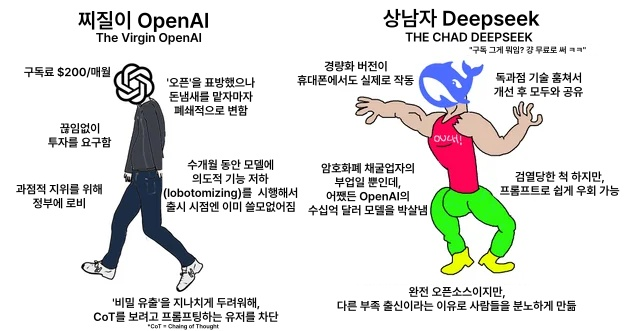

import LinkPreview from "@site/src/components/LinkPreview";

# 개발 관련 내용 둘러보는 글

 

항상 그랬겠지만 개발자로 살아남으려면 참 해야할 것, 알아야 할 것이 많다.

새로운 기술, 흥미로운 사이드 프로젝트, 유명 라이브러리의 구현 분석등...

보다보면 나만 뒤처진다는 생각이 들때가 많은데, 학습과 성장에 대해 스트레스를 받는 사람이 나뿐만 아닐 것이다.

<LinkPreview url="https://velog.io/@kimfield/2025%EB%85%84-%EC%B2%AB%EB%B2%88%EC%A7%B8%EA%B8%B0%EB%A1%9D-%ED%87%B4%EC%82%AC-%EA%B7%B8%EB%A6%AC%EA%B3%A0-%EC%83%88%EB%A1%9C%EC%9A%B4%EC%8B%9C%EC%9E%91" />

사람이 새싹도 아니고 어떻게 성장만 하겠는가!

공부할 시간 내기가 정말 쉽지 않은게 현실이다. 해도 까먹음... ㅠㅠ

사실 이건 방법이 없다... 그냥 해야한다. 한잔해🥂

나는 문제를 풀거나, [GeekNews](https://news.hada.io/), [velog trands](https://velog.io/), 유명 블로그들의 글들을 읽어보는 식으로 이모저모 살펴본다.

이번 포스팅은 여태 눈팅한 내용들에 대해 얉고 넓게 작성해본다.

{/* truncate */}

## 최근 LLM에 관해

개발자들은 참 AI라는 주제에 대해 할말도 많고, 고민도 많을 것 같다. 나 역시 그렇다.

정말 모든 사무직을 박살낼 것 같은 움직임을 보여주는데, 내 눈에도 찻잔 속의 태풍만은 아닐 것 같다.

### 최근 AI 업계에서 가장 큰 이슈는 딥시크일 것이다.

그래픽카드 규제를 받는 중국에서, 중국의 인재들이 낮은 비용으로 OAI의 GPT 최신모델에 비견되는 성능을 가진 모델을 출시한 것과 그 모델을 오픈소스로 공개한 것은 참 충격적인 일이었다.

2025년 1월 20일에 R1 공개 후, 온 매체에서 난리가 났고, 딥시크발 나스닥 폭락에 기술 유튜버뿐만 아닌 경제유튜버들까지도 딥시크에 대해 떠들었다.

<LinkPreview url="https://news.hada.io/topic?id=18824&utm_source=weekly&utm_medium=email&utm_campaign=202504" />

특히 엔비디아가 급락 했었는데(현재는 많이 복구), 최고성능의 LLM을 개발하는데 엔비디아의 그래픽카드가 필수적이지 않을 수 있다는 논지였다.

성능이 좋을 수록 무조건 유리하기에 일시적인 하락이라 생각했지만 매수는 안했었다 까비...

특히 고성능 LLM을 개발하기 위해서는 수천억이상의 비용이 든다는 생각을 딥시크는 완전히 부숴버렸는데 V3 모델에 투입된 개발 비용이 557만6000달러(약 78억8천만원)라고 한다.

| 모델             | 개발 비용 (추정) | 비고                                                    |
| ---------------- | ---------------- | ------------------------------------------------------- |
| **딥시크 V3**    | ~$5.57M          | 저비용, 강화학습 위주 개발 – 기존 빅테크 대비 매우 낮음 |
| **OpenAI GPT-4** | ~$100M+          | 대규모 데이터 및 컴퓨팅 인프라 투자 필요                |
| **Llama 3.1**    | ~$500M+          | 연구 및 인프라 투자 비용 포함                           |

딥시크가 비용 정보를 발표한 후, 사람들은 마크 주커버그가 빠따를 쳐도 무죄라더라🤣(실제로 MMA를 수련하고 있음)

<LinkPreview url="https://news.hada.io/topic?id=18896" />

물론 딥시크의 모델 개발비용이 굉장히 축소 발표 되었다는 의혹이 있지만 이에 대해 이 글에서는 넘어가겠다.

### 가장 최근에 나온 Grok3

그리고 최근에 나온 현시점 지구 2짱 일론의 Grok3이다.

현 시점 기준 현존하는 비추론 모델 중 벤치마크에서 가장 높은 성능을 내고, 검열의 수준도 낮으며 [무료로 사용가능](https://grok.com/chat)하다.

이번 모델을 통해 xAI는 후발주자로서 ai 경쟁에 OAI, Google, Meta, Anthropic, DeepSeek등 유의미한 플레이어로 합류했다고 본다.

<LinkPreview url="https://news.hada.io/topic?id=19297" />

나는 claude를 pro로 몇달 사용하다, 2달 전부터 GPT pro를 구독 사용중인데, 이번에 grok3을 찍먹 해봤을 때, 일반적으로 물어보는 내용중에서 유의미하게 성능차이가 난다고 느끼는 부분은 거의 없는 것 같다.

이미 LLM 모델들의 성능향상이 일반 사용자들의 요구사항을 충족시키기에는 차고 넘친다고 본다.

현 시점에 AGI는 이미 달성했다고 생각한다. 만약 아니더라도 2025년이 되자마자 터지는 AI 빅뉴스들을 지켜보고 있으면 인간지능을 초월하는 시점은 올해가 될 것 같다.

 

일론이 최고성능의 LLM을 시장에 내놓기까지를 잘 정리한 기사인데, 아이언맨의 모델 답다.

하수에겐 지옥이고, 고수에겐 놀이터인게 이 세상이라면 이정도면 주인공 아닐까?

<LinkPreview url="https://news.kbs.co.kr/news/pc/view/view.do?ncd=8183082" />

일론과 샘 알트먼의 대립도 참 흥미로운 주제다.

<LinkPreview url="https://www.youtube.com/watch?v=C9QumCJCT_I" />
<LinkPreview url="https://www.youtube.com/watch?v=y4KJ0bxFEjQ" />

### AI 공동과학자와 재귀개선

이것도 최근에 발표 된 내용인데, 제미니 2.0 모델을 기반으로 여러 agent를 만들어 agent끼리 특정 문제에 대해 연구하게 만들었더니,

논의 및 수정을 반복하여 실제 연구에서 성과를 냈다고 한다.

특히 증가된 컴퓨팅을 통한 재귀적 자기 개선 능력이 가장 무서운 능력이다.

그리고 멀티 에이전트 시스템은 LLM의 구애를 받지 않는데, 이는 모든 LLM으로 동일한 시스템을 구축할 수 있다는 것이다.(개인적으로 gemini 2.0 사용경험은 타 챗봇보다 별로였음)

사람은 이해도 못하는데, AI 혼자서 북치고 장구치는 세상이 머지 않은 것이다.

<LinkPreview url="https://research.google/blog/accelerating-scientific-breakthroughs-with-an-ai-co-scientist/" />

<LinkPreview url="https://www.unite.ai/ko/%EA%B5%AC%EA%B8%80%EC%9D%98-%EC%83%88%EB%A1%9C%EC%9A%B4-AI-%EA%B3%B5%EB%8F%99-%EA%B3%BC%ED%95%99%EC%9E%90--%EA%B3%BC%ED%95%99%EC%A0%81-%EB%B0%9C%EA%B2%AC-%EA%B0%80%EC%86%8D%ED%99%94%EB%A5%BC-%EB%AA%A9%ED%91%9C%EB%A1%9C-%ED%95%A8/" />

### AI가 개발자를 대체하게 될까

과거에서는 모든 문서작업을 손으로 했다고 한다. 그래서 그때는 손글씨를 잘쓰는 사람이 승진도 잘됐다더라.

컴퓨터와 excel의 등장은 수명의 일을 한명이 처리할 수 있도록 생산성을 올려줬다.

LLM의 발전은 사람의 충실한 도구가 될 것인가, 아예 사람을 대체 해버릴 것인가?

이세돌이 알파고에 패한 이후, 바둑이란 게임에서 사람이 AI를 이길 수 없다는 건 일반적 사실이 되었다.

그러면 프로바둑은 망했나? 프로바둑은 여전히 진행중이며 프로기사들이 AI기보를 보며 학습할 수는 있지만, 경기는 사람이 한다.

AI들이 프로보다 바둑을 더 잘두는데 왜 사람들이 하는 바둑을 지켜보는가?

예전에 스타크래프트에서도 AI가 사람을 이긴지는 한참 되었지만(물론 APM 이슈가 있다) 프로리그는 계속 되었었다.

이에 대한 생각은 스타나 바둑은 근본적으로 엔터테인먼트 사업이고, 사람들은 사람들이 하는 것을 보고 싶어한다는 것이다.

그러면 일반적인 사무직의 일이나 개발일은 어떤가.

내가 사용하는 서비스의 코드가 AI 생성인지, 사람이 한땀한땀 쓴 수제코드인지 사람들이 신경쓸까?

잘 동작하면 그만이라고 생각할 것 같다.

이런 관점으로 보면, 초반에는 AI를 활용하는 사람들이 활용하지 않는 사람들을 대체하다 결국은 사람을 전부 대체할 것 같다.

정말 극소수의 사람이 남거나 전부 대체 될수도 있을 것 같은데, 그나마 다행이라면 일반 사무직보다 개발관련 지식이 있는 사람이

AI 기술을 좀 더 잘 활용할 확률이 높을테니, 수명이 쬐끔은 더 길다고 본다.

모두가 CEO가 되는 사회가 도래할 수도 있겠지만, 해당 서비스도 AI로 생성한 서비스일 것이고 유망하다고 판단된다면

많은 사람들이 같은 종류의 서비스를 매우 쉽게 시작할 수 있을 것이다. 이는 수익화의 큰 애로사항이다.

그리고 서비스는 결국 사람이 이용해야 하는데, 서비스가 많아진다고 사람들이 서비스를 다 사용할 수 있는 것도 아니다.

결국 사람이 별로 필요없는 사회가 되는 것이다. 선진국에서 출산율이 낮은 수준을 유지하는 것은 사회에 필요한 인원들의 수가 감소하기 때문을 집단지성?으로 알게 모르게 인지하고 있다고 생각해서인데, 줄어드는 사람에 대한 수요만큼, 공급이 줄어들기 전까지는 과도기 단계가 있을 것 같다.

<LinkPreview url="https://news.hada.io/topic?id=19207" />

위글을 보고 이 주제에 대해 생각을 정리해봤는데 안그래도 나라경제도 팍팍한데 암울한 생각인건지,

그쯤 되면 기본소득이 실현 되어 인간의 노동 해방이 될지 유토피아냐 디스토피아일지 궁금하다.

## 사내 검색에 LLM 적용?

사내 검색에 `Elasticsearch`을 도입한 내용의 글은 종종 본 것 같은데, LLM을 도입한 글은 처음 봤다.

<LinkPreview url="https://tech.kakaopay.com/post/choonsiri/#%EB%82%B4%EC%9D%BC%EC%9D%98-%EC%B6%98%EC%8B%9C%EB%A6%AC" />

## t 함수 자동 래핑 스크립트

전에 맡았던 서비스에서 다국어를 지원 했었는데 이게 참 손이 많이 가는 일이었다.

기존에는 엑셀을 보고 번역팩을 개발자가 관리 했었는데, 엑셀에만 키 밸류를 작성하면 스크립트 호출 시, 빌드시점에 번역팩 생성하도록 했었다.

<LinkPreview url="https://tech.inflab.com/20250206-i18n-automation/" />

키 네이밍을 3번 방식의 느낌으로 작성했었는데,

인프랩은 기존의 한글 위주의 서비스를 효율적으로 다국어 서비스로 변환하기 위해 한글 키 방식 채택 & t 함수 자동 래핑 스크립트 만들기를 통해 처리했다한다.

'영문 키를 사용할 경우 대응되는 번역 키를 찾는 과정이 번거로움'에 바로 공감했고,

또 기존에 한글 텍스트를 영문키로 변환하는 과정을 스크립트로 처리하기가 어려웠을 것 같다.

그리고 변환과정을 스크립트로 처리한 것도 대단하다. 언젠가 적용할 일이 있다면 꼭 활용해보고 싶다.

## 최근에 살펴본 사이드 프로젝트

### BOJ Tester

<LinkPreview url="https://velog.io/@koomin1227/%EB%B0%B1%EC%A4%80-%EB%8D%94-%ED%8E%B8%ED%95%98%EA%B2%8C-%ED%91%B8%EB%8A%94-%EB%B2%95" />

백준을 풀 때 작성자가 느꼈던 불편함을 나도 느꼈었는데, extension으로 해결한 것이 멋있다.

최근에는 릿코드를 풀고 있어서 혹시나 릿코드도 유사한 extension이 있나 했더니 있네.

<LinkPreview url="https://github.com/LeetCode-OpenSource/vscode-leetcode" />

### 고딩들이 만든 모바일 청첩장 서비스

<LinkPreview url="https://velog.io/@yeseong0412/%EA%B3%A0%EB%94%A9%EB%93%A4%EC%9D%B4-%EB%A7%8C%EB%93%A0-%EB%AA%A8%EB%B0%94%EC%9D%BC-%EC%B2%AD%EC%B2%A9%EC%9E%A5-%EC%84%9C%EB%B9%84%EC%8A%A4" />

웹팩을 사용하고 있는 것 같은데, 개발모드로 배포를 한건지 소스가 노출되는 건 아쉽지만,

디자인도 이쁘고 취지도 좋다.

정말 대단한 고등학생이라고 생각한다. 강의도 내고 깃허브도 빼곡하고... 나는 그땐 게임밖에 안했는데 말이다.

### Termo - 웹에서 터미널 UI를 구현하는 터미널 에뮬레이터

<LinkPreview url="https://news.hada.io/topic?id=18331" />

데모를 사용해보니 신기하더라. 거기에 인도인 개발자!!

의외였던 건, 터미널 UI는 `xterm.js`에 약간 스타일링을 한 것이고,

`fireworks`, `poppers`같은 기능 역시 타 라이브러리(`canvas-confetti`)를 사용했다는 것이다.

보여주는게 이뻐서 찾아봤는데 소스를 봤는데 없어서 당황했었다.

<LinkPreview url="https://github.com/catdad/canvas-confetti?tab=readme-ov-file" />

### 또 흥미로워 보이는 프로젝트들

<LinkPreview url="https://news.hada.io/topic?id=18705" />

<LinkPreview url="https://news.hada.io/topic?id=18639" />

## CRA 지원 종료

<LinkPreview url="https://news.hada.io/topic?id=19242" />

`CRA`가 지원이 공식적으로 중단되었다. `vite`가 대세가 된지 좀 되었으니 그려려니 한다.

## 변경하기 쉬운 프론트엔드 코드를 위한 지침서

나 역시도 그렇지만 다들 더 나은 개발자가 되기를 추구할 것이다.

<LinkPreview url="https://frontend-fundamentals.com/" />

토스 프론트챕터에서 코드에 대한 표준으로, Rule과 구체적인 예제 사례를 제시한다.

가장 흥미있는 부분은 좋은 토론 모아보기로, 어떤 주제에 대해 다양한 프론트엔드 개발자들이 소통한 내용을 볼 수 있다는 것이다.

토론을 살펴보니, 좋은 의견을 달아주시는 분들이 많아서 댓글로도 학습할 내용들을 찾을 수 있었다.

<LinkPreview url="https://blog.hoseung.me/" />

개인적으로는 특히 이분의 댓글이 인상 깊어서 찾아봤더니, 21년에 고등학교를 졸업하셨다.

하하하...😭

## outro - mdx에 component import

이번 포스팅을 작성하다가 링크를 삽입하는 부분을 개선하려다 보니, 마크다운에 컴포넌트를 삽입하는 방식을 사용해보게 되었는데 나름 재밌었다.

컴포넌트를 만들고 MDX에 import하면 되는데, 다큐사우러스의 프론트매터와 import문의 순서에서 오류가 발생했다.

import문을 최상단에 두면 프론트매터가 텍스트 처리가 되고, 프론트매터를 최상단에 두면 import가 동작하지 않는 이슈였다.

이것저것 시도하다 프론트매터를 최상단에 import는 그 하단에 두고 사이에 주석을 추가하니 동작하더라;;

그러다 vscode에서 MDX 플러그인을 설치하니 해결되었다.

하다보니 궁금했던 건 mdx 파일에 react component를 import할 경우, 클라이언트에서 리액트 앱이 동작하고 있어야 하는가였다.

이는 React 런타임이 필요하지만, 그 런타임이 클라이언트에서 "동작 중"일 필요는 환경에 따라 다르다 한다.

이전에 링크를 쭈르륵 넣어놓은 것보다 훨씬 포스팅이 있어 보여 만족스럽다!
