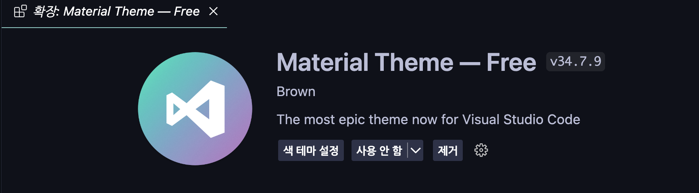

import LinkPreview from "@site/src/components/LinkPreview";

# Material Theme 이슈 해결하는 이야기

<br />

이번주에 발생한 일인데, 갑자기 잘사용하던 Material Theme extension을 vscode가 저절로 삭제했다.

기본 테마는 이미 material theme에 익숙해진 나에게 너무 불편했고, 다시 설치하니 vscode가 또 삭제하더라...?

나중에는 검색해도 안나오더라.


해당 이슈를 해결하는 이야기이다.

{/* truncate */}

## 삭제되는 이슈 해결하기

:::warning
**중요:** 참고 해야할 내용까지 읽어주세요!!!
:::

vscode는 extension을 식별자로 관리한다.

extension의 식별자는 `[publisher][name]`의 형식을 따르고, material theme의 식별자는 `equinusocio.vsc-material-theme`이다.

그래서 extension의 파일의 publisher나 name을 변경해서 식별자를 변경하고 설치하면, vscode가 삭제하지 않을거라고 생각했다.

### vsix 파일 설치

extension을 설치하려면 .vsix 파일이 필요하니, 파일을 먼저 찾아야 한다.

마켓플레이스나 아래 링크를 사용해서 vsix파일을 다운 받자.

<LinkPreview url="https://www.vsixhub.com/vsix/1533/" />

### 정보 변경

vsix파일은 기본적으로 ZIP 형식의 압축 파일이라 하니 먼저 압축을 풀어주자.

```bash
unzip Equinusocio.vsc-material-theme-34.7.9.vsix -d Brown.vsc-material-theme-34.7.9
```

vsix파일은 처음인데, 굉장히 익숙한 폴더구조에 뭘 바꾸면 될지 바로 느낌이 왔었다.

`package.json`에 publisher를 변경하자.


그리고 다시 압축한 후 설치를 해주자.

```bash
cd Brown.vsc-material-theme-34.7.9
zip -r ../Brown.vsc-material-theme-34.7.9.vsix *
cd ../
code --install-extension Brown.vsc-material-theme-34.7.9.vsix
```



따란🔥🔥🔥

~~이 방법 전에 삭제를 못하게 하려고, 심볼릭링크를 사용해 봤는데 vscode가 삭제는 못하지만 매번 경고메세지를 띄움~~

## 참고 해야할 내용

material theme이 뭔가 문제가 있어서 삭제됐다는 것만 알고 있었는데 포스트를 작성하려고 좀 더 알아봤다.

<LinkPreview url="https://github.com/microsoft/vsmarketplace/issues/1168" />
<LinkPreview url="https://news.ycombinator.com/item?id=43178831" />

위 글들의 쟁점에 대한 GPT의 요약이다.

> 라이선스 및 커밋 기록 삭제
> 원래 Apache 2.0(또는 MIT) 라이선스로 배포되던 Material Theme이, 기여자들의 기록을 삭제하며 닫힌 소스 형태로 전환되었다는 비판이 있습니다.
> 이 과정에서 원 저작권자 외 다수 기여자들의 기여가 은폐되었다는 점이 문제로 지적됩니다.
>
> 난독화된 코드와 악성 의혹
> 확장에 포함된 index.js 파일과 기타 코드가 난독화되어 있으며, 일부에서는 이를 악의적 행동의 징후로 보기도 합니다.
> 여러 사용자가 난독화된 코드 내에 “이상한” 의존성(예: 오래된 sanity.io 라이브러리)이나 불필요한 기능이 포함되어 있다고 주장합니다.
> 반면, 일부는 실제 악성 코드가 발견되지 않았으며 단순히 “의심스러운” 부분일 뿐이라고 주장합니다.
>
> VS Code 마켓플레이스의 대응
> Microsoft 측에서는 커뮤니티의 보안 분석 결과를 바탕으로 해당 확장을 마켓플레이스에서 제거하고, 사용자들에게 강제 언인스톨 조치를 내렸습니다.
> 제거 이유는 라이선스 문제나 저작권 분쟁과는 무관하게 “악의적인 의도”와 의심스러운 코드 때문이라는 설명이 제공되었습니다.

**요지는 악의적인 행동이 일어났다는 증거는 없지만, 문제로 볼 수 있는 요소들이 있다는 것이다.**

아래는 수상해보이는 코드를 지운 버전을 만들었다는 유저의 글과 레포지토리이다.

<LinkPreview url="https://t3.gg/blog/post/equinusocio" />
<LinkPreview url="https://github.com/t3dotgg/vsc-material-but-i-wont-sue-you" />

material theme을 설치할꺼라면, 위 내용들을 한번은 확인해보길 바란다!

## outro

원래 삭제되는 이슈를 해결하는 간단한 글을 작성할 생각이었는데, 덕분에 시간을 더 소요했다.

다음은 블로그 최고의 인기글 터키트립을 이어가는 상하이 여행기를 작성할 예정이니 많관부!!!
