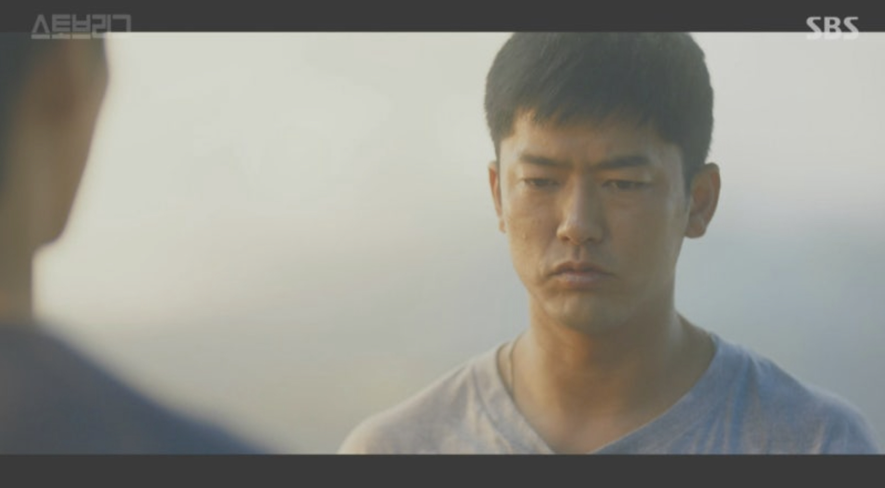

import LinkPreview from "@site/src/components/LinkPreview";

# 흔한 FE 개발자 회고 - 2

 

회고 1편을 쓰고, 보니 내가 이 블로그를 시작한 시기가 그맘때더라

그때 쓴 1년차 회고를 보니 참 시간 빠르다. 나는 내가 이렇게 될 줄 알았을까?

그때의 내가 지금의 나를 보면 어떨까 궁금하다.

<LinkPreview url="https://music.bugs.co.kr/track/1553550" />

{/* truncate */}

## 첫 회사생활 이후

22년 4월쯤 루나 코인 사태라는 코인 시장에 엄청난 폭풍이 왔다.

이때 FTX도 망하고 코인시장이 급 나락으로 가게 되는데, 회사도 사정이 안좋아졌다.

조직도 3분의 1만 남게 되고 서비스도 코인 거래소에서 코인 대리 투자 형태의 서비스로 변경한다.

이때 퇴사하신 분들이 다들 역량이 있으셨지만서도 이직을 금방금방 좋은곳으로 하셔서, 나는 개발자는 이직이 잘되는구나라는 엄청난 착각을 하게 된다.

남은 인원끼리는 으쌰으쌰해서 서비스도 출시하고, 회사의 메인 전략이 잘나가면서 50비트이상 운용하게 된 순간도 있었다.

그러다 23년에 코인 상승장을 예측하면서 전략 다변화 및 커버드 콜의 전략을 수정했는데, 타이밍을 못맞추면서 손실이 나기 시작헀다.

근본 전략이 흔들리자 투자금은 빠르게 빠져나갔고, 결과적으로는 서비스를 접게된다.

지금 생각해보면 상승흐름이 올거라는건 맞췄지만, 전략 특성상 상승 시점을 일주일 단위로 맞춰야 했다는 점, 포지션을 공개로 수행했다는 점이 실패의 원인으로 생각된다.

투자받아 전략을 수행하던 유사 온체인 서비스들도 대부분의 전략이 손실인 케이스가 많았는데, 이러한 이유가 아닐까 추측해본다.

포지션이 노출되어 있으면 연기금도 털리는데, 몰라서 안털리는거지 알면 안털릴 수가 없는 것 같다.

## 첫 이직 썰

그렇게 이직을 준비해야 하는 상황이 된 나는 가장 먼저 동료 개발자와 14박 터키 여행을 다녀온다.

회사가 사업을 종료했기에 실업급여 대상이기도 했고, 나름 열심히 했었는데 마음도 싱숭생숭했고, 이직이 대한 고민도 크지 않았다.

빨리했으면 그나마 좀 더 상황이 나았을 텐데, 작년에 사람들이 잘됐던 기억에 안일하게 생각했다.

2년반 동안 열심히 했고, 나름 인정도 받고 하다보니 우물안 개구리 상태였달까? 아주 건방진 상태였다.

그래서 그런지 살면서 참 많이 지원해보고 면접을 보고 떨어져본다.

4월쯤 합격을 준 회사도 있었지만, 3곳의 2차 결과를 기다리고 있어 거절했다가 불합격 받은 건 지금도 어지럽다.

그 이후로 멘탈 잡고 구직하다 두번째 회사를 만나게 된다.

## 두번째 회사생활

개발팀이 3명(팀장,FE, BE)에 기존 FE 퇴사 후, 신입으로 뽑은 FE가 혼자서 못한다고 나간다해서 대타로 들어온 자리였다.

외주를 받아 구축한 뒤 기존 FE가 1년정도 유지 및 개발을 진행했다 들었는데, 진짜 구현만 되게끔 구축한 뒤 기능을 덕지덕지 붙여놓은 유지보수하기 코드베이스였고

첫 회사 FE 코드(내가 입사전 21년 6월 이전에 구축된)보다도 3년은 뒤쳐진 레벨이었다.

이 얘기를 팀장과 해보니 시기적으로 비슷했던게 신기하더라. FE 1인 개발에서는 내가 빨리 뛸 수 있는 환경을 만드는 게 중요한데

현재 코드베이스에서는 빠르게 개발을 할 수 없다고 판단했고 오자마자 신규 기술 스택으로 AS-IS 작업을 시작한다.

이 작업을 하면서 고통이 컸지만 또 많이 배웠다. 재구축, 리팩토링은 역량이 요구되는 멋있는 일처럼 느껴지지만,

실상은 기존 시스템 파악이라는 노가다 위에서만 가능하다는 것 같은...

기존의 기능의 맥락과 동작을 파악하고 신규 베이스에서 구현을 해야하는데, 서비스와 코드베이스의 이해도가 낮은 상태에서 이 작업을 질러버린 것이다.

규모가 큰 프로젝트였다면 물리적으로 불가능했겠지만, 기존에도 1명이 개발하던 프로젝트 + 나의 열정 + 팀원의 도움으로 한달 반정도로 마무리 했던 것으로 기억한다.

리뉴얼이 마무리 될 때쯤(추석 언저리), 투자를 위해 유통사를 위한 프라이빗 쇼핑몰을 만들어야 된다고 하더라.

당시 나(3년차), BE(2년차) 둘이서 이제 쇼핑몰을 개발을 시작했고, 2 ~ 3월쯤에 기초적인 기능은 완성되었다.

사용하기로 했던 유통사에서 4월정도쯤부터 테스트 사용을 시작 했었는데... 부디 잘쓰고 있길 바란다.

25년 3월말부터 기존 서비스 개발을 시작하는데, 서버쪽 업무가 바빠서 API 개발을 찍먹하게 된다.

그러다 재직 1년 직전에 개발팀을 외주화할 계획이라고 나가달라고 하길래, 알겠다고 하고 2주 만에 나오게 된다.

## 그후 ~ 현재

이때 진로를 고민했을 때, 나는 서버 개발을 포함하는 풀스택으로 가야겠다는 생각이 들었다.

AI가 좋아질수록 개인이 할 수 있는 영역이 늘어나고, 약간 답답하면 내가 뛰어야지라는 생각도 있었다.

이렇게 김영한님 강의를 기반으로 5개월간 자바 스프링 폐관수련을 하는데, 안 쓴지 1년이다보니 이젠 기억도 가물가물하다.

공부만을 위한 공부는 더이상은 naver...

한 5개월 쯤 공부 하고, 이제 구직을 하려는 내 타켓 포지션은 FE 기반의 풀스택 개발자였다.

하지만 막상 보면 서버기반의 어드민 정도 구현해본 풀스택 개발자의 수요가 있지, 내가 원하면서도 나를 원하는 자리는 좀 찾기 어려웠다.

SI/SM 쪽은 풀스택으로 하는 포지션이 많다고 생각해, 눈을 돌려 면접을 한 3군데 정도 봤다.

기술 인터뷰라기보다는 만담을 하더라. 이때 좀 현타를 느꼈다. 그 다음 면접은 순수 FE 포지션에 집이 멀어서 별 기대 안했는데,

가보니 제대로 된 기술 면접을 진행했고 정말 신기하게 스쳐가는 인연이 있었던 곳이었고,

면접 직후, 바로 연락을 주셔서 한번 경험해보자하고 시작한게 지금까지 다니고 있다.

여기서는 FE 팀으로 내가 녹아날 수 있는지, 그동안 쌓아온 역량이 과연 유효한지등이 궁금했고 어느정도 해답은 얻었다.

거리가 멀어서 반년이상은 절대 무리라고 생각했는데 벌써 곧 1년이네... 시간은 너무 빠르다.

## outro

개발 공부 시작부터 현 시점까지 상세히 풀어보았다. 공부나 개발관련 이것저것들을 꾸준히 하긴 했지만

나라는 사람에 물음표를 없앨 수 있는 노력이 필요하지 않았나 싶다. 사실상 커리어 역주행이 아닌가...

언젠가 결혼을 하고 가정을 꾸릴텐데, 그저 평범함을 지킬 수 있는 사람이길 바래본다.
