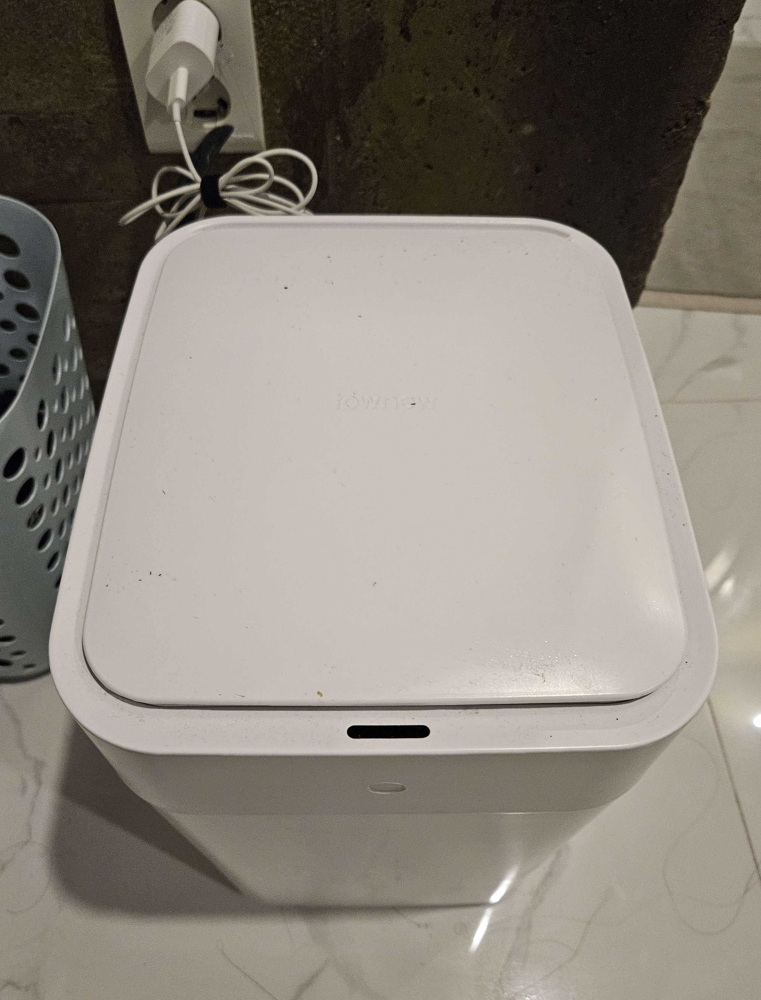

import LinkPreview from "@site/src/components/LinkPreview";

# 토뉴 쓰레기통 수리하는 이야기

 

몇 년 동안 우리 집에서 있던, 샤오미 쓰레기통으로 유명한 토뉴 쓰레기통이 8월 중순쯤 갑자기 고장났다.

손을 흔들어도 열리지 않는 현상...

새로 사자니 10만원이 넘고, 그냥 쓰레기통으로 바꾸자니 아쉬운 상황에서 보다보니 센서는 동작하는 것 같았다.

뭔가 이거 고칠 수 있을 것 같은데 싶었다.

{/* truncate */}

처음에 든 생각은 모터만 사서 바꿔 끼우면 되겠네 였다.

<LinkPreview url="https://m.blog.naver.com/anyoya/224074396105" />

정보를 찾다가 위 글을 봤는데, 같은 모델에 아주 상세히 사진을 첨부해주셨다.

모터 가격은 새로 쓰레기통을 사는 비용에 비하면 거의 거저다.

수리는 모터를 받아서 위 글에 적힌 그대로 진행하면 된다. 생각보다 쉽더라.

이렇게 끝나면 이글을 쓰는 이유가 없지. 간단한 팁을 남겨본다.

1.  나사를 꺼내기 힘들기 때문에 자석? 드라이버가 있으면 확실히 좋다.
2.  6번 과정까지 휴지통을 뉘여서 진행했을텐데 약간 들어주면 잘 분리가 된다.
3.  7번 까만색 모터 하우징 4곳의 나사를 풀어줍니다. 에서 모터에도 나사를 풀어야 빠진다. 당연한 걸 수도 있지만 이부분에 대한 내용이 없어 헤맸다.
4.  정품모터?보다 알리 모터가 축이 약간 짧은데 동작에는 문제 없다.
5.  13번에 재조립하기 전에 빨간 박스 센서와 잘 맞물리는지 확인하라고 하는데 이부분에 문제가 있으면 쓰봉 교체하는 기능에 문제 생기므로 2번 확인하자

잘하는 사람은 금방할 것 같은데, 이래저래 2시간정도 소요했다.

고장나면 다음은 없을테니 건강하자!
