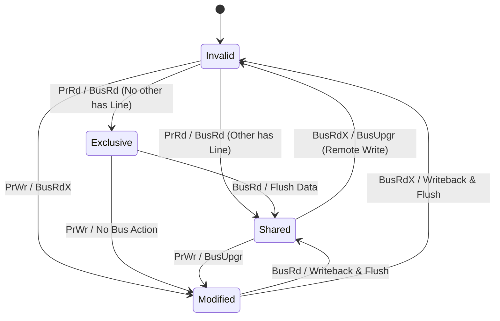
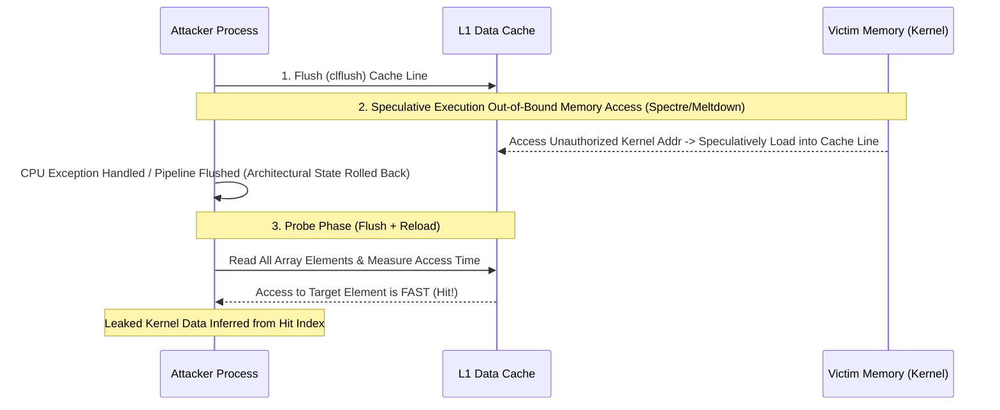

# 고성능 캐시 메모리 이론, AMAT 정량 수식 및 MESI/MOESI 캐시 일관성 프로토콜

<br />

대학원 미시아키텍처 연구에서 캐시 계층 구조(Cache Hierarchy)는 AMAT(Average Memory Access Time) 최적화 문제로 정상화된다.

이 문서에서는 다층 캐시 계층 수식 모델, N-Way Set Associative 하드웨어 비트 파티셔닝, 스누핑(Snooping) 및 디렉토리(Directory) 기반 캐시 일관성 프로토콜, 그리고 캐시 측채널 공격(Cache Side-Channel Attack)의 하드웨어 원리를 정밀 다룬다.

---

## 1. AMAT (Average Memory Access Time) 정량적 수식 모델

$L_1, L_2, L_3$ 다층 캐시 계층 및 DRAM 메모리로 구성된 시스템에서의 평균 메모리 접근 시간 수식:

$$\text{AMAT} = t_{\text{L1}} + MR_{\text{L1}} \times \text{MP}_{\text{L1}}$$

$$\text{MP}_{\text{L1}} = t_{\text{L2}} + MR_{\text{L2}} \times \text{MP}_{\text{L2}}$$

$$\text{MP}_{\text{L2}} = t_{\text{L3}} + MR_{\text{L3}} \times t_{\text{DRAM}}$$

$$\therefore \text{AMAT} = t_{\text{L1}} + MR_{\text{L1}} \left( t_{\text{L2}} + MR_{\text{L2}} \left( t_{\text{L3}} + MR_{\text{L3}} \cdot t_{\text{DRAM}} \right) \right)$$

* $t_{\text{Lx}}$: $L_x$ 캐시 히트 타임 (Hit Time)
* $MR_{\text{Lx}}$: $L_x$ 국소 미스율 (Local Miss Rate, $MR_{\text{Local}} = \frac{\text{Misses at } L_x}{\text{Accesses to } L_x}$)
* $MR_{\text{Global, Lx}}$: 전역 미스율 (Global Miss Rate, $MR_{\text{Global, Lx}} = \frac{\text{Misses at } L_x}{\text{Total CPU Memory Accesses}}$)

---

## 2. N-Way Set-Associative 주소 비트 분할 정리

주소 공간이 $A$ 비트이고, 캐시 용량이 $C$ Bytes, 캐시 블록 크기가 $B = 2^b$ Bytes, Associativity가 $N$-way 일 때:

1. **Offset Bits ($b$)**:
   $$b = \log_2(B)$$

2. **Total Sets ($S$)**:
   $$S = \frac{C}{B \times N} = 2^s \implies s = \log_2\left( \frac{C}{B \times N} \right)$$

3. **Tag Bits ($t$)**:
   $$t = A - (s + b)$$

```mermaid
bit-field
    0-5: "Offset (b bits)"
    6-17: "Index (s bits)"
    18-63: "Tag (t bits)"
```

### 2.1 세트 연관성(Associativity) 수확 체감의 법칙

Miss Rate $MR$과 Associativity $N$ 사이의 경험적 추정 공식:

$$MR(N) \approx MR(1) \times N^{-\alpha} \quad (0.3 \le \alpha \le 0.5)$$

$N > 8$ 이상 증가 시 미스율 감소 효과는 극히 미미해지며, 콤파라터(Comparator) 하드웨어 복잡도 및 딜레이 $t_{\text{Hit}} \propto \log_2 N$ 증가로 인해 AMAT가 오히려 악화되는 역전 현상 발생.

---

## 3. 멀티코어 캐시 일관성 프로토콜: MESI / MOESI / MESIF

### 3.1 MESI FSM (Finite State Machine) 상태 전이 표



| 상태 (State) | 유효성 (Valid) | 메모리 일치 (Clean) | 다른 캐시 소유 여부 | 쓰기 권한 |
| --- | --- | --- | --- | --- |
| **M (Modified)** | Valid | **Dirty (불일치)** | 독점 (None) | 예 |
| **O (Owner - MOESI)** | Valid | **Dirty (불일치)** | 공유 (Shared) | 메모리 대리 응답 전용 |
| **E (Exclusive)** | Valid | Clean (일치) | 독점 (None) | 예 (버스 업그레이드 없이 가능) |
| **S (Shared)** | Valid | Clean (일치) | 공유 (Exist) | 아니오 (BusUpgr 인가 필요) |
| **I (Invalid)** | Invalid | N/A | N/A | 아니오 |

* **MOESI (AMD)**: Owner 상태 추가로 Dirty 캐시 라인을 DRAM 쓰기(Writeback) 없이 다른 캐시에 직접 전달 가능.
* **MESIF (Intel)**: Forward 상태 추가로 Shared 라인 읽기 요청 시 대표 캐시 1개만 응답하도록 보장하여 버스 트래픽 폭증 방지.

---

## 4. 하드웨어 캐시 측채널 공격 (Cache Side-Channel Attacks)

투기적 실행(Speculative Execution) 및 캐시 타이밍 차이를 악용한 하드웨어 보안 취약점 메커니즘.



1. **Flush+Reload**: `clflush` 명령어 기반 공유 모듈 캐시 라인 제거 후, 관측 대상의 재로드 시간에 따른 `Hit(Fast)` / `Miss(Slow)` 정밀 판별.
2. **Prime+Probe**: 공격자가 특정 세트를 자신의 데이터로 채운(Prime) 후, 피해자 실행 후 세트 쫓겨남(Eviction) 탐지(Probe).
