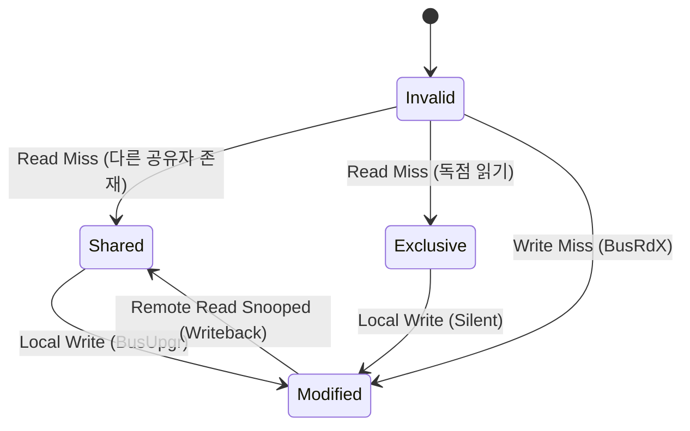

# 고성능 캐시 메모리 이론, AMAT 정량 수식 및 MESI/MOESI 캐시 일관성 프로토콜

<br />

대학원 미시아키텍처 연구에서 캐시 계층 구조(Cache Hierarchy)는 AMAT(Average Memory Access Time) 최적화 문제로 다뤄진다.

이 문서에서는 다층 캐시 계층 수식 모델, N-Way Set Associative 하드웨어 비트 파티셔닝, 스누핑(Snooping) 및 디렉토리(Directory) 기반 캐시 일관성 프로토콜, 그리고 캐시 측채널 공격(Cache Side-Channel Attack)의 하드웨어 원리를 다룬다.

---

## 1. AMAT (Average Memory Access Time) 정량적 수식 모델

L1, L2, L3 다층 캐시 계층 및 DRAM 메모리로 구성된 시스템에서의 평균 메모리 접근 시간 수식:

- **AMAT** = `t_L1 + MR_L1 * MP_L1`
- **MP_L1** = `t_L2 + MR_L2 * MP_L2`
- **MP_L2** = `t_L3 + MR_L3 * t_DRAM`
- **전체 통합 수식**:
  `AMAT = t_L1 + MR_L1 * (t_L2 + MR_L2 * (t_L3 + MR_L3 * t_DRAM))`

* `t_Lx`: L_x 캐시 히트 타임 (Hit Time)
* `MR_Lx`: L_x 국소 미스율 (Local Miss Rate)
* `MP_Lx`: L_x 미스 페널티 (Miss Penalty)

---

## 2. N-Way Set-Associative 주소 비트 분할 정리

주소 공간이 $A$ 비트이고, 캐시 용량이 $C$ Bytes, 캐시 블록 크기가 $B = 2^b$ Bytes, Associativity가 $N$-way 일 때:

1. **Offset Bits ($b$)**: $b = \log_2(B)$
2. **Total Sets ($S$)**: $S = C / (B \cdot N) = 2^s \implies s = \log_2(C / (B \cdot N))$
3. **Tag Bits ($t$)**: $t = A - (s + b)$

```
+-------------------+--------------------+-------------------+
|    Tag (t bits)   |   Index (s bits)   |   Offset (b bits) |
+-------------------+--------------------+-------------------+
```

---

## 3. 캐시 일관성 프로토콜 (MESI & MOESI)

다중 코어 프로세서에서 각 코어의 L1/L2 로컬 캐시 간 데이터 불일치를 방지하기 위한 상태 전이 프로토콜이다.

| 상태 | 명칭 | 설명 |
|---|---|---|
| **M (Modified)** | 수정 상태 | 해당 캐시에만 최신 데이터가 존재하며, 메인 메모리와 불일치(Dirty)함 |
| **E (Exclusive)** | 독점 상태 | 해당 캐시에만 데이터가 존재하나, 메모리와 일치(Clean)함 |
| **S (Shared)** | 공유 상태 | 여러 코어의 캐시에 동일한 복사본이 존재함 (읽기 전용) |
| **I (Invalid)** | 무효 상태 | 유효한 데이터가 없음 (접근 시 Cache Miss 발생) |
| **O (Owner)** | 소유 상태 (MOESI) | 메모리 갱신 없이 다른 코어에 데이터를 직접 브로드캐스트할 권한 소유 |


