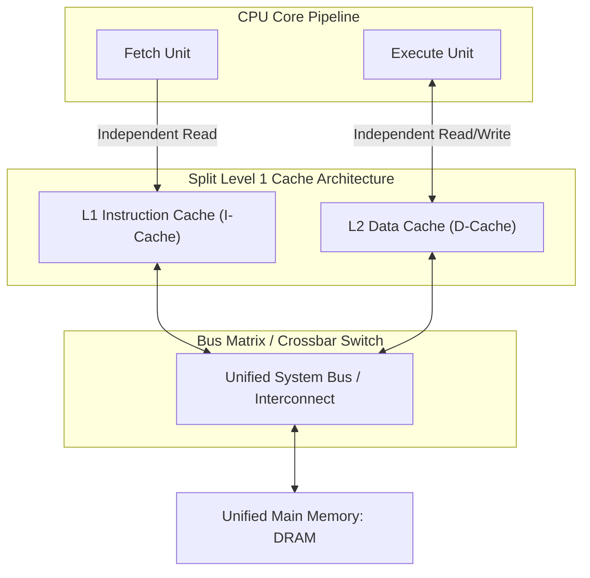

# CPU 미시아키텍처, 암달의 법칙 및 메모리 버스 대역폭 정밀 분석

 

대학원 과정에서의 마이크로프로세서 분석은 단순 기능 분할을 넘어 정량적 성능 방정식(Quantitative Performance Equation), 전력 대비 성능(Power-Performance Pareto Frontier), 메모리 뱅크 수준 인터리빙(Bank-Level Parallelism) 및 온칩 인터커넥트(On-Chip Interconnect) 파이프라이닝의 물리적 한계를 다룬다.

---

## 1. 정량적 성능 모델 (Quantitative CPU Performance Model)

### 1.1 CPU Execution Time 수식 모델

CPU의 프로그램 실행 시간 $T_{\text{CPU}}$는 명령어 수(Instruction Count, $IC$), 명령어당 평균 클록 주기(Cycles Per Instruction, $CPI$), 클록 주기($\tau$) 또는 클록 주파수($f_{\text{clk}}$)의 상호작용으로 정량화된다.

$$T_{\text{CPU}} = IC \times CPI \times \tau = \frac{IC \times CPI}{f_{\text{clk}}}$$

* **Global $CPI$ 방정식**:

$$CPI = CPI_{\text{ideal}} + CPI_{\text{stall}} = CPI_{\text{ideal}} + \sum_{i} \left( \text{Rate}_i \times \text{Penalty}_i \right)$$

$$\text{Where } \text{Rate}_i \text{ is the frequency of hazard/miss type } i \text{ and } \text{Penalty}_i \text{ is the stall cycles.}$$

---

### 1.2 암달의 법칙 (Amdahl's Law) 및 병렬화 확장 모델

시스템의 특정 구성 소자를 개선할 때 얻는 전체 속도 향상 비율(Speedup, $S_{\text{overall}}$)은 개선된 영역의 병렬 비율($p$)과 해당 영역의 개선 배수($s$)로 결정된다.

$$S_{\text{overall}} = \frac{T_{\text{old}}}{T_{\text{new}}} = \frac{1}{(1 - p) + \frac{p}{s}}$$

$$\lim_{s \to \infty} S_{\text{overall}} = \frac{1}{1 - p}$$

#### 병렬 처리 한계 해석
$p = 0.95$ (95% 병렬화)인 고성능 컴퓨팅 워크로드라 하더라도, 직렬 연산 구간 $1 - p = 0.05$로 인해 임의의 무한대 무작위 코어 수($s \to \infty$)를 투입했을 때 얻을 수 있는 이론적 속도 향상 상한선은 최대 20배($\frac{1}{0.05} = 20$)로 제한된다.

---

## 2. 폰 노이만 병목현상 (Von Neumann Bottleneck)과 하버드 아키텍처

### 2.1 물리적 병목 및 Memory Wall

명령어 메모리와 데이터 메모리가 단일 Bus를 공유할 때 발생하는 **폰 노이만 병목현상**:

$$\text{Throughput}_{\text{Max}} = \min\left( \text{BW}_{\text{Bus}}, \text{Rate}_{\text{ALU}} \right)$$

현대 미시아키텍처에서는 $\text{Rate}_{\text{ALU}} \gg \text{BW}_{\text{Bus}}$ 조건이 성립하여 CPU 내부 파이프라인 정체(Stall)의 80% 이상이 메모리 대역폭 한계에서 기인한다.

### 2.2 하버드 아키텍처 (Harvard Architecture) 및 Split L1 Cache

* **구조적 해저드 제거**: Fetch와 Memory Access 단계가 동일 사이클에 병렬 수행 가능.

---

## 3. DRAM 셀 물리, 뱅크 인터리빙 및 메모리 버스 대역폭

### 3.1 DRAM 셀 물리적 전하 누설과 Refresh Overhead

DRAM 1T1C (1-Transistor 1-Capacitor) 셀 전하량 $Q$:

$$Q = C_{\text{cell}} \times V_{\text{DD}}$$

Capacitor 전하 누설 전류 $I_{\text{leak}}$에 따른 전압 강하:

$$V(t) = V_{\text{DD}} \cdot e^{-\frac{t}{R_{\text{leak}} C_{\text{cell}}}}$$

$V(t) < V_{\text{ref}}$ (센스 앰프 임계 전압)에 도달하기 전 주기적인 **Refresh Cycle ($\sim 64\text{ms}$)** 필수. Refresh 수행 중 해당 셀 뱅크 접근 불가.

---

### 3.2 뱅크 수준 병렬성 (Bank-Level Parallelism, BLP) 및 인터리빙

DRAM chip 내부의 $M$개 독립 뱅크(Bank)를 주소 하위 비트 기반으로 인터리빙(Interleaving) 처리하여 $t_{\text{RAC}}$ (Row Access Strobe Latency)를 은폐함.

```mermaid
gantt
    title N-Way Bank Interleaved Memory Access
    dateFormat X
    axisFormat %s

    section Bank 0
    RAS / Row Activate :active, 0, 4
    CAS / Data Transfer :done, 4, 5

    section Bank 1
    RAS / Row Activate :active, 1, 5
    CAS / Data Transfer :done, 5, 6

    section Bank 2
    RAS / Row Activate :active, 2, 6
    CAS / Data Transfer :done, 6, 7

    section Bank 3
    RAS / Row Activate :active, 3, 7
    CAS / Data Transfer :done, 7, 8
```

#### 메모리 대역폭 수식 모델

$$\text{Effective Bandwidth} = f_{\text{bus}} \times \text{Bus Width (Bytes)} \times \text{Data Rate Factor} \times \eta_{\text{interleaving}}$$

$$\text{Where } \text{Data Rate Factor} = 2 \text{ (DDR)}, 4 \text{ (QDR) and } \eta_{\text{interleaving}} = 1 - P(\text{Bank Conflict})$$
