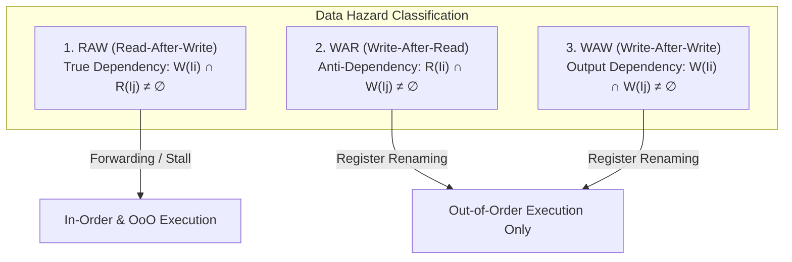
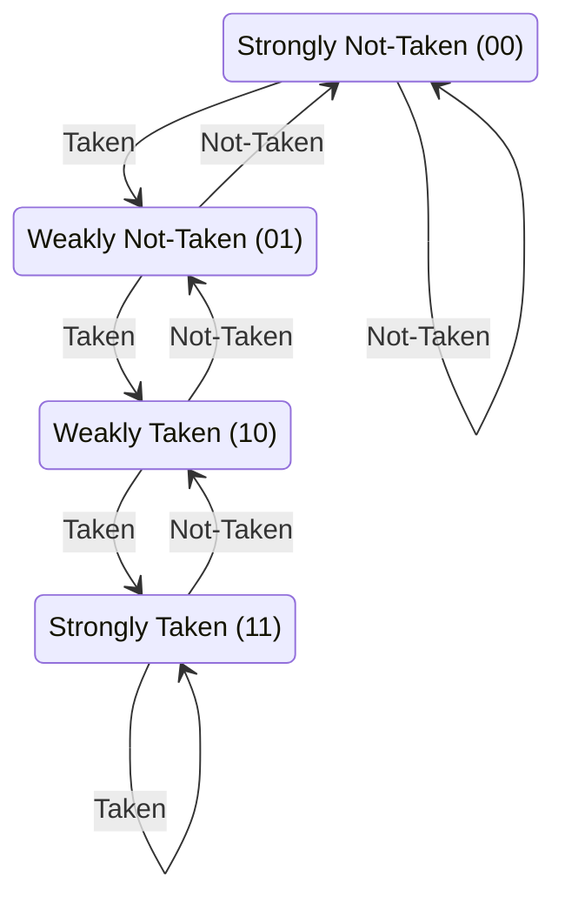
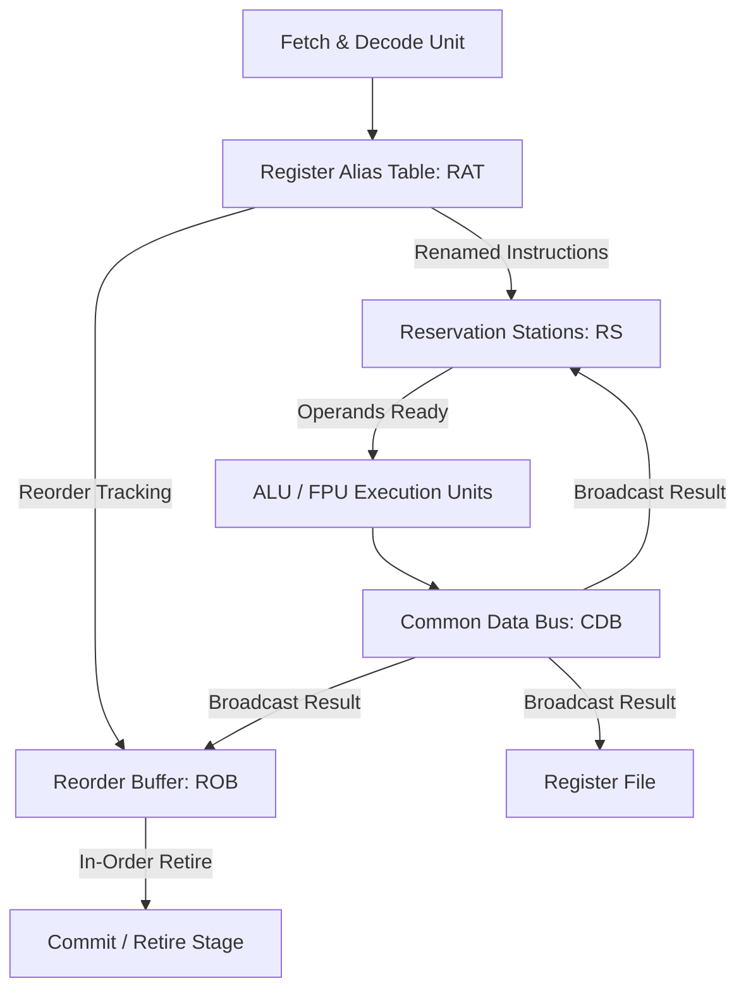

# 고급 파이프라이닝 이론, 토마술로 알고리즘 및 비순차적 실행(OoOE) 파이프라인

 

현대 컴퓨터 아키텍처 연구의 핵심은 명령어 수준 병렬성(Instruction-Level Parallelism, ILP)을 극대화하면서 데이터 의존성(Data Dependency) 및 제어 흐름(Control Flow) 지연을 하드웨어 레벨에서 은폐하는 기법이다.

이 문서에서는 파이프라인 정량적 성능 방정식, RAW/WAR/WAW 데이터 데이터 해저드 이론, 동적 분기 예측 알고리즘, 그리고 Tomasulo 알고리즘 기반 비순차적 실행(Out-of-Order Execution, OoOE) 프로세서 설계를 다룬다.

---

## 1. 파이프라인 정량 성능 방정식 (Pipeline Performance Equations)

$k$-단계 파이프라인에서 $n$개의 명령어를 처리할 때의 execution time $T_{k, n}$ 및 이론적 속도 향상 비율 $S_k$:

$$T_{k, n} = (k + n - 1) \tau$$

$$S_k = \frac{T_{\text{non-pipelined}}}{T_{\text{pipelined}}} = \frac{n \cdot k \cdot \tau}{(k + n - 1) \tau} = \frac{n \cdot k}{k + n - 1}$$

$$\lim_{n \to \infty} S_k = k \quad (\text{명령어 수 } n \text{이 극대화될 때 이론적 최대 속도 향상은 파이프라인 단계 수 } k \text{배})$$

### 1.1 파이프라인 처리량 (Throughput) 및 효율성 (Efficiency)

$$\text{Throughput (TP)} = \frac{n}{(k + n - 1) \tau}$$

$$\text{Efficiency (E)} = \frac{S_k}{k} = \frac{n}{k + n - 1}$$

---

## 2. 데이터 해저드 (Data Hazards)의 정밀 수학적 정의

명령어 $I_i$와 $I_j$ ($i < j$, 즉 $I_i$가 프로그램 순서상 먼저 실행됨)가 소유한 읽기 레지스터 집합 $R(I)$ 및 쓰기 레지스터 집합 $W(I)$ 간의 교집합에 따른 해저드 분류:

1. **RAW (Read-After-Write) - 진성 의존성 (True Dependency)**:
   * $I_j$가 $I_i$의 쓰기 전 값을 읽으려 할 때 발생. **데이터 포워딩(Bypassing) 또는 Stall 필수**.
2. **WAR (Write-After-Read) - 반의존성 (Anti-Dependency)**:
   * $I_j$가 $I_i$의 읽기 전 값을 덮어쓰려 할 때 발생. 비순차적 실행(OoOE) 환경에서 발생하며 **Register Renaming으로 제거**.
3. **WAW (Write-After-Write) - 출력 의존성 (Output Dependency)**:
   * $I_j$가 $I_i$보다 먼저 쓰기를 완료하여 최종 레지스터 값이 오염되는 현상. **Register Renaming으로 제거**.

---

## 3. 동적 분기 예측 (Dynamic Branch Prediction)

### 3.1 2-비트 포화 포화 카운터 (2-bit Saturating Counter FSM)

### 3.2 최신 TAGE (Tagged Geometric History Length) 예측기

* 분기 이력 길이(Branch History Length)를 기하수열적으로 다각화한 복수 예측 태그 테이블 사용.
* 긴 분기 패턴(수백 비트 전역 이력)과 단기 패턴을 동시 분쇄 탐색하여 예측 정확도 95% 이상 달성.

---

## 4. 토마술로 알고리즘 (Tomasulo's Algorithm) 기반 OoOE 아키텍처

Tomasulo 알고리즘은 비순차적 실행(Out-of-Order Execution)과 순차적 퇴출(In-Order Retire)을 통합한 아키텍처 구조다.

### 4.1 핵심 마이크로아키텍처 구성요소

1. **RAT (Register Alias Table)**:
   * Architectural Register ($R_0 \sim R_{31}$)를 Physical Register 또는 ROB 인덱스로 동적 맵핑하여 WAR/WAW 의존성 완전 제거.

2. **RS (Reservation Stations)**:
   * 피연산자(Operand) 값을 수신 대기하는 분산 실행 큐.
   * 필요한 피연산자 데이터가 모두 준비되면 ALU 파이프라인으로 디스패치(Issue).

3. **CDB (Common Data Bus)**:
   * 연산 완료된 데이터와 태그(Tag)를 모든 RS, ROB, Register File에 동시 브로드캐스팅.

4. **ROB (Reorder Buffer)**:
   * 비순차 완료 결과를 회합(Reorder)하여 원래 프로그램 순서대로 Commit 처리.
   * 정확한 예외 처리(Precise Interrupts) 및 투기적 실행 실패 시 안전한 State Rollback 보장.
