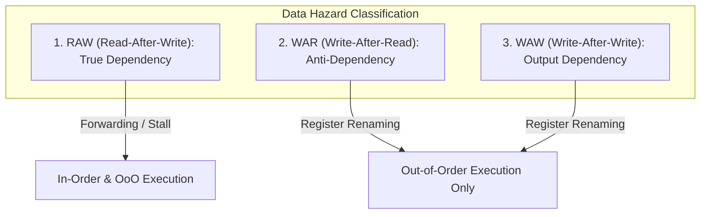

# 고급 파이프라이닝 이론, 토마술로 알고리즘 및 비순차적 실행(OoOE) 파이프라인

 

현대 컴퓨터 아키텍처 연구의 핵심은 명령어 수준 병렬성(Instruction-Level Parallelism, ILP)을 극대화하면서 데이터 의존성(Data Dependency) 및 제어 흐름(Control Flow) 지연을 하드웨어 레벨에서 은폐하는 기법이다.

이 문서에서는 파이프라인 정량적 성능 방정식, RAW/WAR/WAW 데이터 데이터 해저드 이론, 동적 분기 예측 알고리즘, 그리고 Tomasulo 알고리즘 기반 비순차적 실행(Out-of-Order Execution, OoOE) 프로세서 설계를 다룬다.

---

## 1. 파이프라인 정량 성능 방정식 (Pipeline Performance Equations)

$k$-단계 파이프라인에서 $n$개의 명령어를 처리할 때의 실행 시간 `T_(k, n)` 및 이론적 속도 향상 비율 $S_k$:

- `T_(k, n) = (k + n - 1) * τ`
- `S_k = T_non_pipelined / T_pipelined = (n * k * τ) / ((k + n - 1) * τ) = (n * k) / (k + n - 1)`
- `lim_(n -> ∞) S_k = k` (명령어 수 $n$이 충분히 크면 속도 향상은 파이프라인 단계 수 $k$에 수렴)

---

## 2. 데이터 해저드 (Data Hazards)

명령어 $I_i$와 $I_j$ ($i < j$) 사이의 레지스터 접근 충돌 유형:

1. **RAW (Read-After-Write)**: 진성 데이터 의존성(True Data Dependency). 이전 명령어의 결과를 다음 명령어가 읽어야 하므로 **포워딩(Forwarding / Bypassing)** 또는 파이프라인 버블(Stall)로 해결.
2. **WAR / WAW (Name Dependencies)**: 레지스터 이름의 한계로 인해 발생하는 가짜 의존성(False Dependency). **레지스터 리네이밍(Register Renaming)**으로 완전 제거.

---

## 3. 비순차적 실행 (Out-of-Order Execution, OoOE)과 토마술로 알고리즘

- **예약 스테이션 (Reservation Station)**: 명령어가 피연산자를 기다리는 버퍼. 피연산자가 모두 준비되면 즉시 비순차적 실행(Dispatch) 수행.
- **공통 데이터 버스 (CDB - Common Data Bus)**: 연산 결과를 레지스터를 거치지 않고 대기 중인 모든 예약 스테이션과 재정렬 버퍼(ROB)로 직접 브로드캐스트.
- **재정렬 버퍼 (ROB - Reorder Buffer)**: 비순차적으로 실행 완료된 명령어들을 프로그램 본래 순서대로 **순차적 커밋(In-Order Commit)**하여 정밀 예외(Precise Exception)를 보장.
