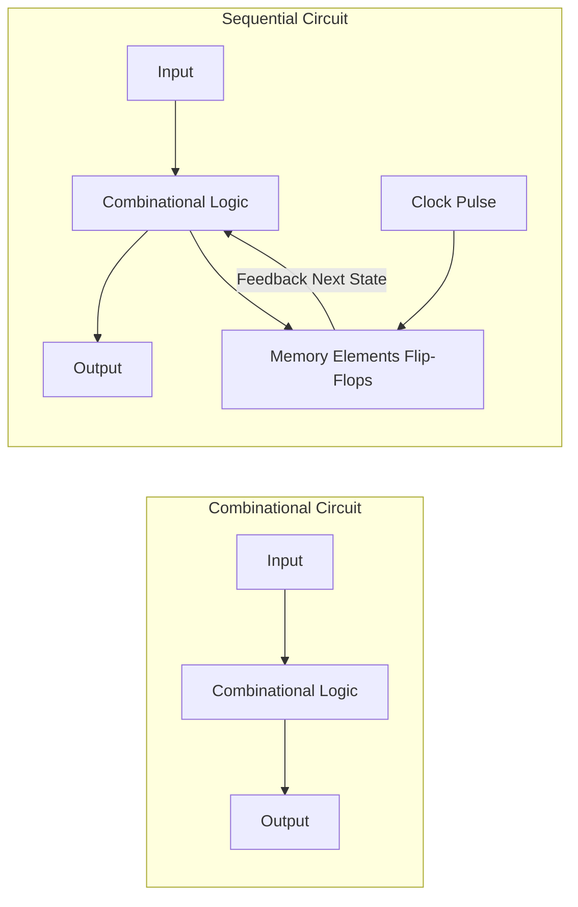

# 플립플롭과 순차논리회로 (Flip-Flops & Sequential Logic Systems)

 

조합논리회로가 "현재의 입력"에만 의존해 출력을 만든다면, **순차논리회로(Sequential Logic Circuit)**는 **"이전의 상태(기억/메모리)"를 저장하고 있다가 클록(Clock) 신호에 맞춰 다음 상태로 전이**하는 회로다.

컴퓨터의 레지스터(Register), 캐시 메모리(SRAM), CPU 제어 장치(Control Unit), 그리고 상태 머신(FSM)은 모두 플립플롭 기반의 순차논리회로로 동작한다. 이 문서에서는 래치부터 플립플롭, 카운터, 그리고 유한 상태 머신(FSM) 아키텍처까지 깊이 있게 다룬다.

---

## 1. 조합논리회로 대 순차논리회로

| 구분               | 조합논리회로 (Combinational)       | 순차논리회로 (Sequential)               |
| ------------------ | ---------------------------------- | --------------------------------------- |
| **출력 결정 요소** | **오직 현재 입력**                 | **현재 입력 + 현재 메모리 상태(State)** |
| **기억 소자**      | 없음                               | **존재 (Latch, Flip-Flop)**             |
| **클록 신호**      | 불필요                             | **필요 (동기식 순차회로의 경우)**       |
| **대표 예시**      | 가산기(Adder), MUX, DEMUX, Decoder | **레지스터, 카운터, RAM, FSM**          |

---

## 2. 래치 (Latch) 대 플립플롭 (Flip-Flop)

\
<truncated 4869 bytes>
