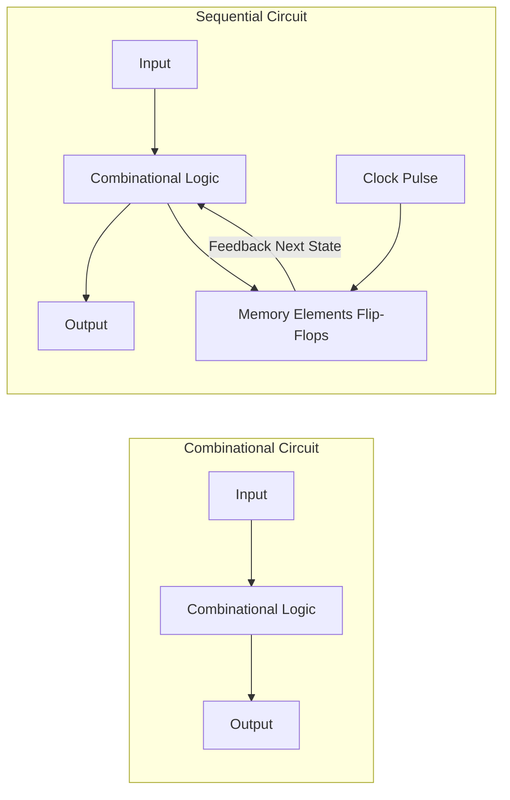

# 플립플롭과 순차논리회로 (Flip-Flops & Sequential Logic Systems)

 

조합논리회로가 "현재의 입력"에만 의존해 출력을 만든다면, **순차논리회로(Sequential Logic Circuit)**는 **"이전의 상태(기억/메모리)"를 저장하고 있다가 클록(Clock) 신호에 맞춰 다음 상태로 전이**하는 회로다.

컴퓨터의 레지스터(Register), 캐시 메모리(SRAM), CPU 제어 장치(Control Unit), 그리고 상태 머신(FSM)은 모두 플립플롭 기반의 순차논리회로로 동작한다. 이 문서에서는 래치부터 플립플롭, 카운터, 그리고 유한 상태 머신(FSM) 아키텍처까지 다룬다.

---

## 1. 조합논리회로 대 순차논리회로

| 구분 | 조합논리회로 (Combinational) | 순차논리회로 (Sequential) |
|---|---|---|
| **출력 결정 요인** | 오직 현재 입력값 | 현재 입력값 + 이전 상태값 |
| **메모리 소자** | 없음 | 플립플롭, 래치 (피드백 루프) |
| **동기 신호** | 클록 불필요 | 클록(Clock) 펄스에 동기화 |
| **대표 예시** | 가산기, 디코더, MUX | 레지스터, 카운터, RAM |

---

## 2. 주요 플립플롭의 종류와 특성

### 2.1 D 플립플롭 (Data Flip-Flop)
클록 엣지(Edge) 발생 시 입력 $D$의 값을 그대로 상태 $Q$에 복사하여 저장한다. 레지스터와 파이프라인 스테이지의 핵심 부품이다.

`Q_next = D`

### 2.2 JK 플립플롭 & T 플립플롭
- **JK 플립플롭**: $J=1, K=1$일 때 이전 상태를 반전(Toggle)시킨다.
- **T 플립플롭 (Toggle)**: $T=1$일 때마다 상태가 반전되어 주파수 분주기 및 2진 카운터에 사용된다.

---

## 3. 유한 상태 머신 (FSM: Finite State Machine)

- **Moore Machine**: 출력이 오직 **현재 상태(Current State)**에 의해서만 결정됨.
- **Mealy Machine**: 출력이 **현재 상태와 현재 입력값(Input)** 모두에 의해 결정됨. 반응 속도가 빠르나 글리치(Glitch)에 민감.
