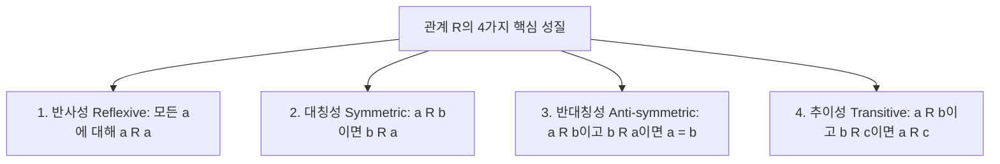

# 관계, 동등 관계 및 그래프 이론 (Relations & Graph Theory)

 

데이터베이스의 관계형 모델(RDBMS), 네트워크 토폴로지, 빌드 시스템의 의존성 관리(Webpack, Gradle), 알고리즘의 최단 경로 탐색은 모두 **관계(Relation)**와 **그래프(Graph)**라는 이산수학적 구조 위에서 작동한다.

이 문서에서는 관계의 4가지 주요 성질, 동치 관계와 동치류, 부분 순서 집합과 위상 정렬, 그리고 그래프 이론의 기본 개념과 주요 표현 방식을 정밀 분석한다.

---

## 1. 이항 관계 (Binary Relations)와 성질

집합 $A$에서 집합 $B$로의 **이항 관계 $R$**은 카티션 곱 $A \\times B$의 부분집합이다 ($R \\subseteq A \\times B$).
$(a, b) \\in R$일 때 $a R b$라고 표기한다.

### 1.1 집합 $A$ 상의 관계 $R$이 가지는 4가지 핵심 성질

---

## 2. 동치 관계와 분할 (Equivalence Relations & Partitions)

### 2.1 동치 관계 (Equivalence Relation)

집합 $A$ 상의 관계 $R$이 **반사성(Reflexive), 대칭성(Symmetric), 추이성(Transitive)**을 모두 만족할 때 $R$을 **동치 관계**라고 한다.

- **예시**: 정수 집합에서 모듈로 연산 관계 $a \\equiv b \\pmod m$ ($a - b$가 $m$의 배수)은 동치 관계다.

#

<truncated 4653 bytes>
