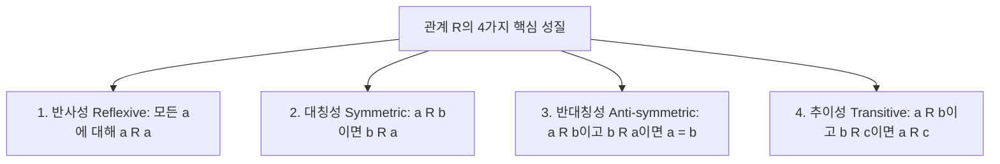

# 관계, 동등 관계 및 그래프 이론 (Relations & Graph Theory)

 

데이터베이스의 관계형 모델(RDBMS), 네트워크 토폴로지, 빌드 시스템의 의존성 관리(Webpack, Gradle), 알고리즘의 최단 경로 탐색은 모두 **관계(Relation)**와 **그래프(Graph)**라는 이산수학적 구조 위에서 작동한다.

이 문서에서는 관계의 4가지 주요 성질, 동치 관계와 동치류, 부분 순서 집합과 위상 정렬, 그리고 그래프 이론의 기본 개념과 주요 표현 방식을 다룬다.

---

## 1. 이항 관계 (Binary Relations)와 성질

집합 $A$에서 집합 $B$로의 **이항 관계 $R$**은 카티션 곱 $A \times B$의 부분집합이다 ($R \subseteq A \times B$).

---

## 2. 동치 관계와 부분 순서 관계

- **동치 관계 (Equivalence Relation)**: **반사성 + 대칭성 + 추이성**을 모두 만족하는 관계. 집합을 서로소인 동치류(Equivalence Classes)로 분할(Partition)한다.
- **부분 순서 관계 (Partial Order)**: **반사성 + 반대칭성 + 추이성**을 만족하는 관계. 선후 관계가 있는 작업 스케줄링 및 위상 정렬(Topological Sort)의 기반이 된다.

---

## 3. 그래프 이론 기초 (Graph Theory)

그래프 $G = (V, E)$는 정점(Vertex)의 집합 $V$와 간선(Edge)의 집합 $E$로 정의된다.

### 3.1 그래프 표현 방식 비교
- **인접 행렬 (Adjacency Matrix)**: $V \times V$ 2차원 배열. 간선 존재 여부 $O(1)$ 확인 가능, 공간 복잡도 $O(V^2)$.
- **인접 리스트 (Adjacency List)**: 각 정점에 연결된 이웃 리스트. 희소 그래프(Sparse Graph)에 최적화, 공간 복잡도 $O(V + E)$.
