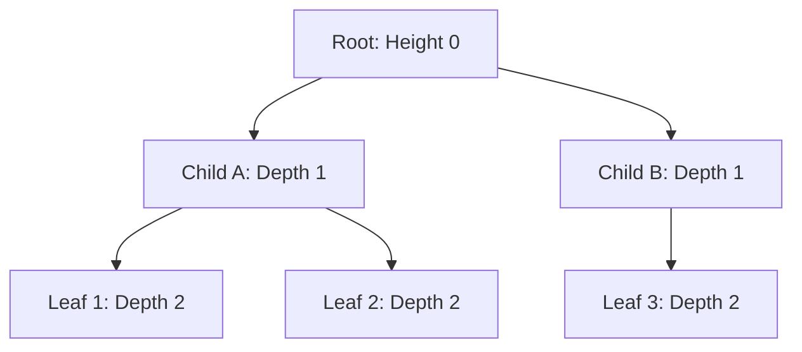

# 트리 구조와 부울 대수 (Trees & Boolean Algebra)

<br />

계층적 구조를 표현하는 **트리(Tree)**와 디지털 컴퓨터 하드웨어의 스위칭 회로를 설계하는 **부울 대수(Boolean Algebra)**는 컴퓨터공학의 뼈대다.

이 문서에서는 트리의 수학적 정의와 최소 신장 트리(MST) 알고리즘, 그리고 부울 대수의 공리 체계 및 **카르노 맵(Karnaugh Map)**을 활용한 논리식 최적화 기법을 완벽히 정리한다.

---

## 1. 트리의 수학적 성질 (Tree Properties)

**트리(Tree)**는 **사이클이 없는 연결 무방향 그래프 (Connected Acyclic Undirected Graph)**로 정의된다.



### 1.1 트리의 동치 조건

$N$개 정점을 가진 그래프 $G = (V, E)$에 대해 다음 조건들은 모두 동치(Equivalent)다.

1. $G$는 트리다.
2. $G$의 임의의 두 정점 사이에는 **단 하나의 경로(Unique Path)**만 존재한다.
3. $G$는 연결 그래프이고 **간선의 수 $|E| = |V| - 1$**이다.
4. $G$는 사이클이 없으며, 간선을 하나라도 추가하면 정확히 하나의 사이클이 형성된다.

---

## 2. 최소 신장 트리 (Minimum Spanning Tree, MST)

가중치 그래프 $G = (V, E)$에서 모든 정점을 포함하면서 간선 가중치의 합이 최소가 되는 부분 트리를 **최소 신장 트리(MST)**라고 한다.

```mermaid
flowchart TD
    subgraph Kruskal Algorithm [Kruskal 알고리즘 (
<truncated 4071 bytes>
```
