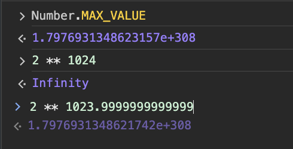

# Types

코드에서 사용되는 모든 데이터는 메모리에 저장되고 참조되어야 하며, 이를 위해 데이터 타입이 중요한 역할을 한다.

데이터 타입은 메모리에 데이터를 저장할 때 필요한 공간의 크기와 할당 가능한 유효한 값의 범위를 정의할 뿐만 아니라, 메모리에 저장된 2진수 데이터를 어떻게 해석해야 할지에 대한 정보를 컴퓨터와 개발자에게 제공함으로써 효율적인 메모리 관리와 데이터 처리를 가능하게 한다.

javaScript는 동적 타이핑 언어로 변수의 타입이 런타임에 결정되고, 타입은 `Primitive type`과 `Object Type` 두가지로 나뉜다.

## Primitive Type(원시 타입)

원시 값(자료형)이란 객체가 아니면서 **메서드 또는 속성도 가지지 않는 데이터이고, 변경 불가능한 값(immutable value)이며 pass-by-value(값에 의한 전달)이다**.

:::caution
원시 값 자체와, 원시 값을 할당한 변수는 다른 개념이다. <br />
변수에 새로운 값을 다시 할당할 수 있지만, 이미 생성한 원시 값은 Object type과 달리 변경할 수 없다.
:::

현 시점에서 원시타입은 다음과 같다.

- string
- number
- boolean
- undefined
- null
- symbol(ES6)
- bigint(ES11)

### string

- 문자열을 나타내는 원시 타입
- UTF-16(Unicode Transformation Format)
  - UTF-16은 문자 인코딩의 방식으로 보편적으로 utf-8, utf-16이 쓰인다.
  - 인코딩은 2bytes(16bits)의 코드 유닛 1개 혹은 2개로 구성(한글, 영문 2bytes)
  - 문자 1개가 2bytes or 4bytes인데 4bytes경우 인덱스를 사용시 짤림 문제 발생가능(`for of` 사용하면 방지)

### number

- 숫자를 나타내는 원시 타입
- 정수, 실수 포함
- 특수값으로 Infinity, -Infinity, NaN(Not-a-Number)
- JavaScript는 숫자형에 대해 64비트 부동소수점 형식(IEEE 754)을 사용
  - 부동 소수점 수를 64비트(8바이트)로 나타낸다.
  - 부호 비트(1비트) - 0은 양수를, 1은 음수
  - 지수 비트(11비트) - 지수 비트는 2의 거듭제곱을 나타내는 데 사용
  - 가수 비트(52비트) - 실수의 소수부를 나타내는 데 사용
  - 표현 가능한 최대 범위는 대략 `2 ** -1022` ~ `2 ** 1023`
  - 정수는 `-(2 ** 53 - 1)` ~ `2 ** 53 - 1` 범위 내에서 안전하게 표현가능



64비트 부동소수점 형식을 사용하면 매우 큰 범위의 숫자를 표현할 수 있지만 근사값으로 표현되므로, 정확성에 한계가 있다.

```javascript
console.log(0.1 + 0.2); // 0.30000000000000004
console.log(1000000000000000000000 + 0.0000000000000000001); // 1000000000000000000000
let sum = 0;
for (let i = 0; i < 100; i++) {
  sum += 0.1;
}
console.log(sum); // 9.99999999999998
console.log(0.1 + 0.2 === 0.3); // false
```

[부동소수점 형식 참조](https://80000coding.oopy.io/5226d086-ed18-482c-a58b-fe65f040a82e)

### boolean

- 논리적인 값(true 또는 false)을 나타내는 원시 타입
- Truthy와 Falsy 값의 개념이 존재(Falsy: false, 0, null, undefined, NaN, "")

### undefined

- 변수가 선언되었으나 값이 할당되지 않은 상태를 나타내는 원시 타입
- 변수를 선언만 하고 초기화하지 않으면 자동으로 undefined 값이 할당됨
- 함수에서 명시적으로 반환값이 지정되지 않은 경우에도 undefined가 반환됨

### null

- 의도적으로 변수에 값이 없음을 나타내는 원시 타입
- null은 객체가 아닌 독립적인 타입으로 취급됨
- typeof 연산자의 결과로 "object"를 반환

### symbol(ES6)

- 고유하고 변경 불가능한 값을 생성하는 데 사용됨
- Symbol 값은 객체 속성의 식별자로 사용될 수 있음
- Symbol 값은 외부에서 직접 접근하거나 열거할 수 없어 private한 속성을 만드는 데 활용됨

### bigint(ES11)

- BigInt 값은 **정수 리터럴** 뒤에 n을 붙여 생성 (예: 1234567890123456789012345678901234567890n)
- BigInt 값은 Number 값과 혼합하여 연산할 수 없으며, BigInt 전용 연산자와 메서드를 사용해야 함
- Number 타입의 한계(2 \*\* 53 - 1)를 넘어서는 큰 정수를 안전하게 다룰 수 있음
  - 2 \*\* 53 - 1은 Number 타입으로 안전하게 표현할 수 있는 최대 정수 값
  - 가수부는 실수의 소수부를 표현하는 데 사용되지만, 정수를 표현할 때는 가수부의 최상위 비트가 항상 1로 가정
  - 이를 숨겨진 비트(hidden bit) 또는 암묵적인 1(implicit 1) 라고 지칭
  - 따라서 가수부의 52비트와 숨겨진 비트를 합쳐 총 53비트로 정수를 표현할 수 있음

### Wrapper Object

원시 타입(primitive types)의 값은 메서드나 프로퍼티를 가지고 있지 않지만 원시 타입의 값에 대해 마치 객체처럼 메서드나 프로퍼티를 호출할 수 있다.

이는 JavaScript 엔진이 원시 타입의 값을 임시로 래퍼 객체(wrapper object)로 변환하기 때문이다.

#### 래퍼 객체가 사용되는 경우

- 메서드 호출
  - 원시 타입의 값에 대해 메서드를 호출할 때, JavaScript 엔진은 해당 값을 래퍼 객체로 일시적으로 변환
  - 해당 객체의 프로토타입 체인을 통해 메서드에 접근
  - 메서드 호출이 완료되면 래퍼 객체는 제거되고, 원시 타입의 값만 남음
- 프로퍼티 접근
  - 원시 타입의 값에 대한 프로퍼티에 접근할 때도 래퍼 객체가 사용(length)
- 명시적 객체 생성

  - new 연산자를 사용하여 명시적으로 래퍼 객체를 생성가능
  - 이 경우 원시 타입 값이 아닌 실제 객체가 생성되며, 해당 객체는 명시적으로 생성되었으므로 폐기되지 않고 유지
  - 대부분의 경우 **원시 타입 값을 직접 사용하는 것이 권장**

## Object Type(객체 타입)

자바스크립트는 객체(object) 기반의 언어로서 **원시 타입(Primitives)을 제외한 나머지 값들은 모두 객체**이다.  
객체는 **데이터(property)와 그 데이터에 관련한 동작(method)**을 모두 포함할 수 있고 **mutable(변경가능)**하며 **pass-by-reference(참조에 의한 전달)** 방식으로 전달된다.

- Object
  - key-value 쌍으로 이루어진 속성(property)들의 집합
  - js의 모든 객체들은 Object를 상속받음
- Array
  - 순서가 있는 값들의 집합
  - 배열의 요소는 다양한 타입(원시 타입, 객체, 함수 등)을 포함할 수 있지만 **한가지 타입만 권장**
  - 배열의 요소 접근은 인덱스(index)를 사용
  - 배열은 동적으로 크기가 변할 수 있음
  - iterable
- Map
  - 키-값 쌍의 집합으로, 객체와 유사
  - weakMap
  - iterable
- Set
  - 고유한 값들의 집합으로, 중복된 값을 허용하지 않음
  - weakSet
  - iterable
- Function
  - 호출 가능한 객체(callable object)
  - 함수는 매개변수(parameter)를 받아 작업을 수행하고, 결과값을 반환(return)
  - 함수는 변수에 할당되거나 다른 함수의 인자로 전달가능(js에서 일급 객체)

### iterable

iterable(순회가능한)한 객체는 `Symbol.iterator`라는 메서드를 가진 객체로, `for of`로 순회할 수 있다.

> 1. for..of는 Symbol.iterator를 호출(없으면 에러) Symbol.iterator는 반드시 iterator(next 메서드가 있는 객체)를 반환
> 2. 이후 for..of는 반환된 객체(이터레이터)만을 대상으로 동작
> 3. for..of에 다음 값이 필요하면, for..of는 이터레이터의 next()메서드를 호출
> 4. next()의 반환 값은 `{done: Boolean, value: any}`와 같은 형태
> 5. done=true는 반복이 종료되었음을 의미, done=false일땐 value에 다음 값이 저장

```javascript
// ex
const iterable = {
  [Symbol.iterator]() {
    let i = 0;
    return {
      next() {
        if (i < 3) {
          return { value: i++, done: false };
        }
        return { done: true };
      },
    };
  },
};

for (const value of iterable) {
  console.log(value);
}
```

### Object와 Map의 차이

둘다 모두 키-밸류의 데이터 구조

- Object의 키는 `String`, `Symbol`이며, Map은 모든 타입의 키를 가질 수 있다.
- Object는 크기를 수동으로 추적해야하지만, Map은 크기를 쉽게 얻을 수 있다.
- Object는 메서드도 정의 가능
- Map은 삽입된 순서대로 반복된다.
- Map은 키-값 쌍의 추가, 삭제, 검색 등의 연산이 Object에 비해 효율적이다.

따라서 키가 문자열이나 심볼로 고정되어 있고, 객체의 속성과 메서드를 함께 정의하는 경우 Object,
키로 다양한 타입을 사용해야 하고, 키-값 쌍의 추가/삭제가 빈번하며, 순서가 중요한 경우 Map이 권장 된다.

#### `for of`와 `for in` 차이

- `for in`은 객체의 속성을 순회, `for of`는 iterable 객체의 `Symbol.iterator`를 호출
- `for in`은 객체의 키를 반환, `for of`는 객체의 값(next())을 반환
- `for in`은 객체의 `모든 열거 가능한 속성을 순회`하므로 상속받은 속성도 포함 - `hasOwnProperty()` 메서드로 상속받은 속성을 제외가능
- 배열 순회 시 `for in`은 인덱스를 문자열로 반환(순서 보장X), `for of`는 값을 직접 반환하고 순서가 보장

참조

- https://developer.mozilla.org/ko/docs/Glossary/Primitive
- https://poiemaweb.com/js-data-type-variable
- https://ko.javascript.info/iterable
- https://developer.mozilla.org/ko/docs/Web/JavaScript/Guide/Keyed_collections
