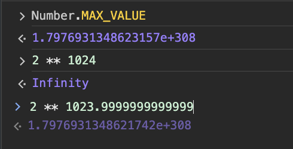

# Types

코드에서 사용되는 모든 데이터는 메모리에 저장하고 참조할 수 있어야 한다. 데이터 타입은 데이터를 메모리에 저장할 때 확보해야 하는 메모리 공간의 크기와 할당할 수 있는 유효한 값에 대한 정보, 그리고 메모리에 저장되어 있는 2진수 데이터를 어떻게 해석할 지에 대한 정보를 컴퓨터와 개발자에게 제공한다.

javaScript는 동적 타이핑 언어로, 변수의 타입이 런타임에 결정된다. 내장 타입은 두가지로 나뉘는데, `Primitive type`과 `Object Type`이다.

## Primitive Type(원시 타입)

현 시점에서 원시타입은 다음과 같다.

- string
- number
- boolean
- undefined
- null
- symbol(ES6)
- bigint(ES11)

원시 값(자료형)이란 객체가 아니면서 **메서드 또는 속성도 가지지 않는 데이터이고, 변경 불가능한 값(immutable value)이며 pass-by-value(값에 의한 전달)이다**.

:::caution
원시 값 자체와, 원시 값을 할당한 변수는 다른 개념
변수에 새로운 값을 다시 할당할 수 있지만, 이미 생성한 원시 값은 Object type과 달리 변형할 수 없음
:::

### string

- 문자열을 나타내는 원시 타입
- UTF-16(Unicode Transformation Format)
  - UTF-16은 문자 인코딩의 방식으로 보편적으로 utf-8, utf-16이 쓰인다.
  - 인코딩은 2bytes(16bits)의 코드 유닛 1개 혹은 2개로 구성(한글, 영문 2bytes)
  - 문자 1개가 2bytes or 4bytes인데 4bytes경우 인덱스를 사용시 짤림 문제 발생(for of 사용해야함)

### number

- 숫자를 나타내는 원시 타입
- 정수, 실수 포함
- 특수값으로 Infinity, -Infinity, NaN(Not-a-Number)...
- JavaScript는 숫자형에 대해 64비트 부동소수점 형식(IEEE 754)을 사용
  - 부동 소수점 수를 64비트(8바이트)로 나타낸다.
  - 부호 비트(1비트) - 0은 양수를, 1은 음수
  - 지수 비트(11비트) - 지수 비트는 2의 거듭제곱을 나타내는 데 사용
  - 가수 비트(52비트) - 실수의 소수부를 나타내는 데 사용
  - 표현 가능한 최대 범위는 대략 `2 ** -1022` ~ `2 ** 1023`



64비트 부동소수점 형식을 사용하면 매우 큰 범위의 숫자를 표현할 수 있지만 근사값으로 표현되므로, 정확성에 한계가 있다.

```javascript
console.log(0.1 + 0.2); // 0.30000000000000004
console.log(1000000000000000000000 + 0.0000000000000000001); // 1000000000000000000000
let sum = 0;
for (let i = 0; i < 100; i++) {
  sum += 0.1;
}
console.log(sum); // 9.99999999999998
console.log(0.1 + 0.2 === 0.3); // false
```

[부동소수점 형식 참조](https://80000coding.oopy.io/5226d086-ed18-482c-a58b-fe65f040a82e)

### boolean

- 논리적인 값(true 또는 false)을 나타내는 원시 타입
- Truthy와 Falsy 값의 개념이 존재(Falsy: false, 0, null, undefined, NaN, "")

### undefined

- 변수가 선언되었으나 값이 할당되지 않은 상태를 나타내는 원시 타입
- 변수를 선언만 하고 초기화하지 않으면 자동으로 undefined 값이 할당됨
- 함수에서 명시적으로 반환값이 지정되지 않은 경우에도 undefined가 반환됨

### null

- 의도적으로 변수에 값이 없음을 나타내는 원시 타입
- null은 객체가 아닌 독립적인 타입으로 취급됨
- typeof 연산자의 결과로 "object"를 반환

### symbol(ES6)

- 고유하고 변경 불가능한 값을 생성하는 데 사용됨
- Symbol 값은 객체 속성의 식별자로 사용될 수 있음
- Symbol 값은 외부에서 직접 접근하거나 열거할 수 없어 private한 속성을 만드는 데 활용됨

### bigint(ES11)

- BigInt 값은 **정수 리터럴** 뒤에 n을 붙여 생성 (예: 1234567890123456789012345678901234567890n)
- BigInt 값은 Number 값과 혼합하여 연산할 수 없으며, BigInt 전용 연산자와 메서드를 사용해야 함
- Number 타입의 한계(2 \*\* 53 - 1)를 넘어서는 큰 정수를 안전하게 다룰 수 있음
  - 2 \*\* 53 - 1은 Number 타입으로 안전하게 표현할 수 있는 최대 정수 값
  - 가수부는 실수의 소수부를 표현하는 데 사용되지만, 정수를 표현할 때는 가수부의 최상위 비트가 항상 1로 가정
  - 이를 숨겨진 비트(hidden bit) 또는 암묵적인 1(implicit 1) 라고 지칭
  - 따라서 가수부의 52비트와 숨겨진 비트를 합쳐 총 53비트로 정수를 표현할 수 있음

### Wrapper Object

원시 타입(primitive types)의 값은 메서드나 프로퍼티를 가지고 있지 않지만 원시 타입의 값에 대해 마치 객체처럼 메서드나 프로퍼티를 호출할 수 있는데, 이는 JavaScript 엔진이 원시 타입의 값을 임시로 래퍼 객체(wrapper object)로 변환하기 때문이다.

래퍼 객체가 사용되는 경우

- 메서드 호출
  - 원시 타입의 값에 대해 메서드를 호출할 때, JavaScript 엔진은 해당 값을 래퍼 객체로 일시적으로 변환
  - 해당 객체의 프로토타입 체인을 통해 메서드에 접근
  - 메서드 호출이 완료되면 래퍼 객체는 제거되고, 원시 타입의 값만 남음
- 프로퍼티 접근
  - 원시 타입의 값에 대한 프로퍼티에 접근할 때도 래퍼 객체가 사용(length)
- 명시적 객체 생성

  - new 연산자를 사용하여 명시적으로 래퍼 객체를 생성가능
  - 이 경우 원시 타입 값이 아닌 실제 객체가 생성되며, 해당 객체는 명시적으로 생성되었으므로 폐기되지 않고 유지
  - 대부분의 경우 원시 타입 값을 직접 사용하는 것이 권장

- https://developer.mozilla.org/ko/docs/Glossary/Primitive
- https://poiemaweb.com/js-data-type-variable

## Object Type(객체 타입)

자바스크립트는 객체(object) 기반의 언어로서 **원시 타입(Primitives)을 제외한 나머지 값들은 모두 객체**이다.  
객체는 **데이터(property)와 그 데이터에 관련한 동작(method)**을 모두 포함할 수 있는 존재로 **pass-by-reference(참조에 의한 전달)** 방식으로 전달된다.

- Object
  - key-value 쌍으로 이루어진 속성(property)들의 집합
  - js의 모든 객체들은 Object를 상속받음
- Array
  - 순서가 있는 값들의 집합
  - 배열의 요소는 다양한 타입(원시 타입, 객체, 함수 등)을 포함할 수 있지만 **한가지 타입만 권장**
  - 배열의 요소 접근은 인덱스(index)를 사용
  - 배열은 동적으로 크기가 변할 수 있음
  - iterable
- Map
  - 키-값 쌍의 집합으로, 객체와 유사
  - iterable
- Set
  - 고유한 값들의 집합으로, 중복된 값을 허용하지 않음
  - iterable
- Function
  - 호출 가능한 객체(callable object)
  - 함수는 매개변수(parameter)를 받아 작업을 수행하고, 결과값을 반환(return)
  - 함수는 변수에 할당되거나 다른 함수의 인자로 전달가능(일급 객체)
- Date
  - 날짜와 시간을 표현하는 내장 객체
- Math
  - 수학적인 상수와 함수를 제공하는 내장 객체
  - 모든 속성과 메서드는 정적(static)
- Error
  - 오류 정보를 나타내는 내장 객체
  - 오류 메시지를 인자로 전달

### Object

### Array

### iterable

### Map

### Function

### new

생성자(constructor) 함수란 new 키워드와 함께 객체를 생성하고 초기화하는 함수를 말한다. 생성자 함수를 통해 생성된 객체를 인스턴스(instance)라 한다. 자바스크립트는 Object 생성자 함수 이외에도 String, Number, Boolean, Array, Date, RegExp 등의 빌트인 생성자 함수를 제공한다. 일반 함수와 생성자 함수를 구분하기 위해 생성자 함수의 이름은 파스칼 케이스(PascalCase)를 사용하는 것이 일반적이다.

## typeof

## global object

Object - 키-값 쌍으로 구성된 데이터 구조 - 중괄호({})를 사용하여 객체 리터럴로 생성하거나, 생성자 함수를 통해 생성 가능 - 점 표기법(obj.key) 또는 대괄호 표기법(obj['key'])으로 속성에 접근
3.2. Array - 순서가 있는 집합을 나타내는 객체 타입 - 대괄호([])를 사용하여 배열 리터럴로 생성하거나, Array 생성자 함수를 통해 생성 가능 - 인덱스를 통해 배열 요소에 접근하며, 다양한 배열 메서드를 제공

3.1. Function - 호출 가능한 객체 타입 - 함수 선언문, 함수 표현식, 화살표 함수 등 다양한 방법으로 정의 가능 - 매개변수와 반환값을 통해 데이터를 주고받으며, 코드의 재사용성을 높임
3.4. Date - 날짜와 시간을 나타내는 객체 타입 - Date 생성자 함수를 통해 생성하며, 다양한 메서드를 제공 - 시간 정보를 가져오거나 설정할 때 유용하게 사용됨
3.5. RegExp - 정규 표현식을 나타내는 객체 타입 - 문자열 패턴을 정의하고 검색, 치환 등의 작업을 수행 - 정규식 리터럴(/pattern/flags) 또는 RegExp 생성자 함수를 통해 생성
3.6. Map and Set - ES6에서 도입된 새로운 데이터 구조 - Map은 키-값 쌍을 저장하는 객체로, 다양한 타입을 키로 사용 가능 - Set은 중복되지 않는 유일한 값들의 집합을 나타내는 객체
Type Coercion
4.1. 암묵적 타입 변환 - JavaScript 엔진에 의해 자동으로 수행되는 타입 변환 - 연산자나 함수 호출 시 피연산자 또는 인수의 타입이 자동으로 변환됨 - 예: 문자열과 숫자의 덧셈 연산 시 숫자가 문자열로 변환됨
4.2. 명시적 타입 변환 - 개발자가 의도적으로 타입을 변환하는 것 - 내장 함수(Number(), String(), Boolean() 등)이나 연산자(+, !, !! 등)를 사용하여 명시적으로 타입 변환 가능
4.3. 타입 변환의 규칙과 예외 - 타입 변환은 일관된 규칙에 따라 이루어지지만, 예외적인 상황도 존재 - null과 undefined는 숫자로 변환 시 각각 0과 NaN이 됨 - 객체는 원시 타입으로 변환될 때 객체의 toString() 또는 valueOf() 메서드가 호출됨

Type Checking
5.1. typeof 연산자 - 피연산자의 타입을 문자열로 반환하는 연산자 - 원시 타입에 대해서는 정확한 타입 정보를 제공하지만, null은 "object"로 반환하는 특이점이 있음 - 객체 타입에 대해서는 "object"로 반환하므로, 세부 객체 타입 구분에는 한계가 있음
5.2. instanceof 연산자 - 객체가 특정 생성자 함수의 인스턴스인지 여부를 확인하는 연산자 - 상속 관계에 있는 객체 타입 확인에 유용하게 사용됨
5.3. Object.prototype.toString 메서드 - 객체의 내부 [[Class]] 속성을 반환하는 메서드 - 객체의 타입을 좀 더 구체적으로 확인할 수 있음 - 배열, 정규식, 날짜 등의 내장 객체 타입 구분에 활용 가능
5.4. 타입 체크의 한계와 주의점 - 타입 체크 연산자와 메서드는 완벽하지 않으며, 일부 한계와 주의점이 존재 - typeof는 null을 "object"로 반환하고, 함수를 "function"으로 반환하는 등의 특이점이 있음 - instanceof는 프로토타입 체인을 확인하므로, 다른 창이나 iframe에서 생성된 객체에 대해서는 정확한 결과를 반환하지 않을 수 있음
Type Inference 6.1. 변수 선언과 초기화 - 변수 선언 시 초기값을 할당하면, JavaScript 엔진은 해당 값의 타입을 추론하여 변수의 타입을 결정함 - 초기값이 할당되지 않은 경우, 변수의 타입은 undefined로 설정됨 6.2. 함수 매개변수와 반환값 - 함수의 매개변수나 반환값에 타입을 명시하지 않아도, JavaScript 엔진은 전달되는 인수나 반환되는 값의 타입을 추론함 - 함수 내부에서 매개변수의 타입에 따라 분기 처리하거나, 반환값의 타입을 일관되게 유지하는 것이 좋은 코딩 관례임 6. 3. 타입 추론의 규칙과 제한 - JavaScript 엔진은 변수의 초기값, 할당되는 값, 연산 결과 등을 바탕으로 타입을 추론함 - 타입 추론은 코드의 가독성을 높이고 불필요한 타입 선언을 줄일 수 있지만, 복잡한 로직에서는 한계가 있을 수 있음 - 명시적인 타입 선언이 필요한 경우도 있으므로, 적절한 균형을 유지하는 것이 중요함
Type Annotations and Type Systems 7.1. JSDoc을 활용한 타입 어노테이션 - JSDoc은 JavaScript 코드에 주석을 통해 타입 정보를 제공하는 방법 - @param, @returns, @typedef 등의 태그를 사용하여 함수의 매개변수, 반환값, 사용자 정의 타입 등을 명시할 수 있음 - IDE나 코드 에디터에서 JSDoc을 인식하여 코드 자동 완성, 타입 체크 등의 기능을 제공함 7.2. TypeScript와 Flow의 정적 타입 시스템 - TypeScript와 Flow는 JavaScript에 정적 타입 시스템을 추가한 언어 확장 - 변수, 함수, 클래스 등에 타입을 명시할 수 있으며, 컴파일 시점에 타입 오류를 감지할 수 있음 - 강력한 타입 체크와 IDE 지원을 통해 대규모 프로젝트에서의 코드 품질과 개발 생산성을 향상시킬 수 있음 7. 3. 정적 타입 시스템의 장단점 - 정적 타입 시스템은 코드의 안정성, 가독성, 유지보수성 등을 높일 수 있음 - 컴파일 시점에 타입 오류를 조기에 발견하고 수정할 수 있어 런타임 에러를 줄일 수 있음 - 다만 타입 선언으로 인한 코드 작성 오버헤드가 발생할 수 있으며, 기존 JavaScript 라이브러리와의 호환성 문제도 고려해야 함
Best Practices and Tips 8.1. 일관된 타입 사용 - 코드 전반에 걸쳐 일관된 타입 사용을 유지하는 것이 중요 - 함수의 매개변수와 반환값, 변수의 초기값 등에서 타입 일관성을 지키면 코드 이해도와 안정성이 높아짐 8.2. 타입 검사와 에러 처리 - 타입 검사를 적극적으로 활용하여 잠재적인 타입 관련 에러를 사전에 방지할 수 있음 - typeof, instanceof 등의 연산자를 사용하여 타입을 확인하고, 필요한 경우 적절한 에러 처리를 수행 - try-catch 문을 통해 예외 상황을 처리하고, 사용자에게 적절한 피드백을 제공 8. 3. 코드 가독성과 유지보수성 향상을 위한 팁 - 변수, 함수, 클래스 등에 의미 있는 이름을 사용하여 코드의 가독성을 높임 - 주석을 적절히 활용하여 코드의 의도와 동작을 설명 - 함수를 작고 단일 책임을 가지도록 분할하고, 재사용 가능한 코드 작성을 지향 - 비동기 처리, 에러 핸들링 등 복잡한 로직은 별도의 함수나 모듈로 분리하여 관리
Conclusion 9.1. JavaScript 타입 시스템의 특징과 중요성 요약 - JavaScript는 동적 타이핑 언어로, 타입 추론과 타입 변환 등의 특징을 가짐 - 타입은 코드의 안정성, 가독성, 유지보수성 등에 큰 영향을 미치므로 중요하게 다뤄야 함 9.2. 타입을 고려한 코드 작성의 필요성 - 명시적인 타입 선언, 일관된 타입 사용, 적절한 타입 검사 등을 통해 코드의 품질을 높일 수 있음 - 정적 타입 시스템의 도입을 고려하여 대규모 프로젝트에서의 개발 효율성과 코드 안정성을 향상시킬 수 있음
