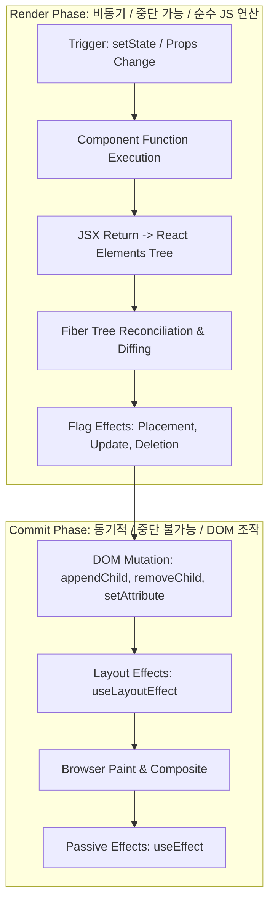

# React 리렌더링 연산과 실제 DOM 변경(Mutation) 비용 심층 분석

 

개발자 사이에서 흔히 소비되는 구호 중 하나가 **"React는 Virtual DOM을 사용하므로 DOM 조작보다 빠르다"** 또는 **"리렌더링을 무조건 줄여야 웹 애플리케이션이 빠르다"**라는 명제다.

그러나 브라우저 렌더링 엔진(Blink, WebKit)의 내부 연산 구조를 뜯어보면, **JavaScript 수준의 Virtual DOM reconciliation 비용과 실제 브라우저 C++ DOM Node 생성/Layout 연산 비용 사이에는 수백 배에서 수천 배에 달하는 거대한 차이**가 존재한다. 이 문서에서는 Render Phase와 Commit Phase의 메커니즘 차이, DOM Mutation의 물리적 비용, 그리고 메모이제이션의 수학적 타당성을 정밀하게 다룬다.

---

## 1. React Fiber의 2단계 파이프라인: Render Phase 대 Commit Phase

React의 렌더링 과정은 명확히 두 개의 단계(Phase)로 구분된다.

<truncated 6084 bytes>
