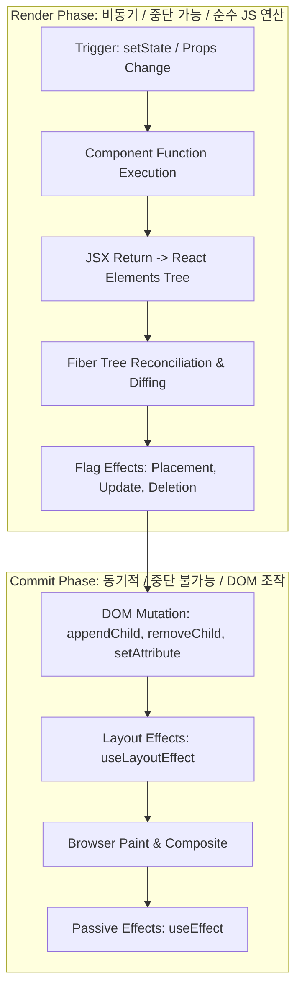

# React 리렌더링 연산과 실제 DOM 변경(Mutation) 비용 심층 분석

<br />

개발자 사이에서 흔히 소비되는 구호 중 하나가 **"React는 Virtual DOM을 사용하므로 DOM 조작보다 빠르다"** 또는 **"리렌더링을 무조건 줄여야 웹 애플리케이션이 빠르다"**라는 명제다.

그러나 브라우저 렌더링 엔진(Blink, WebKit)의 내부 연산 구조를 뜯어보면, **JavaScript 수준의 Virtual DOM reconciliation 비용과 실제 브라우저 C++ DOM Node 생성/Layout 연산 비용 사이에는 수백 배에서 수천 배에 달하는 거대한 차이**가 존재한다. 이 문서에서는 Render Phase와 Commit Phase의 메커니즘 차이, DOM Mutation의 물리적 비용, 그리고 메모이제이션의 수학적 타당성을 정밀하게 다룬다.

---

## 1. React Fiber의 2단계 파이프라인: Render Phase 대 Commit Phase

React의 렌더링 과정은 명확히 두 개의 단계(Phase)로 구분된다.



### 1.1 Render Phase (비용: 수십 마이크로초 ~ 수 밀리초)
컴포넌트 함수를 실행하고 이전 Fiber 트리와 새 Fiber 트리를 비교(Reconciliation)하여 변경 사항 목록(Effect Tag / Flags)을 만드는 순수 JavaScript 연산이다. 이 단계에서는 브라우저의 DOM 트리에 아무런 영향도 주지 않는다.

### 1.2 Commit Phase (비용: 수 밀리초 ~ 수십 밀리초)
Render Phase에서 수집된 변경 플래그를 실제 브라우저 DOM API(`appendChild`, `setAttribute` 등)로 반영하는 단계다. DOM 노드가 변경되면 브라우저 엔진은 **Recalculate Style -> Layout(Reflow) -> Paint(Repaint) -> Composite** 과정을 거치게 된다.

---

## 2. 왜 DOM Mutation이 순수 JS 연산보다 훨씬 비싼가?

1. **C++ 바인딩 브리지 비용**: JavaScript 엔진(V8)이 브라우저 DOM 객체(Blink C++)를 호출할 때 발생하는 컨텍스트 스위칭 비용.
2. **Layout(Reflow) 파이프라인 무효화**: DOM 구조나 기하학적 속성(`width`, `height`, `margin`, `top` 등)이 변경되면 관련된 렌더 트리의 좌표계를 전부 재계산해야 한다.
3. **강제 동기식 레이아웃 (Forced Synchronous Layout)**:
   ```javascript
   // Anti-pattern: Read & Write 반복
   for (let i = 0; i < elements.length; i++) {
     elements[i].style.width = '100px'; // Style Invalidate
     const width = elements[i].offsetWidth; // Forced Reflow 발생!
   }
   ```

---

## 3. useMemo / useCallback 메모이제이션의 수학적 손익 분기점

무조건적인 메모이제이션은 오히려 메모리 오버헤드와 클로저 생성 비용을 증가시킨다.

```
Total Cost = Dependency Comparison Cost + Closure Allocation Cost + Cache Memory
```

### 언제 메모이제이션해야 하는가?
- 계산 복잡도가 $O(N \log N)$ 이상이거나 원소 수가 1,000개 이상인 대규모 데이터 변환
- `React.memo`로 감싼 무거운 자식 컴포넌트에 참조형 props(함수, 객체)를 전달할 때
- Custom Hook에서 반환되는 객체/함수가 다른 `useEffect`의 의존성 배열에 들어갈 때
