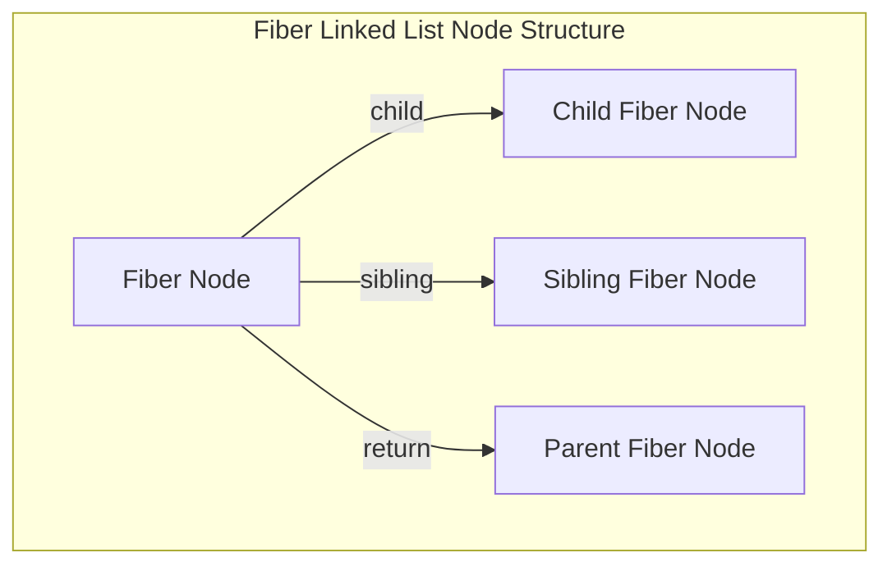

# React 18 동시성(Concurrent) 엔진과 서버 컴포넌트(RSC) 심층 가이드

 

React 18은 단순한 API 추가 버전이 아닌, **React의 렌더링 코어 패러다임이 '동기적 단일 스레드 작업'에서 '우선순위 기반의 비동기 타임 슬라이싱 엔진'으로 전환된 분기점**이다.

동시성(Concurrency) 기법을 통해 React는 긴 UI 업데이트 작업 중에도 사용자의 클릭, 타이핑, 마우스 호버 이벤트를 즉각 처리할 수 있게 되었다. 더 나아가 이 동시성 레일 위에서 **Selective Hydration**과 **React Server Components (RSC)** 스트리밍 아키텍처가 결합된다.

---

## 1. Concurrent React의 핵심: 타임 슬라이싱 (Time Slicing)

### 1.1 Stack Reconciler 대 Fiber Reconciler

- **React 15 이전 (Stack Reconciler)**: 콜 스택을 통한 재귀적 트리 순회. 렌더링이 시작되면 트리가 끝날 때까지 브라우저 메인 스레드를 100% 점유. (Frame Drop 발생)
- **React 18 (Fiber Reconciler)**: 트리를 **단방향 링크드 리스트(Fiber Node)** 구조로 개편하여, `workInProgress` 포인터를 통해 **어디서든 작업을 멈추고(Pause), 우선순위 높은 작업으로 전환(Yield)한 뒤, 다시 돌아와 재개(Resume)**할 수 있다.

### 1.2 Scheduler와 MessageChannel 타임 슬라이싱

React 스케줄러는 메인 스레드를 독점하지 않기 위해 렌더링
<truncated 6781 bytes>
