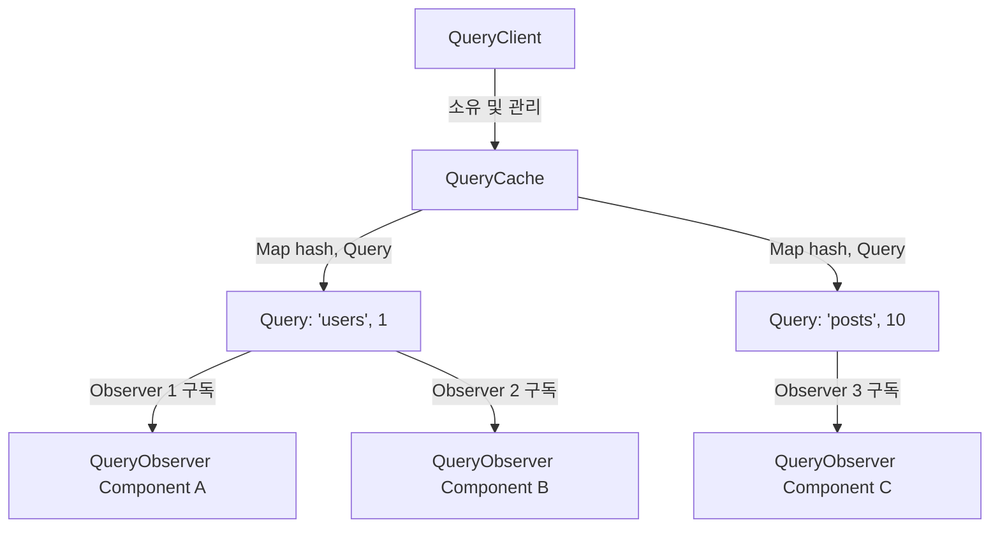

# TanStack Query (React Query) 코어 아키텍처 및 캐싱 메커니즘

 

서버 상태 관리(Server State Management) 라이브러리의 표준이 된 **TanStack Query(React Query)**는 클라이언트 전역 상태(Zustand, Redux)와는 완전히 다른 고민에서 출발했다.

서버 상태는 클라이언트가 소유하지 않으며, **비동기적이고(Asynchronous), 비동기 데이터의 스냅샷이며, 언제든 오래된(Stale) 상태가 될 수 있다.** 이 문서에서는 TanStack Query의 4계층 코어 객체 구조, 구독(Subscription) 및 재렌더링 트리거 메커니즘, Structural Sharing 알고리즘, 그리고 낙관적 업데이트(Optimistic Update) 상태 머신을 깊이 있게 다룬다.

---

## 1. TanStack Query 4계층 코어 아키텍처

TanStack Query는 React 프레임워크 독립적인 순수 TypeScript 라이브러리(`@tanstack/query-core`) 위에서 동작한다. 계층 구조는 다음과 같은 4가지 핵심 객체로 구성된다.

### 1.1 계층별 핵심 역할

1. **`QueryClient`**: 전체 캐시 스토어의 파사드(Facade) 객체. 디폴트 쿼리 옵션을 관리하고 `QueryCache` 및 `MutationCache` 인스턴스를 소유한다.
2. **`QueryCache`**: 쿼리 키(Query Key)의 해시값을 키로
   <truncated 7632 bytes>
