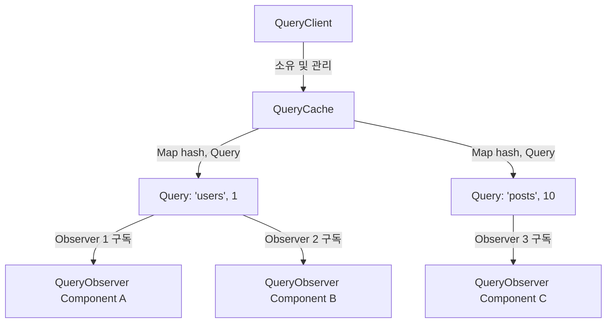
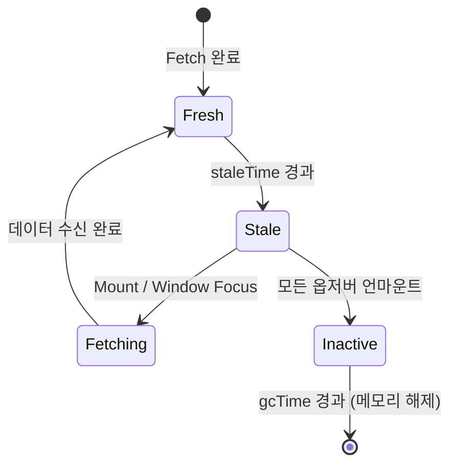

# TanStack Query (React Query) 코어 아키텍처 및 캐싱 메커니즘

<br />

서버 상태 관리(Server State Management) 라이브러리의 표준이 된 **TanStack Query(React Query)**는 클라이언트 전역 상태(Zustand, Redux)와는 완전히 다른 고민에서 출발했다.

서버 상태는 클라이언트가 소유하지 않으며, **비동기적이고(Asynchronous), 비동기 데이터의 스냅샷이며, 언제든 오래된(Stale) 상태가 될 수 있다.** 이 문서에서는 TanStack Query의 4계층 코어 객체 구조, 구독(Subscription) 및 재렌더링 트리거 메커니즘, Structural Sharing 알고리즘, 그리고 낙관적 업데이트(Optimistic Update) 상태 머신을 깊이 있게 다룬다.

---

## 1. TanStack Query 4계층 코어 아키텍처

TanStack Query는 React 프레임워크 독립적인 순수 TypeScript 라이브러리(`@tanstack/query-core`) 위에서 동작한다. 계층 구조는 다음과 같은 4가지 핵심 객체로 구성된다.



### 1.1 계층별 핵심 역할

1. **`QueryClient`**: 전체 캐시 스토어의 파사드(Facade) 객체. 디폴트 쿼리 옵션을 관리하고 `QueryCache` 및 `MutationCache` 인스턴스를 소유한다.
2. **`QueryCache`**: 쿼리 키(Query Key)의 해시값을 키로 하는 `Map<string, Query>`를 관리하며, 쿼리 추가/삭제 이벤트 리스너를 발행한다.
3. **`Query`**: 단일 엔드포인트/리소스의 상태(state), 데이터(data), 에러(error), 재시도 큐(retry loop)를 캡슐화한 인스턴스.
4. **`QueryObserver`**: 개별 컴포넌트가 `useQuery`를 호출할 때 생성되어 특정 `Query`에 연결되는 옵저버. `select`, `staleTime`, `enabled` 등의 옵션을 계산하고 컴포넌트 리렌더링을 제어한다.

---

## 2. Stale-Time vs GC-Time (구 CacheTime) 라이프사이클

가장 잦은 혼동이 발생하는 두 가지 시간 개념의 동작 흐름이다.

| 구분 | `staleTime` (기본값: 0) | `gcTime` (기본값: 5분) |
|---|---|---|
| **정의** | 데이터가 신선(Fresh)하다고 간주되는 유효 기간 | 사용되지 않는(비활성) 쿼리가 메모리에서 유지되는 시간 |
| **만료 시 동작** | 트리거(윈도우 포커스, 마운트 등) 발생 시 Background Refetch 수행 | 캐시 인스턴스가 완전히 가비지 컬렉션(GC)되어 삭제됨 |
| **기준 시점** | 데이터 fetch 성공 시점부터 카운트다운 | 활성 `QueryObserver` 수가 0이 되는 언마운트 시점부터 카운트다운 |



---

## 3. Structural Sharing (구조적 공유) 알고리즘

TanStack Query는 새 응답 데이터가 도착했을 때, 이전 데이터와 재귀적으로 동등성을 비교하여 **변경된 필드만 교체하고 변경되지 않은 객체 참조를 보존**한다.

```typescript
function replaceEqualDeep(prev: any, next: any): any {
  if (prev === next) return prev;
  if (typeof prev !== 'object' || prev === null || typeof next !== 'object' || next === null) {
    return next;
  }
  const isArray = Array.isArray(prev) && Array.isArray(next);
  if (isArray) {
    if (prev.length !== next.length) return next;
    let equal = true;
    const result = next.map((item: any, i: number) => {
      const res = replaceEqualDeep(prev[i], item);
      if (res !== prev[i]) equal = false;
      return res;
    });
    return equal ? prev : result;
  }
  // Object deep compare logic
  const prevKeys = Object.keys(prev);
  const nextKeys = Object.keys(next);
  if (prevKeys.length !== nextKeys.length) return next;
  let equal = true;
  const result: Record<string, any> = {};
  for (const key of nextKeys) {
    result[key] = replaceEqualDeep(prev[key], next[key]);
    if (result[key] !== prev[key]) equal = false;
  }
  return equal ? prev : result;
}
```

이 알고리즘 덕분에 `useMemo`나 `React.memo`를 적용한 자식 컴포넌트들이 불필요하게 리렌더링되지 않는다.

---

## 4. 낙관적 업데이트 (Optimistic Update) 패턴

```typescript
const queryClient = useQueryClient();

const mutation = useMutation({
  mutationFn: updateTodo,
  onMutate: async (newTodo) => {
    await queryClient.cancelQueries({ queryKey: ['todos'] });
    const previousTodos = queryClient.getQueryData(['todos']);
    queryClient.setQueryData(['todos'], (old: any) => [...old, newTodo]);
    return { previousTodos };
  },
  onError: (err, newTodo, context) => {
    queryClient.setQueryData(['todos'], context?.previousTodos);
  },
  onSettled: () => {
    queryClient.invalidateQueries({ queryKey: ['todos'] });
  },
});
```
