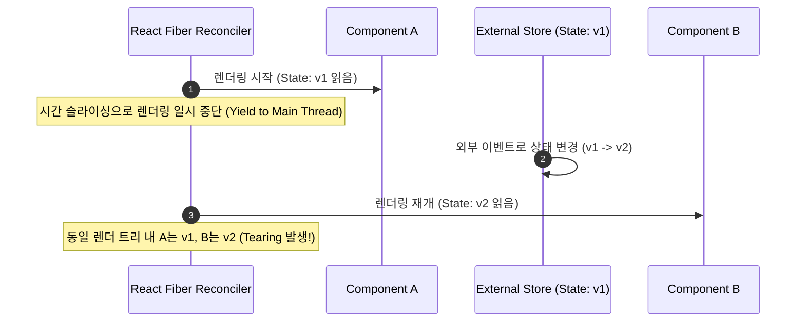

# Zustand 내부 메커니즘과 구독 모델 (useSyncExternalStore)

<br />

React 생태계에서 상태 관리 라이브러리는 Redux의 중앙 집중형 복잡성에서 시작하여 Recoil/Jotai의 원자(Atom) 모델, 그리고 Zustand의 **발행-구독(Publish-Subscribe) 기반 경량 스토어** 모델로 진화해 왔다.

Zustand는 번들 크기가 1KB 미만에 불과하면서도, React 18의 **Concurrent Rendering(동시성 렌더링)** 환경에서 발생하는 **Tearing(찢어짐 현상)**을 완벽히 방지한다. 이 문서에서는 Zustand의 내부 코어 구현, React 바인딩 원리, selector 비교 메커니즘, 그리고 미들웨어 파이프라인을 심층 분석한다.

---

## 1. React 18 Tearing 문제와 useSyncExternalStore

### 1.1 Tearing(찢어짐 현상)이란?

React 18 이전의 동기적(Synchronous) 렌더링에서는 한 프레임의 렌더링이 시작되면 끝날 때까지 브라우저 메인 쓰레드가 차단되었다. 그러나 React 18의 **Concurrent Mode**에서는 렌더링 작업이 타임 슬라이싱(Time Slicing)에 의해 중단(Pause)되고 다른 고우선순위 이벤트가 실행될 수 있다.



### 1.2 useSyncExternalStore의 해결책

React 18 팀은 외부 스토어의 Tearing을 방지하기 위해 `useSyncExternalStore` 훅을 제공한다.

```typescript
import { useSyncExternalStore } from 'react';

const state = useSyncExternalStore(
  subscribe,        // 스토어 변경 감지 리스너 등록
  getSnapshot,      // 현재 상태 스냅샷 반환
  getServerSnapshot // SSR용 초기 스냅샷
);
```

동시성 렌더링 도중 스토어 상태가 변경되면, React는 해당 렌더링 결과를 폐기하고 **동기적 렌더링(Synchronous deopt)**으로 즉시 재렌더링하여 일관성을 보장한다.

---

## 2. Zustand Vanilla 코어 구현 (vanilla.ts)

Zustand의 핵심은 클로저(Closure)와 `Set`을 활용한 순수 JS 발행-구독 모델이다.

```typescript
type Listener<T> = (state: T, previousState: T) => void;

export interface StoreApi<T> {
  setState: (partial: T | Partial<T> | ((state: T) => T | Partial<T>), replace?: boolean) => void;
  getState: () => T;
  subscribe: (listener: Listener<T>) => () => void;
  destroy: () => void;
}

export const createStore = <T>(createState: (set: any, get: any, api: StoreApi<T>) => T): StoreApi<T> => {
  let state: T;
  const listeners: Set<Listener<T>> = new Set();

  const setState: StoreApi<T>['setState'] = (partial, replace) => {
    const nextState = typeof partial === 'function' ? (partial as any)(state) : partial;
    if (!Object.is(nextState, state)) {
      const previousState = state;
      state = (replace ?? typeof nextState !== 'object' || nextState === null)
        ? nextState
        : Object.assign({}, state, nextState);
      listeners.forEach((listener) => listener(state, previousState));
    }
  };

  const getState: StoreApi<T>['getState'] = () => state;

  const subscribe: StoreApi<T>['subscribe'] = (listener) => {
    listeners.add(listener);
    return () => listeners.delete(listener);
  };

  const destroy: StoreApi<T>['destroy'] = () => {
    listeners.clear();
  };

  const api = { setState, getState, subscribe, destroy };
  state = createState(setState, getState, api);
  return api;
};
```

---

## 3. React 바인딩 및 useStore 구현

React 컴포넌트에서 상태를 구독할 때는 `useSyncExternalStoreWithSelector`를 통해 필요한 서브트리만 선택 구독한다.

```typescript
import { useSyncExternalStoreWithSelector } from 'use-sync-external-store/shim/with-selector';

export function useStore<T, U>(
  api: StoreApi<T>,
  selector: (state: T) => U = api.getState as any,
  equalityFn?: (a: U, b: U) => boolean
): U {
  const slice = useSyncExternalStoreWithSelector(
    api.subscribe,
    api.getState,
    api.getServerState || api.getState,
    selector,
    equalityFn
  );
  return slice;
}
```

### 3.1 불필요한 리렌더링 방지 (Equality Function)

기본적으로 `Object.is`로 이전 슬라이스와 새 슬라이스를 비교한다. 객체를 반환할 때는 `shallow` 비교 함수를 전달하여 얕은 비교를 수행한다.

```typescript
import { shallow } from 'zustand/shallow';

// count 또는 name이 바뀔 때만 리렌더링
const { count, name } = useUserStore(
  (state) => ({ count: state.count, name: state.name }),
  shallow
);
```

---

## 4. Transient Update (비리렌더링 상태 구독)

화면 렌더링 없이 실시간 좌표나 애니메이션 프레임을 갱신할 때는 리액트 훅 대신 `subscribe` API를 직접 바인딩한다.

```typescript
useEffect(() => {
  const unsub = useStore.subscribe((state) => {
    if (domRef.current) {
      domRef.current.style.transform = `translate3d(${state.x}px, ${state.y}px, 0)`;
    }
  });
  return unsub;
}, []);
```
