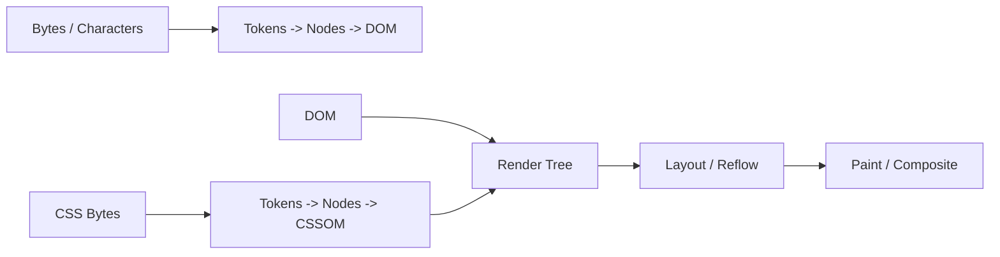

# 웹 성능 최적화 마스터피스: Critical Rendering Path부터 Core Web Vitals까지

<br />

웹 애플리케이션의 성능 최적화는 단순히 "이미지 용량을 줄이거나 스크립트를 파일 끝에 넣는 것"에 그치지 않는다.

현대의 성능 공학(Performance Engineering)은 **브라우저의 렌더링 파이프라인(CRP), 네트워크 트랜스포트 계층(HTTP/3, TCP/QUIC), 그리고 Google의 사용자 경험 표준 지표인 Core Web Vitals(LCP, INP, CLS)**를 유기적으로 연결하여 밀리초 단위로 제어하는 과정이다. 이 문서에서는 웹 성능 최적화의 모든 핵심 아키텍처와 실전 기법을 다룬다.

---

## 1. Critical Rendering Path (CRP) 5단계 심층 분석

브라우저가 서버로부터 HTML 바이트를 수신하여 디스플레이 픽셀로 변환하기까지의 5단계 파이프라인이다.



### 1.1 DOM 및 CSSOM 구성
- **DOM (Document Object Model)**: 점진적(Incremental) 스트리밍 파싱 가능.
- **CSSOM (CSS Object Model)**: **렌더 차단 리소스(Render-Blocking)**. 스타일 규칙이 덮어씌워질 수 있으므로 CSS 파싱이 완료될 때까지 Render Tree 구성이 차단됨.

### 1.2 Layout vs Paint vs Composite
- **Layout (Reflow)**: 각 노드의 기하학적 위치와 크기 계산 (`width`, `height`, `margin`, `display`).
- **Paint (Repaint)**: 픽셀을 채우는 작업 (`color`, `background-color`, `border-radius`).
- **Composite**: GPU 레이어를 합성하여 화면에 표시 (`transform`, `opacity`). Layout과 Paint를 유발하지 않아 가장 빠름.

---

## 2. Core Web Vitals 핵심 3요소 튜닝

| 지표 | 측정 대상 | 권장 기준 (Good) | 주요 최적화 기법 |
|---|---|---|---|
| **LCP (Largest Contentful Paint)** | 로딩 성능 (최대 콘텐츠 렌더 시간) | 2.5초 이하 | `<link rel="preload">`, CDN 엣지 캐싱, FetchPriority="high" |
| **INP (Interaction to Next Paint)** | 반응성 (사용자 입력 후 다음 프레임까지 지연) | 200ms 이하 | `yieldToMain()`, Long Task 분할, Web Worker 오프로딩 |
| **CLS (Cumulative Layout Shift)** | 시각적 안정성 (예상치 못한 레이아웃 흔들림) | 0.1 이하 | 이미지/동영상 `aspect-ratio` 지정, 폰트 `font-display: swap` |

---

## 3. 리소스 로딩 전략 (Resource Hints)

```html
<!-- 1. DNS 사전 조회 및 TCP/TLS 사전 연결 -->
<link rel="preconnect" href="https://api.braurus.dev" crossorigin />

<!-- 2. 중요 LCP 히어로 이미지 사전 로드 -->
<link rel="preload" as="image" href="/img/hero.webp" fetchpriority="high" />

<!-- 3. 미래 방문 가능성이 높은 페이지 리소스 프리페치 -->
<link rel="prefetch" href="/studies/react" />
```
