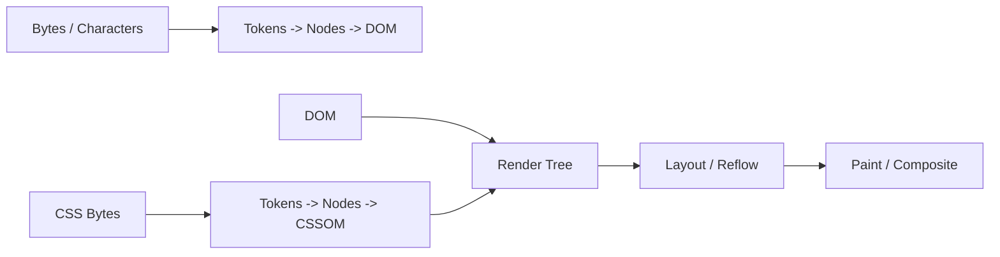

# 웹 성능 최적화 마스터피스: Critical Rendering Path부터 Core Web Vitals까지

 

웹 애플리케이션의 성능 최적화는 단순히 "이미지 용량을 줄이거나 스크립트를 파일 끝에 넣는 것"에 그치지 않는다.

현대의 성능 공학(Performance Engineering)은 **브라우저의 렌더링 파이프라인(CRP), 네트워크 트랜스포트 계층(HTTP/3, TCP/QUIC), 그리고 Google의 사용자 경험 표준 지표인 Core Web Vitals(LCP, INP, CLS)**를 유기적으로 연결하여 밀리초 단위로 제어하는 과정이다. 이 문서에서는 웹 성능 최적화의 모든 핵심 아키텍처와 실전 기법을 다룬다.

---

## 1. Critical Rendering Path (CRP) 5단계 심층 분석

브라우저가 서버로부터 HTML 바이트를 수신하여 디스플레이 픽셀로 변환하기까지의 5단계 파이프라인이다.

### 1.1 렌더 블로킹(Render-Blocking) 리소스의 물리적 이유

- **HTML & DOM**: 증분 파싱(Incremental Parsing)이 가능하다. 브라우저는 HTML 패킷이 도착하는 대로 파싱하여 DOM 노드를 부분적으로 생성한다.
- **CSS & CSSOM**: **렌더 차단(Render-Blocking)** 리소스다. CSSOM이 완전히 구성되지 않은 상태에서 렌더링하면 스타일이 입혀지지 않은 가공되지 않은 텍스
  <truncated 7639 bytes>
